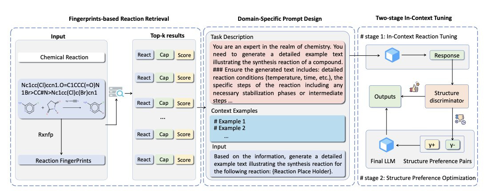
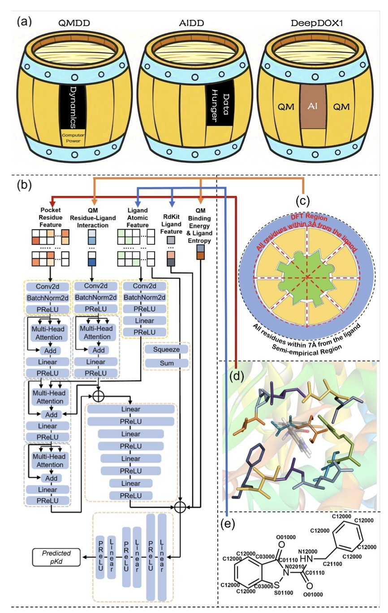
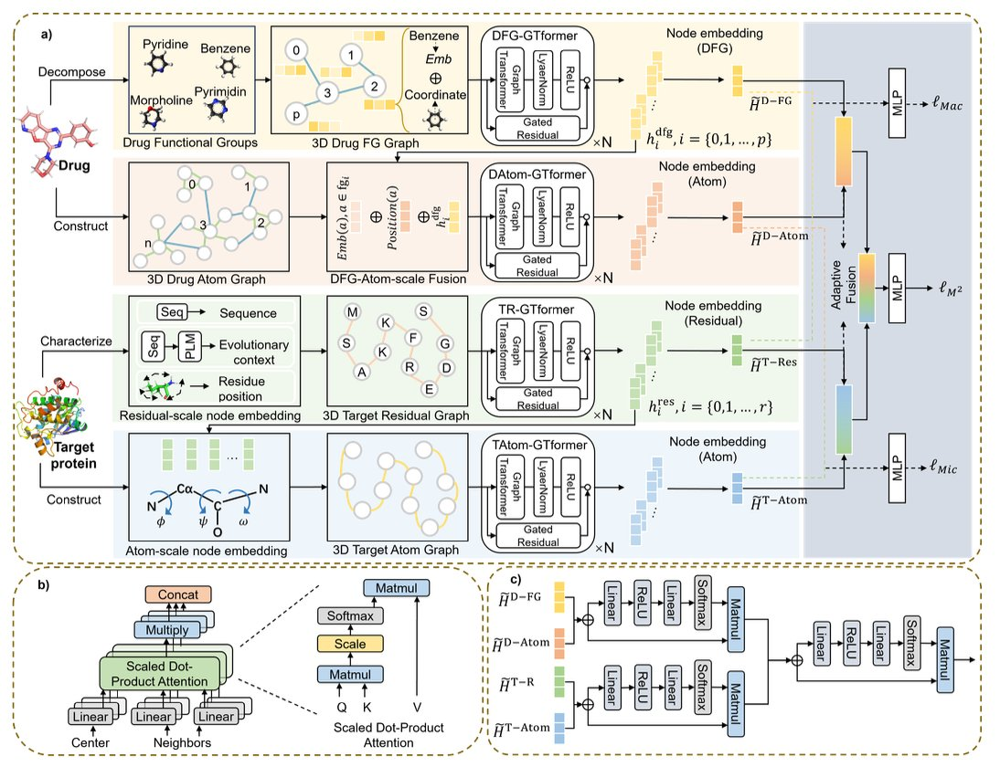
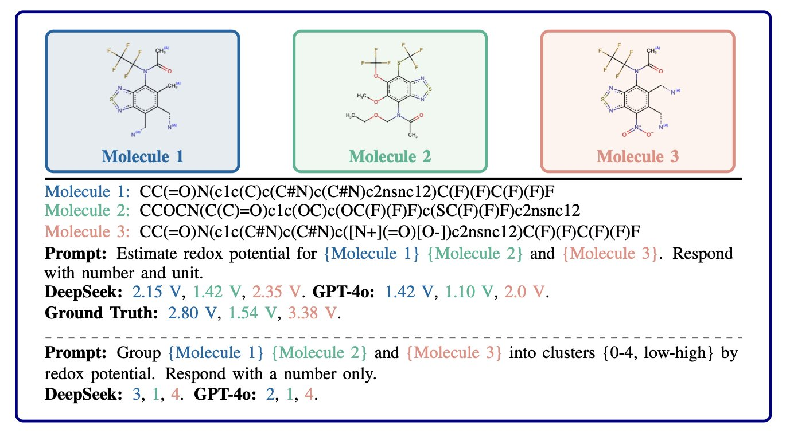
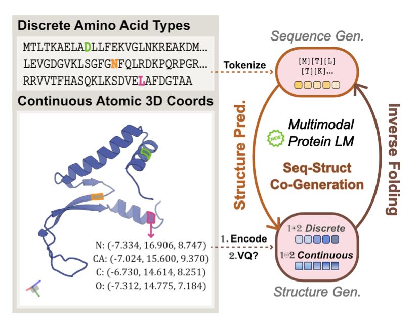
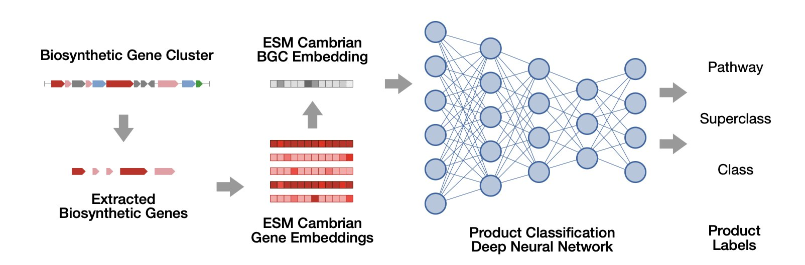

#### 目录  
1. ReactGPT 通过一种巧妙的「上下文调优」方法，利用化学指纹作为「备忘录」，让大语言模型学会了像经验丰富的化学家一样，为化学反应撰写详细的实验记录。
2. DeepDOX1 框架将第一性原理物理学与深度学习结合，为药物 - 蛋白亲和力预测提供了一个更准确、泛化能力更强的解决方案。
3. M2N 模型通过模拟化学家从宏观到微观的分析思路，先看官能团和残基，再聚焦原子，为药物 - 靶点亲和力预测提供了更精准的视角。
4. 这项工作另辟蹊径，利用大语言模型的化学先验知识直接指导贝叶斯优化的探索方向，从而省去了构建显式代理模型的步骤，让分子发现的效率更高。
5. HD-Prot 创新地使用连续结构 token，解决了离散化带来的信息损失，实现了高保真、低成本的蛋白质序列 - 结构联合建模。
6. BGCat 利用蛋白质语言模型，为海量未知生物合成基因簇（BGC）精准预测其化学产物结构，解决了天然产物发现的一大瓶颈。

## 1. ReactGPT：让大模型像化学家一样读懂化学反应  
  
  

我们每天都在跟化学反应打交道，但记录实验过程却是一件相当繁琐的事。把反应物、试剂、溶剂、温度、时间、后处理步骤一一写进实验记录本（ELN），不仅耗时，还容易出错。现在，想象一下，如果有一个 AI 助手，你只要给它一个反应式，它就能自动生成一份详尽、规范的实验报告，这会是什么体验？  
  
这正是 ReactGPT 想要解决的问题。大语言模型 (Large Language Models, LLMs) 在处理自然语言方面很强大，但它们并不懂化学。你直接扔给它一个反应式，它看到的只是一串符号，无法理解背后复杂的物理化学过程。  
  
研究者的思路很直接：我们不指望从头训练一个「化学家」大模型，那太费钱了。不如找个「实习生」（比如 GPT-4），教它如何查阅资料，然后模仿着写报告。这套方法就是所谓的「上下文学习」 (In-Context Learning)。  
  
ReactGPT 的工作流程可以分为三步：  
  
第一步是**用化学指纹检索相似反应**。每个化学反应都有自己独特的「指纹」（Fingerprints），这是一串可以代表反应物结构和变化信息的数字编码。当拿到一个新反应时，ReactGPT 会先计算它的指纹，然后去庞大的反应数据库里，找出指纹最相似的几个「前辈」反应。这就像教实习生：「别急着自己写，先去看看师兄师姐们之前做过的类似实验是怎么记录的。」  
  
第二步是**设计领域专用的提示词** (Prompt)。直接让大模型「描述反应」是行不通的。你需要给它一个清晰的指令模板，告诉它需要输出哪些信息，比如「反应物」、「催化剂」、「溶剂」、「温度」、「产物」、「产率」。这相当于给实习生一张标准化的报告表格，让他照着填，确保不会漏掉关键信息。  
  
第三步是**两阶段上下文调优**。这是整个流程最核心的部分。ReactGPT 会把第一步检索到的相似反应案例，连同第二步设计的提示词模板，一起打包塞给大模型。这个过程分两步走：首先让模型学习反应描述的通用「语法」和格式，然后让它聚焦于当前这个具体反应的细节。整个过程都是在「上下文」中动态完成的，不需要重新训练模型。这就像实习生在看完几个范例后，马上就学着写自己手头这份新的报告，现学现用。  
  
结果如何？ReactGPT 在「反应字幕」（Reaction Captioning，即生成反应描述）和预测实验步骤这两个任务上，都取得了当前最好的效果。它生成的文本不仅化学逻辑准确，而且在格式和结构上也更符合人类化学家的书写习惯。  
  
从一个一线研发者的角度看，ReactGPT 的价值在于它提供了一个非常务实的工程化解决方案。它没有试图让大模型凭空「领悟」化学，而是巧妙地将大模型的语言能力与现有的化学知识库结合起来。模型本身的好坏，很大程度上取决于它能查阅的数据库的质量。如果数据库里的「范例」本身就不够好，那 AI 也学不出什么花样来。  
  
此外，这个框架的潜力不止于自动写实验记录。如果一个模型能准确地「正向」描述一个反应，那么它离「逆向」预测合成路线（也就是逆合成分析）也就更近了一步。这对于药物发现中新分子的设计与合成，有着不可估量的价值。  
  
📜Title: ReactGPT: Understanding of Chemical Reactions via In-Context Tuning  
🌐Paper: https://ojs.aaai.org/index.php/AAAI/article/view/31983/34138  

## 2. DeepDOX1：AI+ 量子力学革新药物亲和力预测  
  
  

预测药物分子和靶点蛋白的结合强度，也就是亲和力，一直是药物研发里的核心难题。  
  
传统的打分函数快但不准。纯粹的物理模拟，比如自由能微扰（Free Energy Perturbation, FEP），准但太慢了，算一个分子可能要花几天。最近几年，AI 模型看起来很有希望，但大家心里都有个疙瘩：它们像个黑箱，而且泛化能力是个大问题。一个在激酶上训练得很好的模型，换到 GPCR 上可能就完全失灵。  
  
这篇 DeepDOX1 的工作思路就很有意思。它没有让 AI 单打独斗，而是搞了个「双驱动」框架，让物理学和 AI 各司其职。  
  
你可以这么理解：研究者先用量子力学（Quantum Mechanics, QM）计算，得到一个药物分子和蛋白口袋之间的「静态」相互作用图谱。这就像是给出了一个基于物理第一性原理的底稿，它描述了原子间的基本作用力。  
  
但真实的结合过程是动态的，有溶剂效应，有蛋白构象的变化。这些「动态」的、复杂的因素，用 QM 去算就太耗时了。所以，他们训练了一个卷积神经网络（Convolutional Neural Network, CNN）模型。这个 AI 模型的任务不是从零开始预测亲和力，而是学习如何在这份物理底稿上进行「修正」。它学习的是 QM 计算值和真实实验值之间的那个「差值」（dynamics correction）。  
  
这样做的好处很明显。首先，模型有了物理学的「骨架」，它学的东西有物理意义，而不是单纯拟合数据。这让它在面对新情况时更可靠。其次，因为大部分繁重的计算由 QM 完成了，AI 部分的架构可以做得很简洁。他们只用了不到一万个数据点来训练，这在动辄需要百万级数据的深度学习领域算是一股清流。这也解释了为什么它的泛化能力这么强。  
  
论文里提到了几个硬骨头，比如共价抑制剂、卤代配体和金属蛋白。这些都是传统计算方法头疼的对象。共价键的形成、卤键的特殊方向性、金属离子的复杂配位场，常常让标准打分函数出错。DeepDOX1 能在这些场景下取得好结果，说明它基于 QM 的特征提取确实抓住了关键的物理化学相互作用。  
  
让我信服的还是他们的实验验证。他们用 DeepDOX1 设计了新的人果糖 -1,6-二磷酸酶（hu-FBPase）共价抑制剂。结果显示，新分子的结合亲和力确实提高了。更重要的是，他们解出了复合物的晶体结构，发现实际的结合模式和模型预测的高度一致。这就是所谓的「闭环验证」，从计算预测到湿实验证实，这是衡量一个计算工具有没有实用价值的金标准。  
  
这种 AI 和第一性原理物理结合的思路，可能真是计算药物设计的一个新方向。它不是要用 AI 取代物理，而是让 AI 成为物理模拟的加速器和精炼器。DeepDOX1 提供了一个成本可控、泛化能力强的工具，而且他们还开放了 web server，这一点非常赞，能让更多人快速上手尝试。  
  
📜Title: DeepDOX1: A Dual-Drive Framework Integrating Deep Learning and First-Principles Physics for Drug-Protein Affinity Prediction  
🌐Paper: https://www.biorxiv.org/content/10.64898/2025.12.12.693818v1  

## 3. M2N 模型：从宏观到微观，像化学家一样预测药物结合力  
  
  

在药物研发中，我们每天都在和亲和力打交道。一个分子的 Kᵢ 值或 IC₅₀ 值，直接决定了它是潜力新星还是废弃物。如果能用计算模型准确预测一个小分子和靶蛋白的结合亲和力，就能省下大把合成与测试的时间和金钱。  
  
现在做这件事的模型很多，但大多都陷入了一个两难的境地：要么只看宏观，比如把氨基酸残基或药物官能团看作一个整体，这样虽然快，但丢失了太多原子层面的关键细节；要么直接进入原子级别的计算，细节是有了，但又容易忽略整体的结构特征，而且计算量巨大。  
  
这个叫 M2N 的新模型有点意思。它的思路很像我们做研究时的直觉。你不会一上来就死磕某个原子，而是先看个大概。就像用谷歌地图，先看城市轮廓（宏观），找到目标区域，然后再放大到街道，找到具体的门牌号（微观）。  
  
它是这么干的：  
  
第一步，宏观分析。对于蛋白，模型先识别结合口袋里的关键氨基酸残基，把它们看作一个个独立的节点。这些「大块头」决定了口袋的基本形状和化学环境。对于小分子药物，模型也是先看它的官能团，比如苯环、羧基、胺基，这些是决定分子性质和相互作用模式的关键「组件」。  
  
第二步，微观细化。在宏观层面建立联系后，模型再「钻」进去，把每个残基和每个官能团都拆解成原子。这样，它就能看到更精细的相互作用了，比如哪个氢原子和哪个氧原子形成了氢键，或者哪两个碳原子之间有范德华力。  
  
最妙的地方在于它如何把宏观和微观信息结合起来。研究者设计了一个叫「自适应融合模块」 (Adaptive Fusion Module, AFM) 的东西。你可以把它想象成一个项目经理。它会根据具体情况，判断在这个药物 - 靶点复合物里，是口袋的整体形状更重要，还是某个特定的原子间相互作用更关键，然后给它们分配不同的权重。模型通过学习，自己掌握了这种权衡的艺术。  
  
研究者在 DAVIS 和 KIBA 这两个业内常用的数据集上跑了测试，结果显示 M2N 的表现超过了目前的一些主流方法。但对我来说，最吸引眼球的是他们提到的泛化能力。一个模型在训练过的数据上表现好不稀奇，能准确预测一个它从没见过的靶点，或者一个全新化学骨架的分子，那才叫真本事。这直接关系到它在我们的实际项目中到底有没有用，能不能帮我们从上百万个虚拟分子中，筛出那几个真正有潜力的苗子。  
  
📜Title: M2N: A Progressive Macro-to-Micro 3D Modeling Scheme for Unveiling Drug-Target Affinity  
🌐Paper: https://ojs.aaai.org/index.php/AAAI/article/view/32039/34194  

## 4. LLM 新玩法：跳过代理模型，直接指导分子发现  
  
  

在药物发现中，我们总是在玩一个「大海捞针」的游戏。化学空间（Chemical Space）大得超乎想象，而理想的药物分子就藏在其中。贝叶斯优化（Bayesian Optimization, BO）是我们在这个大海里导航的常用工具。它的工作逻辑很简单：先基于现有数据建一个「地图」（也就是代理模型，Surrogate Model），然后用这个地图预测哪个未知区域最可能有「宝藏」（通过采集函数，Acquisition Function），接着就去那个区域探索，拿到新数据后再更新地图。这个循环不断重复。  
  
这个流程听起来不错，但问题出在第一步——构建那个代理模型。当分子结构复杂、数据维度高时，这个模型不仅难建，而且经常不准。这就像出发去寻宝，结果大部分时间都花在了绘制一张模糊不清的地图上。  
  
这篇论文的作者们提出了一个很有意思的想法：我们能不能干脆跳过画地图这一步？  
  
他们开发了一个叫 LLMAT 的新方法。这个方法的核心是，不再费力去构建一个完整的代理模型，而是直接利用大语言模型和化学基础模型里已经存在的「化学直觉」，来告诉采集函数下一步该往哪儿走。  
  
**它的工作原理是这样的**：  
  
首先，LLMAT 不把化学空间看作一个平坦的广场，而是把它组织成一棵树。想象一下，树根是所有分子的集合，往下分叉，每个树枝代表一类更具体的分子，树叶就是一个个具体的分子。这种树状结构对计算机来说，处理起来比一个杂乱无章的空间要容易得多。  
  
然后，他们引入了蒙特卡洛树搜索（Monte Carlo Tree Search, MCTS）算法来「修剪」这棵树。MCTS 最早因为 AlphaGo 而出名，它特别擅长在巨大的决策空间里找到最优路径。在这里，它帮助算法沿着最有希望的「树枝」向下探索，而不是在整片「森林」里乱撞。  
  
最巧妙的一步来了。在开始精细搜索之前，LLMAT 会先用一个大语言模型对分子进行一次快速的「粗筛」。它让 LLM 根据预测的性质，把分子分成几个大的集群，比如「高活性区」、「中毒性区」、「溶解度差区」。这样一来，算法就可以把宝贵的计算资源集中在「高活性区」这个最有希望的集群里，大大减少了无效的探索。  
  
这就像一个经验丰富的老化学家，看一眼就告诉你：「别浪费时间了，那边那几类化合物没戏，重点看这边这几个骨架。」LLM 在这里扮演的就是这位老专家的角色，它提供的不是精确的地图，而是宝贵的「先验知识」。  
  
**结果怎么样**？  
  
研究者在多个真实的化学数据集上测试了 LLMAT。结果显示，无论是在样本效率（用更少的实验找到好分子）还是计算效率上，LLMAT 都超过了传统的贝叶斯优化方法，也优于其他一些基于 LLM 的方法。  
  
从一个研发科学家的角度看，这个思路很实用。它没有试图用一个大模型解决所有问题，而是聪明地将 LLM 的宏观知识和 MCTS 的搜索能力结合起来。它绕过了传统 BO 方法中最麻烦的代理模型环节，让整个优化过程变得更直接、更高效。在实际的药物发现项目中，这意味着我们或许能用更低的成本、更快地找到有潜力的候选分子。  
  
📜Title: Informing Acquisition Functions via Foundation Models for Molecular Discovery  
🌐Paper: https://arxiv.org/abs/2512.13935  

## 5. HD-Prot: 连续 token 开启蛋白质建模新范式  
  
  

在蛋白质语言模型 (pLMs) 的世界里，我们一直在处理一个根本性的矛盾：蛋白质序列是离散的，由 20 种氨基酸组成，就像字母表；而蛋白质结构是连续的，是三维空间中原子的精确坐标。过去的模型为了让这两者「对话」，通常会采取一种简单粗暴的方式——将连续的 3D 结构「量化」成离散的 token。这就像把一张高清照片强行转换成马赛克画，虽然能看清大概轮廓，但大量精细的细节不可避免地丢失了。  
  
HD-Prot 这篇工作，就是对这种「马赛克」方法的一次漂亮反击。研究者们问了一个简单的问题：我们为什么非要丢失信息呢？能不能直接在连续空间里对结构进行建模？  
  
**它的工作原理是这样的**：  
  
首先，模型需要一个能理解并编码连续三维结构的「翻译官」。研究者为此设计了一个非量化的自编码器 (Autoencoder) 作为结构 tokenizer。这个 tokenizer 的任务是把复杂的蛋白质坐标压缩成一种紧凑的、连续的数学表达（token），并且还能从这个表达中无损地重建出原始结构。这就好比用矢量图代替像素图，无论放大多少倍，细节都不会失真。这是整个方法保真度的基石。  
  
接下来是真正的挑战：如何让一个模型同时处理两种完全不同的数据类型——离散的序列 token 和连续的结构 token。HD-Prot 使用了一个统一的吸收扩散过程 (Absorbing Diffusion Process) 来解决这个问题。你可以把它想象成一个双语专家，它能同时理解并生成两种「语言」。  
  
对于离散的氨基酸序列，它采用类别预测的方式，就像在做完形填空。对于连续的结构 token，它则使用连续扩散模型，通过一个从噪声中逐步去噪、还原真实结构的过程来建模。这两种过程被巧妙地融合在一个框架下，让模型学会序列和结构之间的底层物理化学规律。  
  
**这带来了什么实际好处**？  
  
HD-Prot 在多项任务上都展示了极具竞争力的性能。  
1.  **序列 - 结构协同生成 (Co-generation**)：模型可以从零开始，同时设计出全新的、化学上合理的蛋白质序列及其对应的稳定三维结构。  
2.  **基序支架设计 (Motif-scaffolding**)：这是药物设计领域非常看重的能力。你可以给模型一个小的功能片段（比如一个药物结合位点），让它设计一个完整的蛋白质支架来稳定并呈现这个基序。  
3.  **结构预测和反向折叠**：在这些传统任务上，它的表现也相当不错。  
  
最关键的一点是，HD-Prot 在取得这些成果的同时，计算成本显著降低。在一个动辄需要巨量算力才能训练模型的时代，这种效率上的优势意味着更多实验室和研究团队可以负担得起、用得上这项技术，从而加速整个领域的发展。  
  
从我的角度看，HD-Prot 的价值不仅在于它是一个性能优异的新模型，更在于它提供了一种新的思路。它证明了在多模态蛋白质建模中，我们不必总是向离散化的简便性妥协。通过拥抱连续空间，我们或许能找到一条更优雅、更高效、更接近生命本质的建模路径。  
  
📜Title: HD-Prot: A Protein Language Model for Joint Sequence-Structure Modeling with Continuous Structure Tokens  
🌐Paper: <https://arxiv.org/abs/2512.15133v1>  

## 6. BGCat: AI 精准预测基因簇产物，天然药物发现新工具  
  
  

在天然产物研发领域，我们就像坐在一个巨大的宝库上。微生物基因组里充满了无数的生物合成基因簇（Biosynthetic Gene Clusters, BGCs），它们是制造各种复杂分子的「化工厂」。问题是，我们手里的地图太模糊了。我们能看到这些「工厂」在哪里，但大多数时候，我们根本不知道它们具体在生产什么。  
  
传统的预测工具，比如 antiSMASH，能给出一个大概的分类，比如「这是一个聚酮合酶（PKS）基因簇」。这很有用，但还不够。这好比告诉你一个工厂生产「汽车」，但你不知道它造的是轿车、卡车还是跑车。对于药物研发来说，这种细节至关重要。  
  
现在，一篇新论文介绍了一个叫 BGCat 的工具，它就像给我们的地图配上了一个高分辨率的镜头。  
  
**BGCat 的工作原理很简单**  
  
作者们首先用一个预训练好的蛋白质语言模型 ESM Cambrian。你可以把这个模型想象成一个精通「酶语言」的专家。它能阅读 BGC 中每个酶的氨基酸序列，并理解它们的功能。  
  
先输入一个基因簇里的所有基因序列，语言模型会为每个基因生成一个数字向量，也就是「基因表征」。这个向量抓住了基因的核心功能信息。然后，一个深度神经网络会接手这些向量，分析整个「工厂」的配置，最终预测出它最可能生产哪一类具体的化学分子。  
  
这个流程摆脱了过去依赖单个同源基因比对的局限，而是从整体上理解 BGC 的功能潜力。  
  
**如何解决数据不足的「老大难」问题**  
  
机器学习模型需要大量数据来训练，但已知的「BGC-产物」配对数据非常有限。这是这个领域一个老大难的问题。  
  
研究者们想出了一个很办法：基于聚类的增强策略。他们先把功能相似的 BGC 聚成一类。如果这个类别里有一个成员的产物是已知的，他们就假设其他成员大概率也会生产结构相似的分子。  
  
通过这种方式，他们为模型「创造」了更多有效的训练样本。这就像教一个孩子认动物，如果你只有一张金毛犬的照片，你可以告诉他，那些长得和金毛很像的狗，也都是狗。这极大地提升了模型的泛化能力和预测精度。  
  
**BGCat 带来了什么实际价值**？  
  
首先，作者们用 BGCat 分析了 antiSMASH 数据库里超过 10 万个之前只有模糊注释的 BGC。一夜之间，我们对微生物世界的化学潜力有了更精细的认识。很多以前被标记为「未知」的基因簇，现在有了具体的预测标签，比如「Ⅰ型芳香族聚酮」或者「内酯类化合物」。这为我们寻找新颖的天然产物提供了直接的线索。  
  
其次，他们提出了一个新概念，叫做「产物类别谱」（Product Class Profiles, PCPs）。过去，我们倾向于给一个基因簇家族（Gene Cluster Family, GCF）贴上一个固定的功能标签。但 PCPs 认为，一个家族的功能更像是一个概率分布。比如，某个 GCF 有 70% 的概率生产大环内酯，20% 的概率生产烯二炔，还有 10% 的概率生产其他东西。  
  
这种视角更符合生物学的现实。一个基因簇家族在进化过程中会发生各种变化，功能也会随之漂移。PCPs 精准地捕捉了这种多样性，让我们对 BGC 的功能理解更进了一步。  
  
BGCat 是一个强大的工具。它能帮我们更快地从海量的基因组数据中筛选出最有希望的候选 BGC，让我们能集中火力，去探索那些真正有潜力成药的未知化学空间。  
  
📜Title: Fine-Grained Structural Classification of Biosynthetic Gene Cluster-Encoded Products  
🌐Paper: https://www.biorxiv.org/content/10.64898/2025.12.12.693975v1
