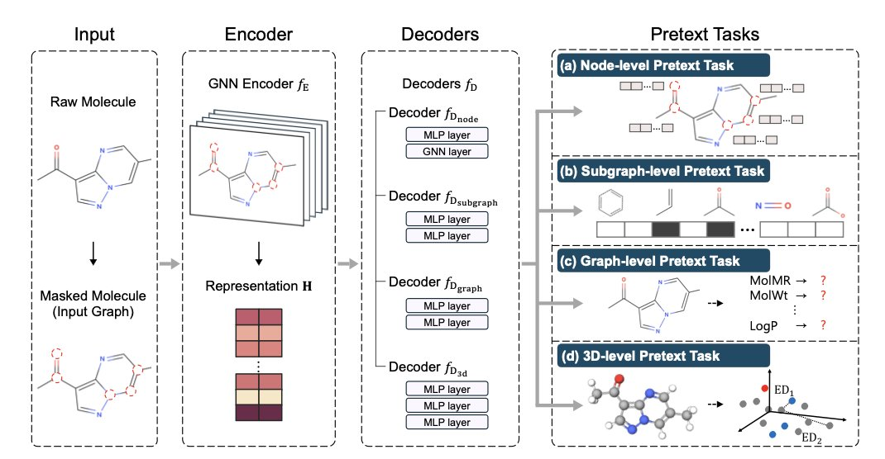
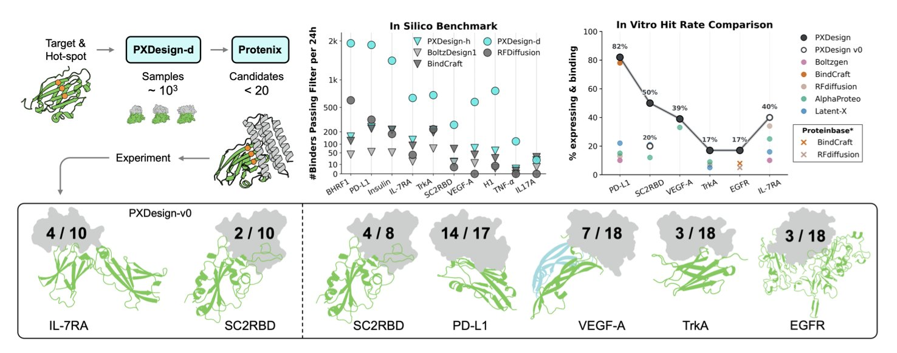
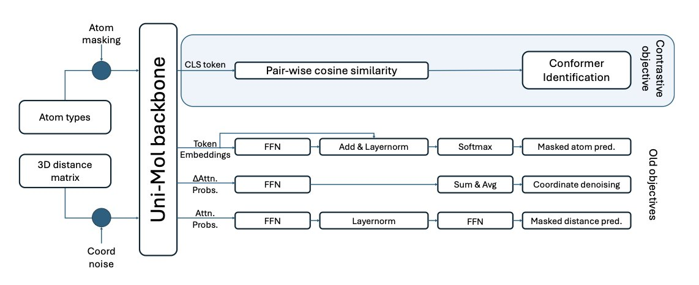
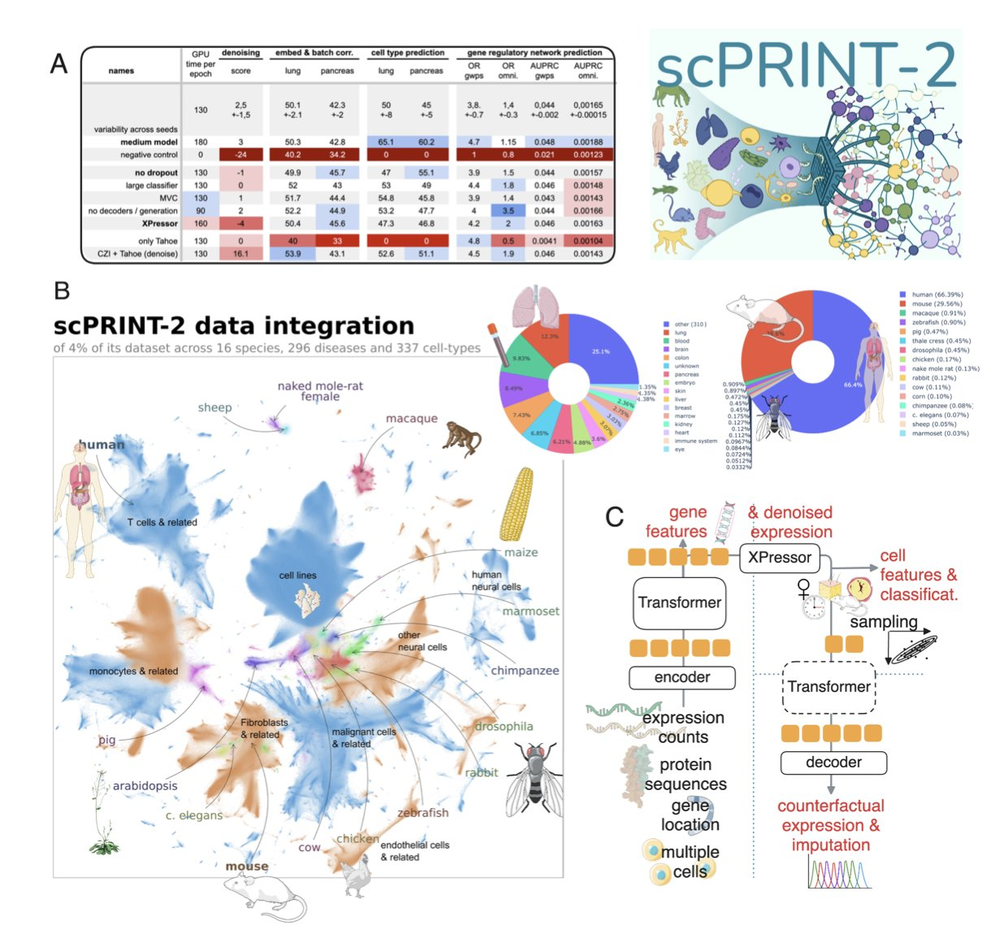
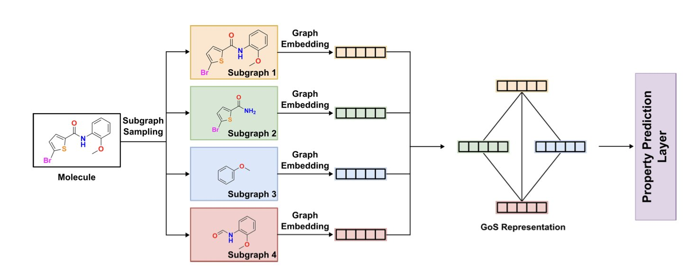

#### Table of Contents  
1. The MORE framework builds a more comprehensive molecular representation by learning from atomic, functional group, whole-molecule, and 3D structural levels simultaneously, providing a powerful new foundation model for AI drug discovery.
2. PXDesign integrates two complementary generative models and an innovative multi-predictor screening strategy to significantly increase the experimental success rate of de novo protein binder design, and it's now open source.
3. ConforFormer uses contrastive learning to distill a universal, conformation-independent vector representation from a molecule's multiple 3D conformations, significantly improving the accuracy of molecular property prediction.
4. By pre-training on an unprecedented dataset of 350 million cells, scPRINT-2 sets a new performance ceiling for single-cell analysis, showing particularly strong cross-species generalization capabilities.
5. GoMS builds a graph network at the functional group level to precisely capture their spatial arrangement and interactions, addressing the shortcomings of traditional graph neural networks in predicting properties of large molecules.

## 1. A New Paradigm in AI Drug Discovery: The Multi-Level Molecular Pre-training Model MORE  
  
  

In AI drug discovery, we're always looking for better ways to help machines "read" molecules. A good molecular representation is the foundation for all downstream tasks, from predicting activity to toxicity.  
  
Many past models focused on just one part of the molecule. Some looked at 2D graphs, like a flat blueprint; others only considered the 3D conformation. This is like the story of the blind men and the elephant—each person touches only one part, so their understanding is incomplete.  
  
This paper from AAAI-25, which proposes the MORE framework, has a very direct idea: why not just use all the information?  
  
MORE acts like an experienced chemist, examining a molecule from four levels at once.  
  
1.  **Node-level (Atoms)**: It looks at the basic properties of each atom, which is the fundamental grammar of chemistry.  
2.  **Subgraph-level (Functional Groups)**: It then identifies key functional groups like benzene rings or carboxyl groups. These are the critical modules that determine a molecule's "personality."  
3.  **Graph-level (Whole Molecule)**: Next, it views the molecule as a whole, understanding how atoms and functional groups connect to form a network.  
4.  **3D-level (Structure)**: Finally, it considers the molecule's three-dimensional spatial conformation. After all, drugs and targets bind in 3D space, where shape is crucial.  
  
To achieve this, the researchers designed an encoder-decoder architecture. A single encoder learns a unified representation, and four specialized decoders handle tasks at each of the four levels.  
  
I think the most impressive part of MORE is its introduction of high-level semantic information like "molecular descriptors." Previous pre-training models mostly ignored this. Molecular descriptors are the rules of thumb summarized by chemists, such as molecular weight, LogP (lipophilicity), and PSA (polar surface area). These are the parameters we look at every day in drug development because they directly relate to a molecule's druggability. Teaching the model this "chemist's intuition" had an immediate effect, especially on complex tasks like predicting toxicity and binding affinity.  
  
The data shows that MORE outperforms existing models on multiple downstream tasks, both in linear probing and full fine-tuning scenarios.  
  
Another interesting finding: during fine-tuning, MORE's parameters change very little. This suggests the knowledge learned during pre-training is very solid and isn't "washed away" when fine-tuning for a new task. This is a vital characteristic for building a truly general foundation model.  
  
The researchers also ran scaling experiments and found that MORE's performance continues to improve as the pre-training dataset grows. This points to an exciting future: if we train a massive MORE model on a huge amount of molecular data, could it become the GPT of chemistry? A foundational model that can answer all kinds of questions about molecules?  
  
📜Title: More: Molecule Pretraining with Multi-Level Pretext Task  
🌐Paper: https://ojs.aaai.org/index.php/AAAI/article/download/34262/36417  

## 2. ByteDance PXDesign: AI-Designed Proteins Hit an 82% Success Rate  
  
  

In drug development, designing a protein from scratch that can precisely bind a target is like forging a key for a lock you've only ever seen in a photograph. Many computational methods look perfect on a computer but fail in the lab. That's why seeing PXDesign's experimental data is so refreshing.  
  
**Two Generative Strategies for Different Needs**  
  
The researchers didn't bet on a single algorithm. They used a two-pronged approach.  
  
The first is `PXDesign-d`, which is based on a diffusion model. You can think of it as a highly creative sculptor. It starts with a random blob of "digital clay" and step-by-step refines it into a plausible protein backbone. The advantage of this method is its ability to generate highly novel and diverse structures, potentially discovering new scaffolds that have never been seen in nature. This is very useful for exploring unknown design space.  
  
The second is `PXDesign-h`, based on a hallucination model. This is more like a goal-oriented engineer. You tell it, "I need to place a specific motif at this position on the protein to bind the target." The model then builds a stable, foldable protein frame around this core functional region. This approach is ideal for fine-tuning a design for a known binding site.  
  
**The Real Highlight: Screening with Multiple "Judges"**  
  
Generating thousands of candidate molecules isn't that hard today. The real bottleneck is panning for gold. Most designed molecules either fail to fold correctly or have no activity in the real world.  
  
PXDesign's approach here is very smart. They didn't rely on just one "judge" like AlphaFold to determine if a design was good. Instead, they assembled a "panel of judges," including their in-house model Protenix and several different versions of AlphaFold.  
  
The logic is simple. Every structure prediction model has its own biases and blind spots. A design that scores high on only one model might be a fluke. But if it gets high scores from multiple independent models, the probability that it will fold correctly and function in the real world increases dramatically. It's like consulting several experts from different backgrounds before making a big decision. This systematic multi-predictor screening strategy is the key to their high experimental success rate.  
  
**Striking Experimental Results**  
  
Ultimately, data is the only thing that matters. They conducted experimental validation on seven biologically relevant targets, including well-known ones like PD-L1 and VEGF-A.  
  
The result was that they successfully found nanomolar-affinity binders for 6 of the 7 targets. Hit rates ranged from 17% to 82%. In the field of protein design, a 17% hit rate is already considered a huge success, and 82% is almost unheard of. This means development teams can save a lot of time and money on molecule synthesis and wet lab validation, focusing their resources on the most promising candidates.  
  
**Beyond Traditional Proteins**  
  
The framework's potential doesn't stop there. The researchers also used it to design cyclic peptide binders and achieved good results. Cyclic peptides are a class of drugs that sit between small molecules and antibodies, with enormous therapeutic potential. PXDesign's versatility suggests it could become a broader platform for designing drug molecules in the future.  
  
They have open-sourced the entire pipeline and code, and also provided a web server.  
  
📜Title: PXDesign: Fast, Modular, and Accurate De Novo Design of Protein Binders  
🌐Paper: https://www.biorxiv.org/content/10.1101/2025.08.15.670450v3  
💻Code: https://github.com/bytedance/PXDesign  
💻Server: https://protenix-server.com  

## 3. ConforFormer: How AI Learns a Molecule's Essence from its 3D Flexibility  
  
  

In drug discovery, we're always dealing with the three-dimensional structures of molecules. A molecule isn't a static 2D drawing; in solution, it constantly twists and bends like a flexible gymnast, adopting many different poses, which we call "conformations." Which conformation is the one that binds to the target? This has always been a tough question. Many AI models simplify the problem by just looking at the 2D structure, but this loses the most critical 3D information.  
  
The ConforFormer project aims to tackle this problem head-on.  
  
Its core idea is intuitive. Imagine you're shown several photos of the same person—one standing, one sitting, one running. You immediately recognize it's the same person. ConforFormer works in a similar way. The researchers first generate a set of plausible, low-energy 3D conformations for each molecule. Then, they train the model using a method called contrastive learning.  
  
The training task is simple: teach the model to pull the representation vectors (think of them as the machine's "fingerprints") of all conformations of the *same* molecule as close together as possible, while pushing the vectors of *different* molecules as far apart as possible. After this training, the model learns to ignore minor conformational differences and grasp the molecule's "essential identity." It can then generate a single, conformation-independent representation vector for each molecule.  
  
The benefits of this are huge. You only need to pre-train the model once to get a molecular representation that can be used for all sorts of tasks. Whether you're predicting solubility, toxicity, or searching for structural similarities, you can use this off-the-shelf vector, saving the trouble of re-calculating for every task or every conformation.  
  
The model is built on the previous Uni-Mol architecture, but its learning objective is new. It doesn't even need to see the molecule's 2D connectivity graph during training; it can infer how atoms are connected just by learning from 3D geometric coordinates. That's quite impressive. The researchers found that ConforFormer can not only distinguish between different conformations but also between isomers—molecules with the same chemical formula but completely different structures. This shows the model has learned something akin to a chemist's intuition.  
  
To validate the model's capabilities, the researchers also created a new benchmark dataset called PharmIsomer. ConforFormer performed well on this dataset, proving it has what it takes to handle the common conformation and isomer challenges in medicinal chemistry. For those of us in drug discovery, this could mean a more accurate tool for virtual screening and property prediction, especially for targets where molecular flexibility is a deciding factor.  
  
📜Title: ConforFormer: Representation for Molecules through Understanding of Conformers  
🌐Paper: https://doi.org/10.26434/chemrxiv-2025-x68vd  

## 4. scPRINT-2: A New Benchmark for Cell Foundation Models, Forged from 350 Million Cells  
  
  

What's the biggest headache in single-cell analysis? The data is noisy, high-dimensional, and very sparse. It's like trying to piece together a clear picture from a pile of pixels mixed with sand. People have been trying to solve this with large models for years, but something always felt missing.  
  
#### This Time, Data Volume is the Real Moat  
  
The logic for building a powerful foundation model is simple: give it enough good data. The scPRINT-2 team did just that, but they took it to an extreme. They integrated a single-cell RNA sequencing (scRNA-seq) dataset containing 350 million cells from 16 different species.  
  
To put that in perspective, previous models were likely trained on datasets of a few million, or at most tens of millions, of cells. It's the difference between teaching a child a language with a few books versus immersing them in the entire internet. scPRINT-2 received an "internet-scale" education in cell biology. This level of data diversity allows the model to learn the fundamental biological principles that transcend individual species or tissues, which is the basis for strong generalization.  
  
#### An Architecture Tailor-Made for Single-Cell Data  
  
Data alone isn't enough; the tools have to keep up. The architecture of scPRINT-2 has a few clever features that show it was made by people who know the field.  
  
First, it uses a Graph Neural Network (GNN) encoder. We know that genes don't work in isolation; they exist in complex regulatory networks. Traditional models often treat genes as a simple list, ignoring these intrinsic connections. A GNN can directly model the interaction relationships between genes, giving the model a viewpoint that is closer to biological reality from the start.  
  
Second is the novel loss function. Single-cell data has a lot of "zeros." Often, this isn't because a gene isn't expressed, but because it wasn't detected due to technical limitations—the "dropout" phenomenon. If you train a model with a traditional Mean Squared Error, it will be misled by these "false zeros." The scPRINT-2 researchers combined a Zero-inflated Negative Binomial loss with Mean Squared Error. The former is a statistical model specifically designed to handle count data with a large number of zeros. It's like giving the model a special pair of glasses that can distinguish between "real zeros" and "unseen data."  
  
#### The Real Test: How Does It Perform in Unknown Territory?  
  
You can't judge a model just by its practice exam scores; you have to see how it performs on the final. For a single-cell model, the "final" is throwing it at species or cell types it has never seen before.  
  
scPRINT-2's performance here is stunning. It can accurately predict cell types and gene networks in an organism it has never encountered, like the planarian worm. This means the model learned not just "what a mouse T cell looks like," but the more fundamental concept of "what a T cell is." This cross-species generalization is immensely valuable for drug development. We often conduct experiments on model animals like mice and monkeys with the ultimate goal of applying the findings to humans. A model that understands the commonalities between species is a bridge for that cross-species research.  
  
#### More Than Just Open-Source Code, It's Open Science  
  
They didn't just release the model weights and call it a day. They made the pre-training datasets, tasks, and even the training logs public.  
  
This matters because it makes the entire research process transparent and reproducible. Others can see exactly how the model was built, understand its capabilities and limitations, and even build upon their work. It avoids the "black box" problem and sets a new standard for the field. When everyone is willing to share their "recipes," the entire community's "cooking skills" improve much faster.  
  
scPRINT-2 isn't a minor update. Through massive data, clever model design, and a commitment to open science, it has set a new starting point for single-cell foundation models. For anyone trying to understand disease at the cellular level and find new targets, this is a very powerful new tool.  
  
📜Title: ScPRINT-2: Towards the Next-Generation of Cell Foundation Models and Benchmarks  
🌐Paper: https://www.biorxiv.org/content/10.64898/2025.12.11.693702v1  

## 5. The GoMS Architecture: Understanding How a Molecule's Functional Groups Are Arranged  
  
  

We've been using Graph Neural Networks (GNNs) for molecular property prediction for years, but something has always felt off. Most GNN models see a molecule like a precision instrument that's been disassembled and thrown into a bag. They know how many screws and gears are inside, but they have no idea how those parts were assembled. This "bag of atoms" or "bag of substructures" approach works okay for small molecules, but it fails when dealing with behemoths of hundreds of atoms, like those in OLED materials or polymers. A molecule's properties, especially its electronic properties, depend heavily on how its functional groups are "arranged" in 3D space.  
  
This paper's proposed GoMS (Graph of Molecule Substructure) architecture is finally addressing this problem.  
  
Its approach is very much in line with a chemist's intuition. The first step is to "dismantle" the molecule. It doesn't use a brute-force mathematical cut, but familiar chemistry tools like BRICS (Breaking of Retrosynthetically Interesting Chemical Substructures) or RECAP (Retrosynthetic Combinatorial Analysis Procedure). These methods essentially mimic a chemist's thought process during retrosynthetic analysis, cleaving the molecule along chemically labile bonds (like amide or ester bonds) to yield chemically meaningful functional groups or fragments. This has two benefits: first, the resulting substructures are understandable and interpretable; second, it avoids chopping the molecule into an astronomical number of tiny pieces, keeping the computation manageable.  
  
The second and most crucial step is to put these substructures front and center. GoMS generates an embedding vector for each substructure—think of it as an "ID card" for each functional group, containing all its internal information. Then, it constructs a new, higher-level graph. In this new graph, each node is a substructure, and the edges represent the topological, chemical, and spatial relationships between them. For instance, are functional group A and functional group B directly connected? Are they close or far apart? This method perfectly preserves the hierarchical structural information within the molecule.  
  
What core problem does this solve? Take a simple example: a benzene ring with two substituents. The properties of the ortho, meta, and para isomers are worlds apart. A traditional GNN might get confused because the number and types of atoms and bonds are identical. But GoMS can clearly distinguish between these three different spatial arrangements and therefore make more accurate predictions.  
  
The researchers tested this on standard datasets like QM9 and a collection of OLED molecules. As expected, GoMS outperformed established models like ESAN, especially when handling complex industrial-grade molecules with over 100 atoms. This shows that when molecules get large enough, long-range interactions and the spatial conformation of functional groups become the dominant factors determining their properties—and that's exactly where GoMS excels.  
  
They also created a Graph Transformer version that introduces an attention mechanism. This is like giving the model a wide-angle lens, allowing it to simultaneously focus on the interaction between two distant functional groups at opposite ends of the molecule. This is particularly useful for understanding conjugated systems or molecules with steric hindrance effects.  
  
The greatest value of the GoMS work is that it successfully integrates a chemist's structural thinking—this bottom-up, hierarchical perspective from functional groups to the whole—into the architecture of an AI model. It's no longer asking the model to play "blind man's bluff" with the molecule; it's drawing the skeleton first and then letting the model fill in the details. For those of us in industrial materials design and drug discovery, a model that is more chemically interpretable and friendly to large molecules is exactly what we need.  
  
📜Title: GoMS: Graph of Molecule Substructure Network for Molecule Property Prediction  
🌐Paper: https://arxiv.org/abs/2512.12489
