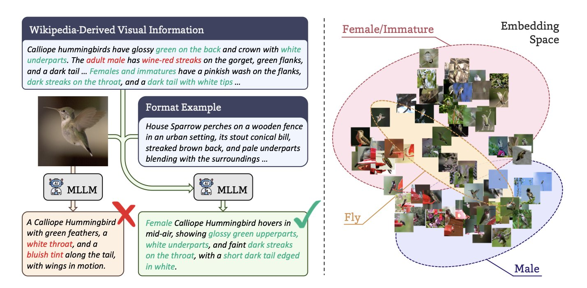
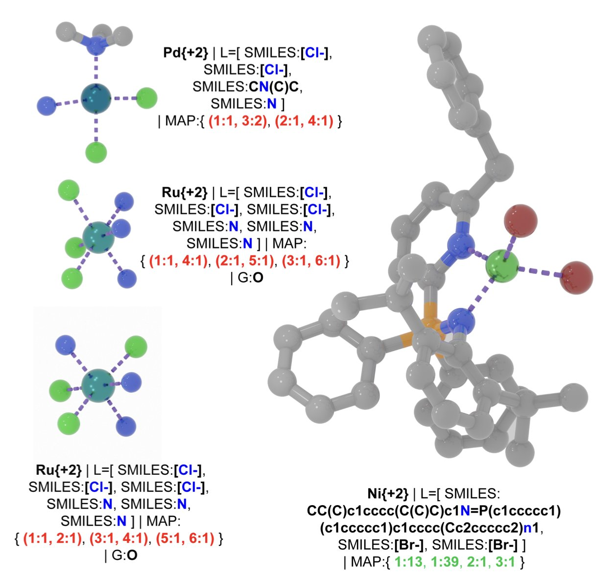
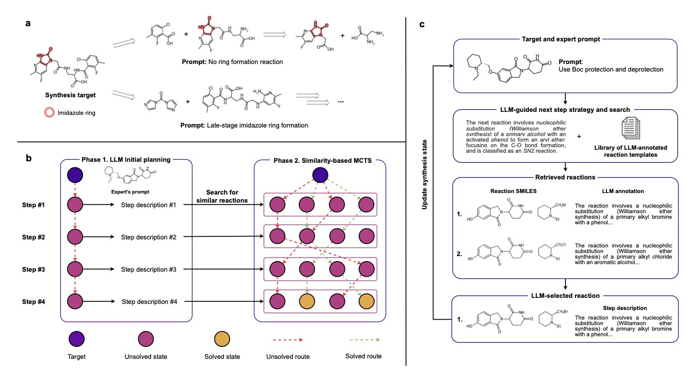
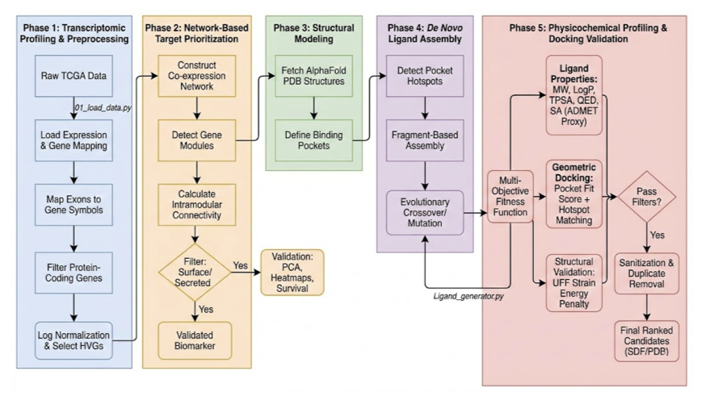
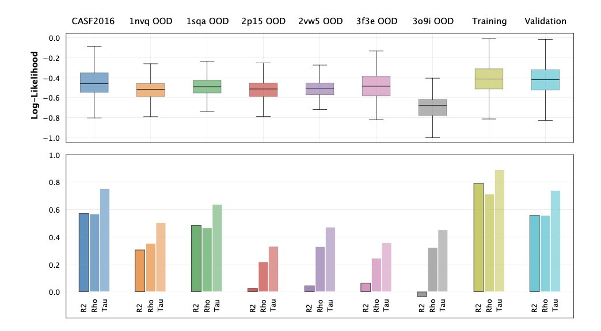

#### Table of Contents
1. By generating high-quality synthetic captions, BIOCAP solves the problem of missing text annotations for biological images, improving AI models' comprehension.
2. T-REX is a new molecular representation that encodes the complex 3D geometry of transition-metal complexes into simple text strings, expanding AI's potential in inorganic chemistry.
3. The Synthelite framework combines the reasoning power of large language models with the intuition of chemists, using natural language interaction to make computer-designed synthesis routes more practical for the lab.
4. Researchers have developed a computational framework that can design personalized drug molecules from scratch for acute myeloid leukemia (AML) patients based on their gene expression data, targeting their specific vulnerabilities.
5. Using a diffusion model, researchers built a "molecular anomaly detector" that can, without labels, identify protein-ligand complexes that an AI model has never seen and that might cause prediction errors.

## 1. BIOCAP: Using AI to Create Data So Models Can Understand Biological Images

In biology, we have no shortage of images. Microscope photos, species snapshots, tissue slides—the amount of data is staggering. What we lack are detailed text descriptions for these images. Most of the time, an image has only a simple label, like the species name "Felis catus" or cell type "HeLa." This information is too sparse for an AI model to learn the rich biological context within the image.

It's like teaching a child about the world by only saying "this is a cat," without ever describing its fur color, posture, or behavior. The child might learn to recognize a cat, but the understanding is shallow. Past models, like BIOCLIP, did just this, pairing images with simple labels. They worked, but they had a low ceiling.

**BIOCAP offers a solution: if you lack descriptions, use AI to create them.**

The key here isn't just to have a Multimodal Large Language Model (MLLM) look at a picture and generate text. Without constraints, the model would likely start making things up, generating descriptions that sound plausible but are factually incorrect—a phenomenon we call "hallucination."

The researchers designed a clever process to constrain the AI, ensuring it speaks like a biologist and bases its descriptions on facts.

**Here's how it works:**

1.  **Provide a factual basis:** First, the model extracts key visual information from a reliable knowledge base like Wikipedia related to the species in the image. For a picture of a bird, it would first learn about the species' typical feather color and beak shape. This is like giving the AI a reference book.
2.  **Set a descriptive framework:** Next, the researchers created specific description templates for different biological categories (taxonomic units). The template for an insect guides the AI to focus on its wings, antennae, and body segments, while the template for a mammal guides it to describe fur, limbs, and facial features. This is like giving the AI a writing outline.

With a "reference book" and a "writing outline," the MLLM can generate a precise description for a specific image that is both biologically accurate and visually relevant.

Let's look at the results. A BIOCAP model trained with these synthetic descriptions was 8.8% more accurate in species classification and 21.3% better at image-text retrieval than the previous BIOCLIP model. This is a significant improvement. It shows the model is no longer just guessing but truly understanding the biological concepts in the images. It knows that to distinguish between two birds, it needs to look at the details of their feathers and body proportions, not just a blurry outline.

This approach has broad potential. Imagine using it to automatically generate detailed morphological descriptions for vast collections of pathology slides, helping doctors spot early-stage disease. Or in drug screening, using it to describe subtle changes in cells after treatment with different compounds, which is critical for understanding a drug's mechanism of action.

Overall, BIOCAP provides a very practical engineering solution to a common pain point in biological AI: the scarcity of high-quality annotated data. It doesn't rely on algorithmic wizardry but instead creates the high-quality "fuel" that models need.

📜Title: BIOCAP: Exploiting Synthetic Captions Beyond Labels in Biological Foundation Models
🌐Paper: <https://arxiv.org/abs/2510.20095>

## 2. T-REX: AI Can Finally Read the 3D Structures of Metal Complexes

In our field, SMILES (Simplified Molecular Input Line Entry System) is a daily tool for turning organic small molecules into text that computers can read. It's a great tool, but it's mostly useless when it comes to Transition-Metal Complexes (TMCs).

What's the problem? The properties of metal complexes, from catalytic activity to optical characteristics, are intrinsically tied to their 3D coordination geometry. In a simple octahedral complex, just changing the position of a ligand can result in a completely new molecule with vastly different properties. Traditional 2D representations simply can't capture this critical stereochemical information. It's like trying to describe a complex sculpture using a flat drawing—too much information gets lost.

Now, researchers from ETH Zürich have developed a new tool called T-REX to tackle this long-standing problem.

The core idea behind T-REX is clever. It doesn't get bogged down in precise atomic coordinates but instead captures the essence of the geometric structure. It describes the geometry using "trans-pair maps." Simply put, with the metal atom at the center, it records which ligands are directly opposite each other. In an octahedral complex, for instance, there are three such pairs. This way, T-REX can compress a 3D geometry problem into a 1D text string. This string is not only canonical (unique) but also contains the essential geometric information.

With this new language, the first thing the researchers did was to re-examine existing databases. The results were startling. They discovered huge "geometric blind spots" in our past datasets. Many theoretically stable coordination isomers were never systematically cataloged because the old representations couldn't describe them. T-REX identified over 20,000 new, possible isomers, effectively doubling the known topological space. It’s as if we thought our map of the world was complete, only to discover two unknown continents next door.

The real power of this new language lies in what it enables for AI. The researchers demonstrated two very compelling applications.

First, large-scale exploration of chemical space. Starting with 658 known metal hydrides, they used T-REX's rules to perform modular ligand substitutions, like playing with LEGOs. They ended up generating a library of 2.3 million new, chemically plausible complexes. This scale of generation was unimaginable in the past.

Second, more accurate property prediction. A molecule's dipole moment is a physical property that is highly dependent on its 3D shape. Predicting it usually requires precise 3D coordinates, which is computationally expensive. The researchers trained a hypergraph neural network, giving it only T-REX strings and no 3D information. The model's accuracy in predicting dipole moments (R²=0.71) far surpassed that of models using traditional 2D bonding information (R²=0.52). This shows that the T-REX string itself contains enough geometric information for the AI to "visualize" the molecule's shape and make a more accurate judgment. This can save significant computational resources in high-throughput virtual screening.

Of course, T-REX currently focuses on mononuclear systems with lower coordination numbers. The authors plan to extend it to higher coordination numbers and polynuclear structures in the future.

This work provides a much-needed foundational language for AI-driven design in inorganic chemistry and materials science. For the first time, it allows machines to effectively understand and create metal complexes with specific 3D structures. Once this door is opened, the possibilities are vast.

📜Title: Taming T-REX: A Canonical Language for Geometry-Aware Generative Design of Transition-Metal Complexes
🌐Paper: <https://doi.org/10.26434/chemrxiv-2025-7s3gx>

## 3. Synthelite: An AI Chemist That Designs Synthesis Routes Using Plain Language

Anyone who does organic synthesis shares a common feeling: the retrosynthesis software on the market always seems a bit "out of touch." It can suggest a route that is theoretically possible, but it’s often not the one an experienced chemist would choose. It might ignore the sensitivity of a certain functional group or recommend an expensive starting material that our lab simply doesn't have.

The Synthelite framework in this new paper appears to be trying to solve this core problem. You can think of it as a very knowledgeable chemistry grad student who is quick on their feet and, most importantly, you can talk to them in plain language.

It works in a two-step process, which is a clever design.

First, you tell a Large Language Model (LLM) your ideas in natural language. For a target molecule, you might say, "I want to build this core heterocycle early," or "add that phenyl group in the last step with a Suzuki coupling." The LLM understands your strategic intent and then generates a preliminary synthesis plan in text. This plan is like a draft or an outline, for example: "Step 1, perform an amidation reaction with A and B; Step 2, cyclize the product..."

Second, this text "blueprint" is passed to a more classic algorithm: Monte Carlo Tree Search (MCTS). The task for MCTS is specific: it checks your lab's chemical inventory and, within the general direction set by the LLM, finds the most suitable specific reactions and starting materials to match the plan.

This two-step method separates "strategic thinking" from "tactical execution." The LLM handles high-level planning that resembles a human chemist's intuition, while MCTS performs precise search and optimization within a vast amount of data. This resolves a major pain point of past software, which was either too rigid or too fanciful to be practical.

The examples in the paper are compelling. For the same target molecule, the researchers fed it two different instructions: "early ring closure" and "late-stage coupling." Synthelite produced two completely different but equally plausible synthesis routes. This is precisely the kind of trade-off and thinking an experienced chemist engages in when designing a route. Now, an AI can do it too.

What's more, the framework has a degree of "chemical common sense" built into its route design. It evaluates a reaction's chemoselectivity, considers whether a functional group might "poison" a catalyst, and even determines if protecting groups are needed. This means the routes it generates aren't just connecting atoms; they are more chemically feasible and more likely to stand up to scrutiny in the lab.

Synthelite also performs well in synthesis tasks with restricted starting materials. For instance, in semi-synthesis or when upcycling waste materials, you can tell it directly: "You must start from this specific material, design a route for me." This is hugely valuable for the pharmaceutical industry, where chemists often modify an existing complex scaffold rather than starting from scratch.

Of course, the authors admit that the current framework relies on closed-source LLMs, which complicates reproducibility and fair comparison. The future direction will surely involve moving toward more open and transparent models.

Synthelite represents an important direction for synthesis planning tools: no longer about having a machine provide a standard answer, but about making the machine a capable assistant to the chemist. Through dialogue and collaboration, they can find the best solution together. The machine handles the exhaustive search and calculation, while the human provides the creative spark and strategic guidance.

📜Title: Synthelite: Chemist-aligned and feasibility-aware synthesis planning with LLMs
🌐Paper: <https://arxiv.org/abs/2512.16424>

## 4. A New Approach for AI Drug Discovery: Designing New Molecules One-on-One for AML Patients

In cancer drug development, we always face the tough problem of heterogeneity. This is especially true in diseases like Acute Myeloid Leukemia (AML), where each patient's cancer cells have their own unique molecular signature. Using one drug to treat all patients naturally leads to mixed results. The computational framework presented in this paper aims to tackle this problem head-on, to truly achieve "one person, one drug."

Here’s how the workflow goes.

First, find the patient's unique "Achilles' heel"—the drug target. The researchers obtained patients' RNA sequencing data, which is like a detailed list of gene activity. They then used a method called Weighted Gene Co-expression Network Analysis (WGCNA) to process this data. You can think of WGCNA as a detective that doesn't just look at the "volume" of individual genes but looks for which genes always "sing in chorus." These networks of co-acting genes often reveal the key pathways driving that specific patient's cancer. This way, they can lock onto high-value targets, such as certain metabolic transporters or immune-regulatory receptors.

Second, get a clear look at the target. Once you've found the target protein, you need to know what it looks like to design a drug that binds to it. This is where AlphaFold3 comes in. This powerful AI tool can predict a protein's 3D structure with considerable accuracy. With this structure, you have a clear blueprint of the lock.

Third, build a key from scratch. This is the most interesting part of the process: De Novo Drug Design. Instead of screening vast compound libraries, they developed a "reaction-aware evolutionary metaheuristic algorithm" to create new molecules from thin air. Let's break down that name:
*   **Reaction-aware:** It uses known chemical reactions to assemble the molecule. This ensures that the molecule is actually synthesizable in a lab.
*   **Evolutionary:** It mimics natural selection. The algorithm iteratively "mutates" and "crosses over" molecular fragments, selecting for candidates with better binding affinity and drug-like properties.

The final step is to verify if the key works well. A molecule that binds well isn't enough; it also needs good drug-like properties. The researchers performed computational predictions of ADMET (Absorption, Distribution, Metabolism, Excretion, Toxicity) properties for the generated candidates, filtering out those with obvious flaws. Then, they used Molecular Docking to precisely calculate the binding free energy between the molecule and the target.

The paper mentions a specific example, a candidate molecule called Ligand L1, which achieved a binding free energy of -6.571 kcal/mol for a key target. In the early discovery phase, this value is a decent starting point, indicating the molecule has the potential to be an effective inhibitor.

Putting the whole process together, you go from a patient's genetic data all the way to a custom-designed, potentially synthesizable, and preliminarily validated drug candidate. Of course, this is still the computational stage. The next step requires chemists to synthesize it in the lab and then validate its true effectiveness through a series of cell and animal experiments. But as a blueprint for achieving precision medicine, this workflow, which integrates systems biology and AI-driven molecular generation, presents a very compelling future.

📜Title: Transcriptome-Conditioned Personalized De Novo Drug Generation for AML Using Metaheuristic Assembly and Target-Driven Filtering
🌐Paper: https://arxiv.org/abs/2512.21301v1

## 5. A New Use for Diffusion Models: Spotting 'Anomalous' Molecules in Drug Discovery

In Computer-Aided Drug Design (CADD), we all rely on predictive models. But these models have an Achilles' heel: they are only confident about things that look like their training data. If you give them something new that they've never seen before—what's known as Out-of-Distribution (OOD) data—they might give you an answer that looks reasonable but is completely wrong, and they won't even know it. This can be fatal in drug development.

Imagine you train a model to predict the activity of kinase inhibitors, but then you accidentally feed it a ligand for a GPCR. The model might force itself to give you a prediction, but that value would be meaningless. We need a "gatekeeper" that, before the model makes a prediction, first determines if the molecule looks "familiar." This paper builds such a gatekeeper.

The researchers' idea is clever: they used Diffusion Models. You can think of a diffusion model as a master "image restorer." Its training process works like this: you start with a clear image (a real protein-ligand complex structure), then you continuously add noise to it until it becomes a chaotic mess of static. Then, you teach the model how to reverse the process, step-by-step, "denoising" the static back into the original clear image.

Once the model has mastered this restoration skill, we can use it to detect OOD data. Give it a new molecule and ask it to "restore" it. If the molecule is a type the model has seen before (in-distribution), the restoration process will be smooth, like driving on a familiar road. If the molecule is a strange thing it has never seen (OOD), the restoration process will be a "struggle," and the path will be more tortuous and unstable.

The core innovation of this work is that it unifies two completely different types of information—the continuous 3D geometric coordinates and the discrete atom/amino acid types—into a single continuous diffusion process. They use an embedding technique to map discrete atomic identities like carbon, nitrogen, and oxygen into a continuous, high-dimensional space. This allows the diffusion model to simultaneously handle both "where the atoms are" and "what the atoms are," learning the joint probability distribution of the entire molecular complex.

What's more interesting is that the researchers don't just look at the final restoration result (the likelihood score). They also analyze the features of the entire restoration "process." For example:
*   The path length of the restoration trajectory.
*   The variance of the trajectory.

Combining these process features with the final likelihood score is like a doctor diagnosing a patient not just by their temperature, but also by their pulse, breathing, and blood pressure. The resulting OOD judgment is far more reliable.

The researchers validated their idea on protein-ligand complexes. The results showed that their model could successfully identify protein families that were intentionally left out of the training data as OOD. More importantly, the OOD scores they calculated showed a strong correlation with the prediction errors of an independent binding affinity prediction model (GEMS). This means that when this "gatekeeper" shouts, "This molecule looks weird!" the downstream prediction model is indeed very likely to make a mistake.

The biggest advantage of this method is that it doesn't require labels. We have massive amounts of molecular structure data, such as in the Protein Data Bank (PDB), but data with high-quality activity labels is scarce. This tool can learn what a "normal" molecule is directly from the structural data itself, giving it huge potential for application in real-world research. It can equip our AI prediction models with a reliable "alarm system," improving the robustness of the entire drug discovery pipeline.

📜Title: Out-of-Distribution Detection in Molecular Complexes via Diffusion Models for Irregular Graphs
🌐Paper: <https://arxiv.org/abs/2512.18454>
