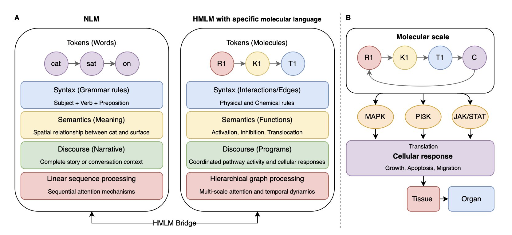
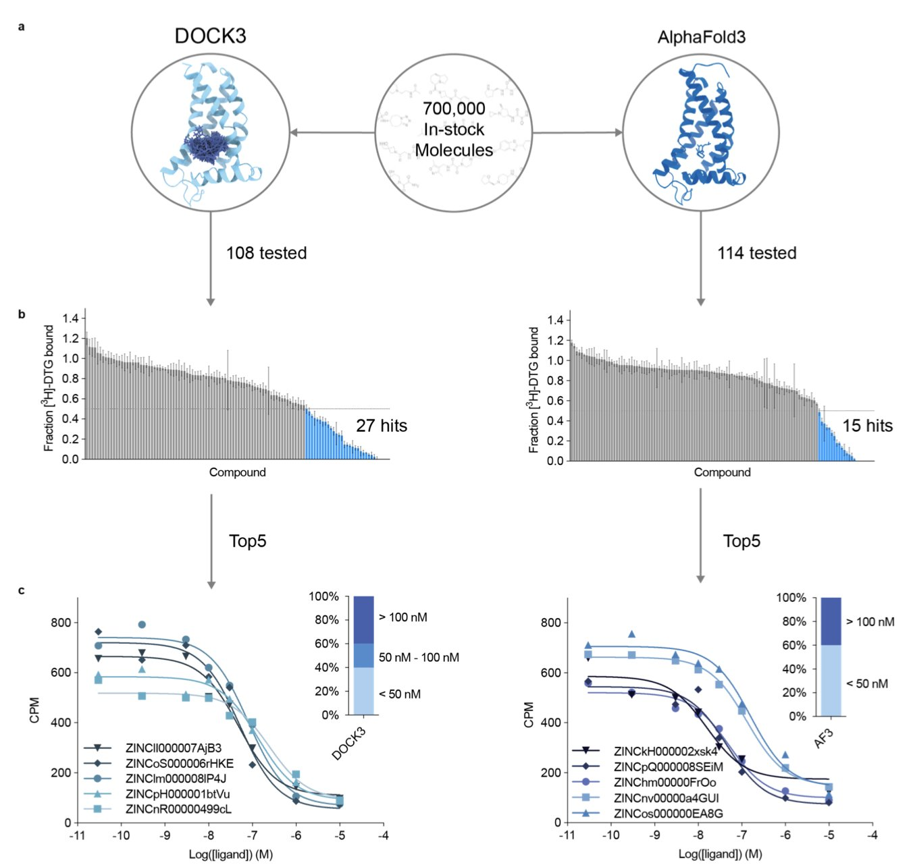
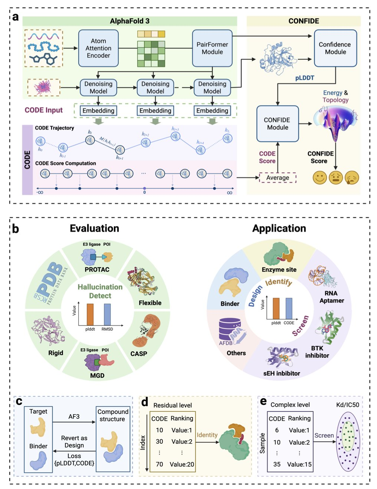
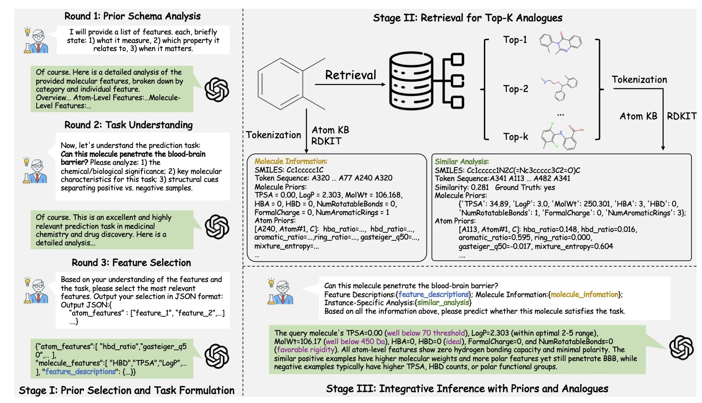
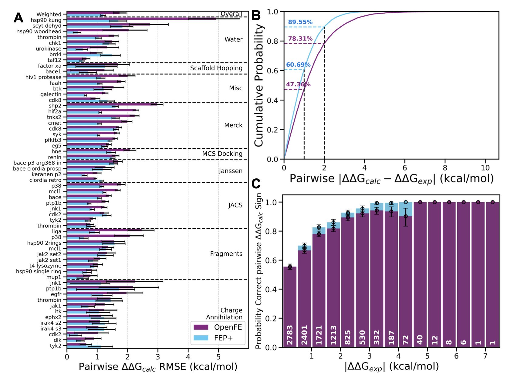

#### Table of Contents
1. HMLM treats molecules like words, using a hierarchical attention mechanism to accurately predict cell signaling dynamics. It significantly outperforms traditional models and has revealed potential drug target cross-talk between mTOR and STAT3.
2. AlphaFold3 shows promise in drug discovery, but for now, it acts more like a "memory expert" that assists traditional docking methods, not a "physicist" that can solve problems independently.
3. CONFIDE provides a reliability check for AI-predicted biomolecular structures by combining topological and energy assessments, solving the "AI hallucination" problem that has troubled drug development.
4. ChemATP enables general-purpose large language models to query and reason like a chemist by adding an external, atom-level knowledge base, all without retraining.
5. Large-scale real-world tests by 15 pharmaceutical companies have proven that the open-source tool OpenFE has reached an industrial-grade standard, offering a reliable new option for drug development with computational accuracy close to commercial software.

## 1. HMLM: Decoding Cell Signals Like a Language, and Beating GNNs

Anyone who has worked in systems biology or computational drug discovery knows that simulating cellular signal transduction networks is a tough problem. For decades, we have mostly relied on Ordinary Differential Equations (ODEs). They are beautiful in theory but painful in practice—you need to know the kinetic parameters for every single reaction, and those are often missing from real experiments. Then people started trying Graph Neural Networks (GNNs), treating molecules as nodes and interactions as edges. This was better, but GNNs often struggle to capture long-range, context-dependent effects.

A new preprint introduces a really interesting framework: **Hierarchical Molecular Language Models (HMLMs)**.

The authors' starting point is simple: **cell signaling is a type of language**.

In this model, each signaling molecule is a "word" (token), the interactions between them form the "grammar," and the resulting change in cell function is the "meaning." This isn't just a nice metaphor; this structure allows the model to handle context. Just like a word can have different meanings in different sentences, the same protein can have different functions in the context of different signaling pathways.

**How well does it work? The data is solid.**

The team tested it on the signaling network of cardiac fibroblasts. The results show that HMLM's mean squared error (MSE) was just 0.058. For comparison, it performed 30% better than a GNN and 52% better than a traditional ODE model. Most importantly, it remained highly robust even when time-sampled data was sparse—a common situation in drug development, where time-resolved experiments are expensive.

**Mechanistically, it wins because of the "hierarchy."**

HMLM doesn't just process molecules in a flat sequence. It uses a hierarchical architecture (aggregation, decomposition, and translation operators). This is a bit like how we read a scientific paper: we look at the specific experimental data (molecular scale), build a pathway map in our heads (pathway scale), and finally understand the paper's overall conclusion (cellular scale). This ability to integrate multiple scales is something traditional flat models can't do.

**What does this mean for people developing drugs?**

The model's internal Attention Maps are more than just pretty pictures; they reveal real biological connections. While analyzing the model's weights, the researchers discovered significant **cross-talk between the mTOR and STAT3 pathways**.

This is a very valuable clue. Anyone developing drugs for cancer or fibrosis knows that this kind of compensatory cross-talk between pathways is often the root cause of **drug resistance**. If we can spot these connections early on, we can design dual-target inhibitors or combination therapies sooner, instead of waiting for a clinical trial to fail before figuring it out.

This is a successful attempt to "lingualize" cell signaling dynamics. In the future, if combined with single-cell sequencing data, it could very well become a "foundation model" for cell biology.

📜Title: Hierarchical Molecular Language Models (HMLMs)  
🌐Paper: https://arxiv.org/abs/2512.00696v1

## 2. AlphaFold3's First Drug Discovery Test: Breakthrough or Assistant?

When AlphaFold3 (AF3) was released, the entire drug development community was buzzing. Everyone was asking the same question: can we throw out our docking software and just use AF3 to find new drugs?

Recently, a team at UCSF led by Brian Shoichet and J.J. Irwin posted a paper on bioRxiv that gives us the first detailed "road test report." They ran a series of tests to see what AF3 is really capable of. First was a "retrospective" test, like an open-book exam, to see if AF3 could pick out known active ligands from a pile of molecules. Then came the more important "prospective" test, a closed-book exam where they used AF3 to screen a real drug target—the sigma-2 receptor—and then bought the predicted molecules to test their activity in the lab.

The results were mixed. In the retrospective tests, AF3 performed well, even outperforming the established docking software DOCK3 on some tasks. This shows that if the database contains "relatives" that look like the molecule you're searching for, AF3 can recognize them quickly.

But that's also where the problem lies. The researchers found that AF3's success depends heavily on how many similar protein-ligand complexes it has "seen" in its training data. It's like a student who hasn't truly understood the laws of physics but has memorized all the practice problems and their answers. He can get a perfect score on problems he's seen before, or slight variations of them. But when faced with a completely new type of problem, he's stumped. AF3's performance dropped sharply when dealing with targets that were very different from its training set.

The real test came from the "in-the-field" screen against the sigma-2 receptor. They used both AF3 and DOCK3 to screen millions of molecules. AF3 did find a very potent hit compound with an affinity of 13 nM and a hit rate of 13%. This result, on its own, is impressive.

But efficiency is a major issue. AF3 took 16,000 GPU hours to complete the screen. In contrast, DOCK3 took only 100 GPU hours, making it two orders of magnitude more efficient. For drug discovery projects where speed and cost are critical, this gap is a deal-breaker.

So, back to the original question: can AF3 replace traditional docking? This study's answer is: not yet. It's more of a powerful new tool than an all-in-one replacement. It works more like a "pattern recognizer" than a "physics simulator" based on first principles.

One possible workflow could be to first use AF3 to run an initial screen on a huge compound library, quickly enriching for a set of promising molecules. Then, use a physics-based docking method like DOCK3 to score and rank this concentrated set more accurately. It's like a two-step process: first use AI for a broad search, then use a physics model for a detailed selection.

To make AF3 more powerful in the future, the key is to expand and diversify its training data. Only by "seeing" a wider variety of proteins and ligands can it evolve from "rote memorization" to true "understanding and reasoning."

📜Title: AlphaFold3 for Structure-guided Ligand Discovery  
🌐Paper: https://www.biorxiv.org/content/10.64898/2025.12.04.692352v1

## 3. CONFIDE: A New 'Quality Inspector' for AI Pharma That Ends Protein Hallucinations

Anyone in Computer-Aided Drug Design (CADD) has probably had this experience: AlphaFold gives you a beautifully predicted structure with a high pLDDT score, but when you try to validate it in an experiment, you find it can't possibly exist in the real world. These plausible-looking but incorrect structures generated by AI are called "hallucinations," and they are a huge bottleneck in our current workflows.

The pLDDT score, which we've long relied on, has a limitation. It's good at judging whether the local chemical environment is reasonable, like if the atoms around an amino acid residue are arranged correctly. It’s like a spell checker that can tell you every word is spelled right but can't tell you if the whole sentence makes sense. A structure with a high pLDDT score might look flawless locally, but globally, its polypeptide chain could be tangled in a physically impossible way.

This is the problem of "topological frustration." Imagine a newly synthesized polypeptide chain as a long telephone cord. It has to fold into its final shape without getting tied into a permanent knot. If the AI prediction makes this "cord" pass through a loop where it shouldn't, creating an unresolvable tangle, then the structure is physically impossible. pLDDT is mostly blind to this kind of global error.

The new CODE metric introduced in this study is designed specifically to solve this. Instead of relying on the final output structure, the researchers went deep inside AlphaFold's "black box" to analyze its latent diffusion embeddings during the structure generation process. This is like listening to the model's "inner monologue" as it builds the structure. When the model tries to arrange the peptide chain in an awkward, unnatural way, its internal data shows signs of this "struggle." CODE is the tool that captures and quantifies this signal.

The data strongly supports this. The correlation between CODE and experimentally measured protein folding rates (a good proxy for topological frustration) is 0.82. In contrast, the correlation between pLDDT and folding rates is only 0.33. This shows that CODE has truly captured a core element of the physics of protein folding.

With CODE as a powerful global checker, the researchers combined it with the local checker, pLDDT, to create a unified framework called CONFIDE. Now, we can assess both the local accuracy and the global physical plausibility of a predicted structure, getting a much more complete quality evaluation.

CONFIDE has shown its power in several very difficult drug discovery scenarios.
Take molecular glues. Predicting the structure of the ternary complex formed by a molecular glue, a target protein, and an E3 ligase is extremely difficult. The study showed that when evaluating these complexes, CONFIDE's correlation with the true structural deviation (RMSD) was 73.8% better than using pLDDT alone. This means it can help us more efficiently filter out unreliable computationally generated models, saving significant experimental resources.

Another example is predicting drug resistance. A single mutation in the BTK protein can cause a drug to fail. CONFIDE also performed exceptionally well in predicting how mutations affect drug affinity. Its predictions had a Spearman correlation of 0.83 with experimental data, whereas pLDDT showed almost no correlation. This gives us a powerful computational tool to proactively design next-generation drugs that can overcome resistance.

Even more interesting, CODE can also be used to identify an enzyme's catalytic site. The regions of topological frustration it measures are often the high-energy areas that enzymes evolved to carry out their catalytic functions. This application shows that CODE is not just a "quality inspector" but also a tool for functional discovery.

Overall, CODE and CONFIDE provide an unsupervised, interpretable set of tools that add a crucial layer of physical reality checking to AI structure prediction. This allows us to use these powerful AI models with much more confidence to accelerate the real process of drug discovery.

📜Title: Confide: Hallucination Assessment for Reliable Biomolecular Structure Prediction and Design  
🌐Paper: https://arxiv.org/abs/2512.02033

## 4. ChemATP: Letting Large Models Understand Chemistry Without Retraining

We all work with various Large Language Models (LLMs). They are smart—they can write code and poetry—but they often fail when faced with serious chemistry problems. The reason is simple: they haven't truly internalized the underlying physicochemical laws that govern the molecular world. The usual solution is "fine-tuning," which involves training a specific model on massive amounts of chemical data. This works, but it's expensive, and you still end up with a black box—it gives you an answer but doesn't tell you why.

ChemATP proposes a completely different path.

The idea is: instead of trying to cram all of chemistry into the model's brain, let's just give it a detailed chemistry "reference book" that it can consult anytime. This "reference book" is the first atomic-level text knowledge base built by ChemATP.

Think about how we usually represent molecules with SMILES strings. It's like a molecule's ID number—you know what it is, but you know nothing about its personality, appearance, or internal details. ChemATP's knowledge base is different. It records the properties of every atom in every molecule—like charge, radius, and bonding—in human-readable language. It's like creating a detailed profile for every single atom.

With this "reference book," ChemATP's workflow starts to look a lot like a real scientist's.

The first step is **Analyze**. When the model gets a chemistry question, like "predict this molecule's solubility," it doesn't just guess. It first analyzes the question to figure out what key chemical knowledge is needed to solve it. For example, it might determine that the "number of hydrogen bond donors/acceptors" and "polar surface area" are important features.

The second step is **Retrieve**. The model takes these key features and searches the knowledge base for the most similar "predecessors" or "neighbors" to use as reference cases. This is exactly like how we check the literature to see how others have made similar compounds before starting a new reaction in the lab.

The third step is **Integrate**. The model lays out everything on the table: the original question, the retrieved reference cases, and all the detailed, atom-level data from the knowledge base. Then, it uses its powerful general reasoning ability to synthesize all this information and provide a well-supported answer.

The benefits of this approach are obvious. First, its performance is strong. Experimental results show that this training-free, "plug-and-play" method can perform on par with specialized models that have been "force-fed" huge amounts of data.

Second, it's very flexible. ChemATP is an independent enhancement layer that you can attach to any large language model, whether it's GPT-4 or Llama. This means you aren't locked into any single technology provider and can always use the latest and most powerful "brain."

The most crucial point is that it solves the "black box" problem. With traditional AI models, we can only choose to trust the answer or not. But ChemATP shows you its entire thought process: "I think this molecule is highly active because I referenced these known active molecules and noticed they all have a negatively charged atom at a key position, which your molecule also has." This level of transparency is essential for high-stakes fields like drug discovery. It lets us know not just the answer, but the chemical logic behind it, ensuring that our decisions are based on sound scientific principles.

📜Title: ChemATP: A Training-Free Chemical Reasoning Framework for Large Language Models  
🌐Paper: <https://arxiv.org/abs/2512.19240v1>

## 5. OpenFE: An Open-Source FEP Tool Put to the Test by 15 Pharma Companies

In drug discovery, we always want to know how strongly a molecule binds to its target. Free Energy Perturbation (FEP) calculations do just that. They can predict how small changes to a molecule's structure will affect its binding affinity, making them a powerful tool in Computer-Aided Drug Design (CADD). The problem is, the most accurate FEP tools are usually commercial software, which is expensive and often a black box. Now, an open-source project called OpenFE is stepping up to change that.

Recently, 15 pharmaceutical companies, including many big names we all know, jointly published a major evaluation. They wanted to find out if the free OpenFE tool could actually be useful in a real industrial R&D setting. They tested it on over 1,700 ligands, using data from both public benchmark datasets and their own proprietary, never-before-seen project data.

Let's look at the results. On the relatively "clean" public datasets, OpenFE performed quite well, with a weighted root mean square error (RMSE) of 1.72 kcal/mol. In FEP calculations, an error under 1 kcal/mol is considered very accurate, and 1-2 kcal/mol is well within the acceptable range. In this test, 10 of the systems even achieved sub-kilocalorie accuracy, which is the gold standard.

The interesting part is its performance on the private datasets. Here, the RMSE increased to 2.44 kcal/mol. This number might look worse, but it actually reflects the reality of industrial R&D. In real projects, molecules are larger and more complex, targets are more flexible, and the experimental data itself can be noisy. This result shows that OpenFE can stand up to real-world complexity, not just produce good results on idealized textbook cases.

The researchers also compared OpenFE to the industry benchmark, Schrödinger's FEP+. The results showed that on ranking problems, like determining "which molecule is better," OpenFE's performance was comparable to FEP+. This means it can effectively guide molecular optimization. However, in terms of the absolute error values, OpenFE still has room to improve.

The most valuable part of this study is that it didn't shy away from problems. It honestly analyzed the sources of error. The researchers found that no single factor was the main culprit. The quality of the input molecular conformations, the accuracy of the atom mapping (which defines the transformation path between two molecules), and the type of transformation (like a change in charge) all affect the final result.

Based on these findings, the authors laid out a clear roadmap for improvement. For example, developing better atom mapping algorithms to prevent calculations from taking inefficient paths; introducing enhanced sampling methods to ensure molecular conformations are fully explored; and supporting more challenging systems, like membrane proteins and molecules that undergo ring-opening/closing changes. These are all cutting-edge challenges in FEP technology.

For those of us on the front lines of drug development, this work is significant. It proves that community-driven, open-source scientific software, through close collaboration with industry, is fully capable of developing top-tier tools that can rival commercial software. OpenFE is no longer an academic toy; it is a reliable tool ready to make a real impact in drug discovery projects.

📜Title: Large-scale collaborative assessment of binding free energy calculations for drug discovery using OpenFE  
🌐Paper: https://doi.org/10.26434/chemrxiv-2025-7sthd
