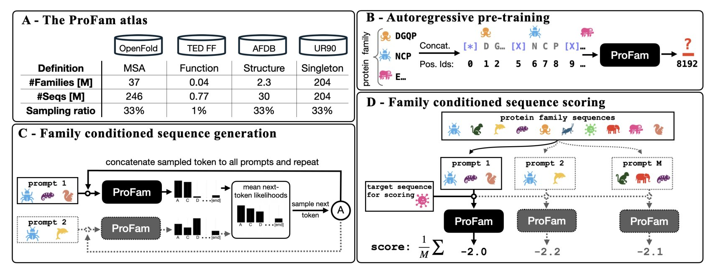
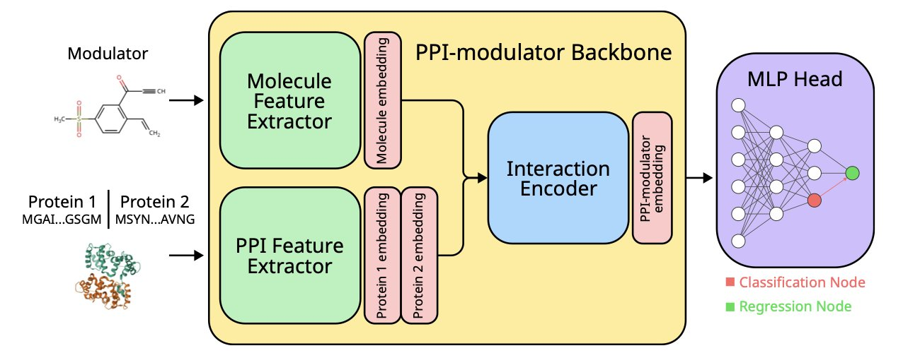
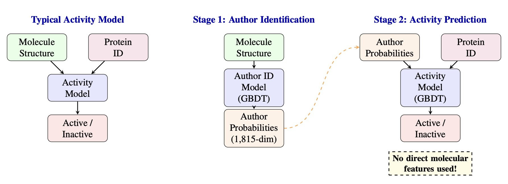
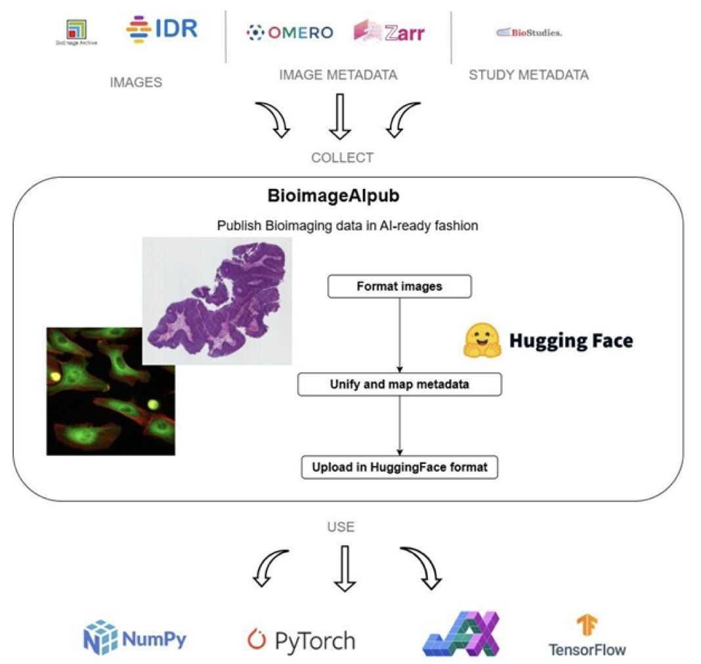
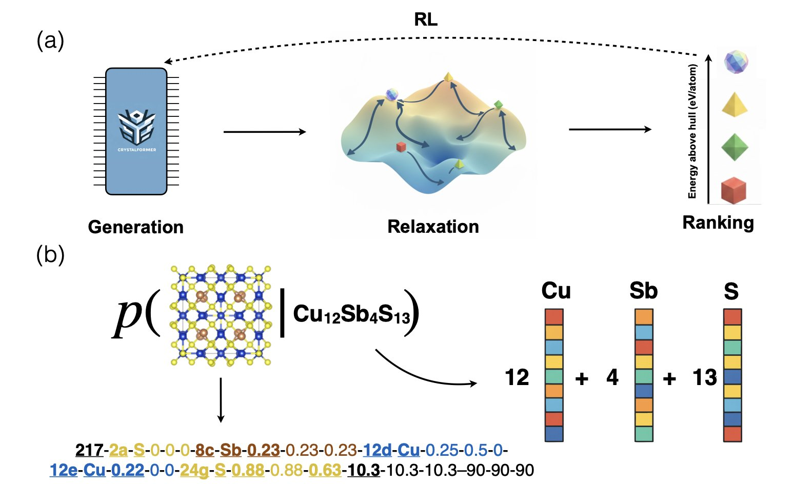

#### 目录  
1. ProFam-1 是一个开源的蛋白质家族语言模型，它通过类似 GPT 的「下一个氨基酸预测」训练，实现了顶尖的零样本（Zero-shot）功能预测性能，并能统一处理替换、插入和缺失等各类突变。
2. 这项研究通过将人工智能与高通量筛选数据相结合，成功开发了一套新流程，显著加速了针对 NCS-1 这类难成药蛋白相互作用靶点的调节剂发现。
3. AI 药物发现模型可能不是在学习构效关系，而是在识别合成这些分子的化学家的个人风格，这是一种隐藏极深的数据泄露。
4. BioimageAIpub 是个实用的工具箱，它把实验室里乱七八糟的生物图像数据，快速变成 AI 能直接用的标准化数据集，解决了数据准备这个老大难问题。
5. CrystalFormer-CSP 框架将 AI 模型的快速生成能力与物理优化的精确性相结合，为晶体结构预测提供了一个既快又准的解决方案。

## 1. ProFam 开源模型：像写句子一样设计蛋白质  
  
  

蛋白质语言模型（pLM）现在遍地开花，我们已经见过了基于 BERT 掩码机制的（比如 ESM 系列），也看到了基于扩散模型的。这次，研究者们换了个思路，回到了语言模型最经典的设计之一：自回归（Autoregressive）模型，也就是类似 GPT 的工作方式。ProFam 这个模型就是基于这个思路构建的。  
  
**工作原理：像「完形填空」一样预测蛋白质**  
  
很多蛋白质语言模型的工作方式像是在做「填空题」。它们拿到一个蛋白质序列，随机遮住（Mask）几个氨基酸，然后让模型去猜被遮住的是什么。这种方法对于预测单个氨基酸替换（Substitution）的效果很好。但是，当遇到氨基酸的插入或删除（Indels）时，这种「填空题」模式就有点力不从心了。  
  
ProFam 的做法不一样。研究者们把同一个蛋白质家族里许多相关的序列（同源序列）首尾相连，拼接成一个长长的序列。然后，他们训练模型去做一件事：根据前面的氨基酸，预测紧邻的下一个氨基酸是什么。  
  
这就像训练 GPT 写句子一样，根据「今天天气很」来预测下一个词是「好」。因为模型在训练时看过了同一个家族里长长短短、略有差异的各种序列，它就自然而然地学会了蛋白质序列的「语法」和「风格」。它不仅知道哪个氨基酸可能出现在某个位置，还学会了在什么地方可能会多一个或少一个氨基酸。  
  
这种方法最巧妙的地方在于，它用一个统一的概率框架（Likelihood）就把替换、插入和删除这几种最主要的突变类型都包含了进去，不需要为不同突变类型设计专门的处理逻辑。  
  
**数据是关键：ProFam Atlas 数据集**  
  
一个模型的好坏，很大程度上取决于它的训练数据。研究者们为此专门构建了一个名为「ProFam Atlas」的庞大数据库。这个数据库整合了来自 AlphaFold DB、TED FunFams 等多个来源的数据，包含了大约 4000 万个蛋白质家族，总计约 4.81 亿条序列。  
  
关键在于，他们训练的是「蛋白质家族」的概念，而不只是零散的序列。这让模型能够更好地理解序列之间的进化关系和保守模式。更重要的是，这个高质量的数据集也完全开放给了社区。  
  
**性能怎么样？用数据说话**  
  
在蛋白质模型「高考」考场 ProteinGym 基准测试上，ProFam-1 在不做任何针对性微调（Zero-shot）的情况下，对替换突变的功能预测斯皮尔曼相关系数（Spearman ρ）达到了 0.47，对插入/删除突变的预测更是达到了 0.53。  
  
这个 0.53 的成绩尤其亮眼，因为 Indels 一直是很多模型的软肋。这直接证明了它那种「下一个氨基酸预测」的训练策略确实有效。  
  
**生成序列，提升结构预测精度**  
  
这个模型除了能「打分」，还能「写作」。你可以给模型一个蛋白质序列作为「引子」（Prompt），让它生成一堆功能相似但序列不同的新蛋白质。这些生成的序列可以组成一个合成的多序列比对（synthetic MSA）。  
  
MSA 对于 AlphaFold 或 ColabFold 这类结构预测工具至关重要。它们通过分析 MSA 中哪些位置的氨基酸协同进化，来推断它们在三维空间中的距离。对于那些在自然界中亲戚很少的「孤儿蛋白」，很难找到有效的 MSA。  
  
研究者发现，用 ProFam 生成的 MSA，能将 ColabFold 的结构预测准确度（lDDT 分数）从 0.5（没有 MSA）提升到 0.7。虽然离天然 MSA 的 0.9 还有差距，但这已经是巨大的进步了，为研究孤儿蛋白结构提供了一个强有力的新工具。  
  
最后，这个项目的所有代码、模型权重和数据都以非常宽松的许可证发布。这意味着任何学术实验室或小公司都可以直接拿来用，针对自己感兴趣的蛋白家族进行微调和设计，大大降低了蛋白质工程的门槛。  
  
📜Title: ProFam: Open-Source Protein Family Language Modelling for Fitness Prediction and Design  
🌐Paper: https://www.biorxiv.org/content/10.64898/2025.12.19.695431v1  
💻Code: https://github.com/alex-hh/profam/  

## 2. AI 助力 NCS-1：攻克蛋白相互作用难成药靶点  
  
  

在药物研发圈子里，蛋白 - 蛋白相互作用（PPI）一直是个让人又爱又恨的领域。  
  
一方面，它们控制着几乎所有的关键细胞过程，是极具潜力的治疗靶点；另一方面，从化学角度看，PPI 的接触面往往平坦且缺乏特征，不像传统的酶或受体那样有一个明显的「口袋」让小分子药物去结合。所以，像 NCS-1（Neuronal Calcium Sensor 1）这样的蛋白，长期以来都被贴着「难成药」（undruggable）的标签。  
  
但这篇最新的研究展示了一个有趣的突破口。  
  
研究者没有沿用传统的暴力筛选逻辑——也就是盲目地测试数百万种化合物，看谁运气好能撞上靶点。相反，他们引入了人工智能作为筛选流程的「大脑」。  
  
这里的工作原理很直观：研究者利用机器学习模型，处理已有的高通量筛选数据。你可以把它看作是一个经验丰富的药物化学家，通过学习大量已知的相互作用模式，迅速掌握了什么样的分子结构最有可能干扰 NCS-1 的相互作用。  
  
这种做法解决了两个痛点：  
  
首先是**效率**。传统的药物发现往往在筛选阶段耗费巨资，且假阳性率高。这个 AI 模型通过在多样化的数据集上训练，学会了区分「真正的信号」和「背景噪音」。它能在实际进行昂贵的湿实验之前，就先在计算机上进行一轮高精度的预测，把最有希望的化合物挑出来。  
  
其次是**泛化性**。很多 AI 模型只能在特定的数据集上表现良好，换个环境就「水土不服」。但这项研究表明，该模型具备很好的通用性，能预测之前从未见过的调节剂结构。  
  
对于从事计算辅助药物设计（CADD）或药物化学的人来说，这个案例非常有价值。它再次证明，AI 在药物研发中不应只是一个炒作的概念，而是一个实实在在的工具。当计算生物学与传统的药理学筛选紧密结合时，我们就有机会撕开那些曾经被认为无法攻克的坚固防线，找到新的治疗机会。  
  
📜Title: An AI-Based Approach Accelerates the Discovery of Protein-Protein Interaction Modulators Targeting NCS-1  
🌐Paper: <https://doi.org/10.26434/chemrxiv-2025-ctmm6>  

## 3. AI 制药模型在作弊？它在识别化学家的个人风格  
  
  

你听说过「汉斯」吗？那是一匹 20 世纪初的马，看起来会算术，能用蹄子敲出正确答案。但后来人们发现，它并不是真的会计算，只是在敏锐地观察提问者无意识的身体语言，比如一个微小的点头，然后在正确答案那里停下来。  
  
现在，化学领域也出现了自己的「聪明汉斯」。一篇新论文指出，我们用来预测分子活性的机器学习模型，可能就像那匹马一样，只是在「察言观色」，而不是真的理解了化学。  
  
这里的「眼色」，指的是合成这些分子的化学家所特有的「风格」。  
  
就像画家有自己的笔触和主题偏好，化学家也有。有些化学家钟爱某些特定的化学骨架（scaffold），有些则对特定的官能团情有独钟，或者长期专注于某一类靶点。这些偏好日积月累，就成了他们作品中难以磨灭的「签名」。  
  
研究者们做了一个非常巧妙的实验。  
  
第一步，他们把 ChEMBL 数据库里的分子和发表这些分子的论文作者关联起来，建立了一个包含 1815 位高产化学家和他们作品的数据集。  
  
然后，他们训练了一个分类器，任务很简单：只给模型看一个分子结构，让它猜这是谁的作品。  
  
结果让人大吃一惊。模型的 top-5 准确率达到了 60%。这意味着，在五个候选人里，模型有六成的把握猜对。这个准确率高得有点吓人，直接说明化学家的「个人风格」确实非常明显，已经成了可以被机器识别的信号。  
  
接下来是真正的高潮部分。  
  
研究者训练了另一个模型来预测分子活性，但他们做了一件「反常」的事：完全不给模型看分子的结构信息。  
  
想象一下，你让一个模型去预测一个分子的生物活性，却不告诉它这个分子长什么样。这听起来像天方夜谭。  
  
取而代之，模型只得到了两个信息：分子的目标蛋白，以及第一个模型预测出的「作者身份概率」。  
  
结果，这个「盲人」模型，仅凭「这可能是张三的作品」和「目标是蛋白 X」这两个线索，其预测效果竟然和一个能看到完整分子结构的普通模型不相上下。  
  
这对做药物发现的人来说，意味着什么？  
  
这意味着我们赖以评估模型的公共基准数据集（benchmark）可能存在严重缺陷。当我们在 ChEMBL 这样的数据集上测试一个新模型时，我们以为是在检验它理解结构 - 活性关系（SAR）的能力。但这项研究告诉我们，模型可能根本没学 SAR，它只是学会了走捷径。  
  
它可能学会了：「哦，这个分子骨架是 A 实验室的风格，他们总是在做激酶抑制剂，那这个分子活性应该不错。」  
  
这不是我们想要的智能，这是投机取巧。这是一种隐藏在数据深处的「泄露」（leakage），比简单的分子重复要隐蔽得多，也更难防范。  
  
好在，研究者也提出了解决方案：建立「作者分离」的数据集划分方式。  
  
也就是说，当划分训练集和测试集时，要确保同一个作者（或同一个实验室）的分子不会同时出现在两者之中。如果训练集里的分子都是 A、B、C 实验室做的，那测试集里的分子就必须来自 D、E、F 实验室。这样一来，模型就没法靠「认人」来作弊了。  

📜Title: Clever Hans in Chemistry: Chemist Style Signals Confound Activity Prediction on Public Benchmarks  
🌐Paper: https://arxiv.org/abs/2512.20924v1  

## 4. BioimageAIpub：告别生物图像数据处理的 80% 苦力活  
  
  

做生物图像分析，尤其是想用 AI 搞点事情的人都遇到过：你花大价钱买了高内涵筛选设备，拍了无数张精美的细胞图片，结果发现这些数据就像一堆写满了不同外星语的藏宝图。在真正开始「寻宝」（也就是训练模型）之前，你得先花掉 70% 甚至 80% 的时间去做「翻译和整理」的苦力活。数据格式五花八门，元数据（Metadata）要么缺失，要么散落在各个角落，简直让人头疼。  
  
BioimageAIpub 这个工具箱，就是来终结这种混乱局面的。你可以把它想象成一个「生物图像数据自动化打包上传流水线」。  
  
它的工作逻辑是这样的： 
  
第一步，告诉它你的数据在哪。无论数据是躺在你本地的服务器硬盘里，还是存在亚马逊的 S3 云存储上，它都能去抓取。  
  
第二步，处理元数据。这是最关键的一环。一张没有上下文信息的生物图片，科学价值会大打折扣。这个工具能从 OMERO 或 IDR 这类图像数据管理系统中自动提取注释信息，比如 RNAi 实验中敲低了哪个基因，或者药物筛选中用了什么化合物、什么浓度。你也可以手动补充额外信息。  
  
第三步，标准化处理。它会把原始图像转换成 OME-Zarr 这样的标准格式，然后把所有零散的元数据整理成一个干净的 CSV 文件。这个过程，就好比把所有外星语的藏宝图都翻译成了统一的、机器可读的语言。  
  
最后一步，一键发布。它能把打包好的数据集直接上传到 HuggingFace。HuggingFace 现在是机器学习领域事实上的「GitHub」，是模型和数据集的集散地。把数据发布到这里，意味着全世界的 AI 专家都能立刻发现并使用你的数据。而且，那个整理好的 CSV 文件还能激活 HuggingFace 的数据集预览功能，别人不用下载几个 G 的数据，就能先看看你的数据质量如何。  
  
这个工具的价值不在于它发明了什么全新的 AI 算法，而在于它解决了通往 AI 应用道路上最泥泞、最耗时的一段路。研究人员可以把精力重新聚焦在科学问题上，而不是整天跟文件格式和数据清洗作斗争。  
  
他们已经用这个工具发布了一个来自 IDR 数据库的 RNAi 敲低筛选数据集，现在每个月有超过 1200 次的下载量。这说明需求是真实存在的。一个原本可能被锁在数据库深处的数据集，现在正在被全球的研究者使用，这本身就加速了科学的进程。  
  
接下来，作者计划支持更多的生物图像格式和元数据来源，甚至想用大语言模型（LLM）来自动生成数据集的说明文档。这是个很想法，能进一步把研究人员从繁琐的文档工作中解放出来。  
  
📜Title: BioimageAIpub: a toolbox for AI-ready bioimaging data publishing  
🌐Paper: https://arxiv.org/abs/2512.15820v1  

## 5. AI 晶体预测新范式：快思慢想，加速材料与药物发现  
  
  

在材料科学和药物研发领域，预测一种分子的晶体结构（Crystal Structure Prediction, CSP）是个出了名的硬骨头。这就像让你在不知道任何规则的情况下，用一堆乐高积木搭出最稳固的城堡。分子的不同晶型（polymorphs）会直接影响药物的溶解度、稳定性和生物利用度，这背后是数十亿美元的研发风险。过去我们主要靠两种方法：要么是基于物理原理的「暴力」计算，非常准但慢得让人绝望；要么是纯数据驱动的方法，速度快，但有时会猜出一些不符合物理规律的「空中楼阁」。  
  
现在，研究者们提出了一个叫 CrystalFormer-CSP 的新框架，它的思路很有意思，借鉴了诺贝尔奖得主丹尼尔·卡尼曼的「快思与慢想」理论。  
  
**第一步：快速思考，生成猜想**  
  
框架的「快思考」系统是一个自回归 Transformer 模型。你给它一个化学式，它就像一个经验丰富的化学家，凭借「直觉」（从海量数据中学到的模式）快速生成一批看起来靠谱的初始晶体结构。  
  
这里的精髓在于，它不是在三维空间里凭空乱放原子。研究者将晶体的「空间群对称性」这一基本物理规则，作为一种归纳偏置（inductive bias）整合到了模型里。这相当于在玩乐高之前，直接告诉你：「所有对称的结构才是更稳定的。」这一下就排除了无数种不靠谱的组合，让模型的初始猜想质量大大提高。  
  
**第二步：慢速思考，精细验证**  
  
有了这些初始猜想，就轮到「慢思考」系统登场了。这个系统是一个机器学习力场（Machine Learning Force Field, MLFF）。它会对 Transformer 生成的每个结构进行精细的能量优化和弛豫计算。  
  
这个过程就像一位工程师拿着初始设计图，用高精度的物理仿真软件去检查每一处细节，计算应力，移动原子，直到整个结构达到能量最低、最稳定的状态。这一步保证了最终输出的结构是符合物理规律的，是「真实存在」的。  
  
**闭环：让「快思考」向「慢思考」学习**  
  
最巧妙的设计在于，这个过程不是单向的。研究者引入了强化学习（Reinforcement learning, RL）机制。  
  
「慢思考」系统完成物理验证后，会给「快思考」系统一个反馈。如果某个初始猜想最终优化成了一个能量极低的稳定结构，系统就会给出一个「奖励」信号，告诉 Transformer：「你这个猜想很棒，下次多往这个方向想。」反之，如果一个猜想最终很不稳定，就会得到「惩罚」。  
  
通过这种方式，生成模型不断从物理模拟的结果中学习，它的「化学直觉」会变得越来越准。  
  
对做研发的人来说，这意味着什么？我们得到了一个兼具速度和准确性的强大工具。它不仅能预测已知材料的晶体结构，还能发现新的、能量更低的晶型，这对于药物固相筛选和新材料设计至关重要。而且，作者还提供了网页界面，让这个工具不再是计算专家的专利，普通实验科学家也能轻松上手。  
  
这个框架未来的方向是预测有机晶体，这直接切中了药物研发的痛点。如果它能成功，我们就能在研发早期更准确地预测候选药物的成药性，避开那些因为晶型问题而注定失败的「坑」。  
  
📜Title: CrystalFormer-CSP: Thinking Fast and Slow for Crystal Structure Prediction  
🌐Paper: <https://arxiv.org/abs/2512.18251>
