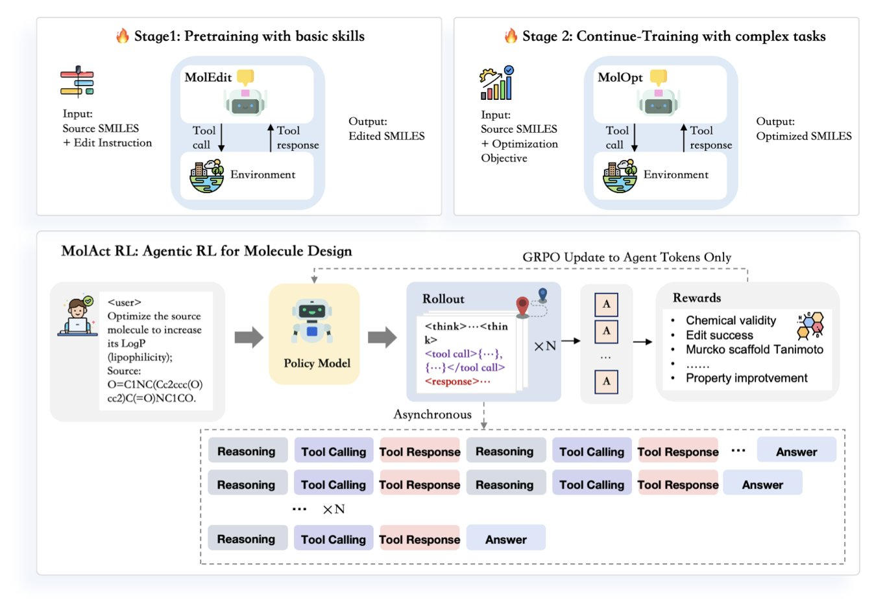
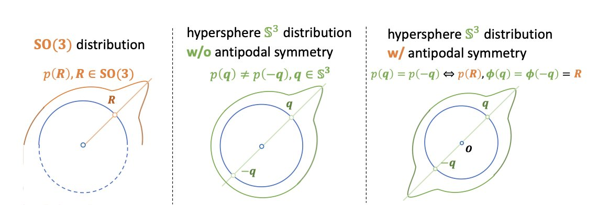
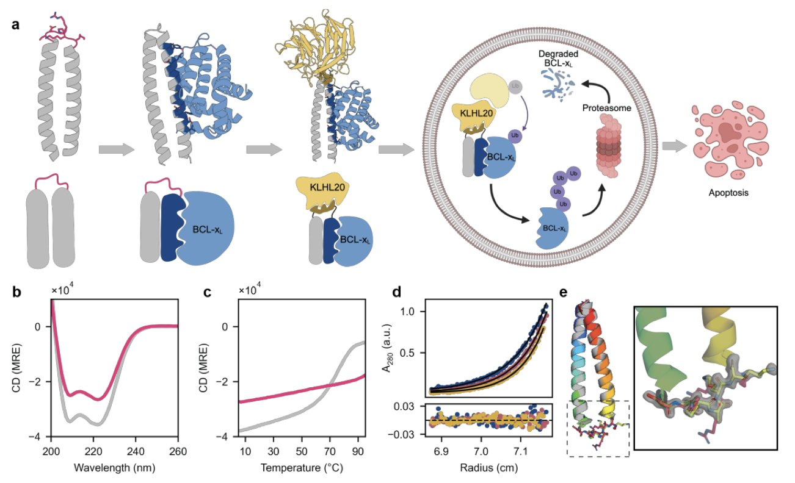
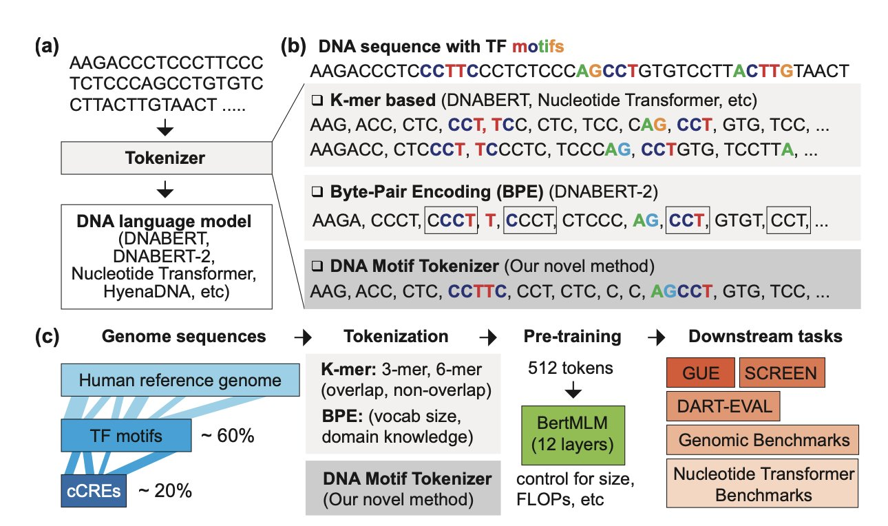
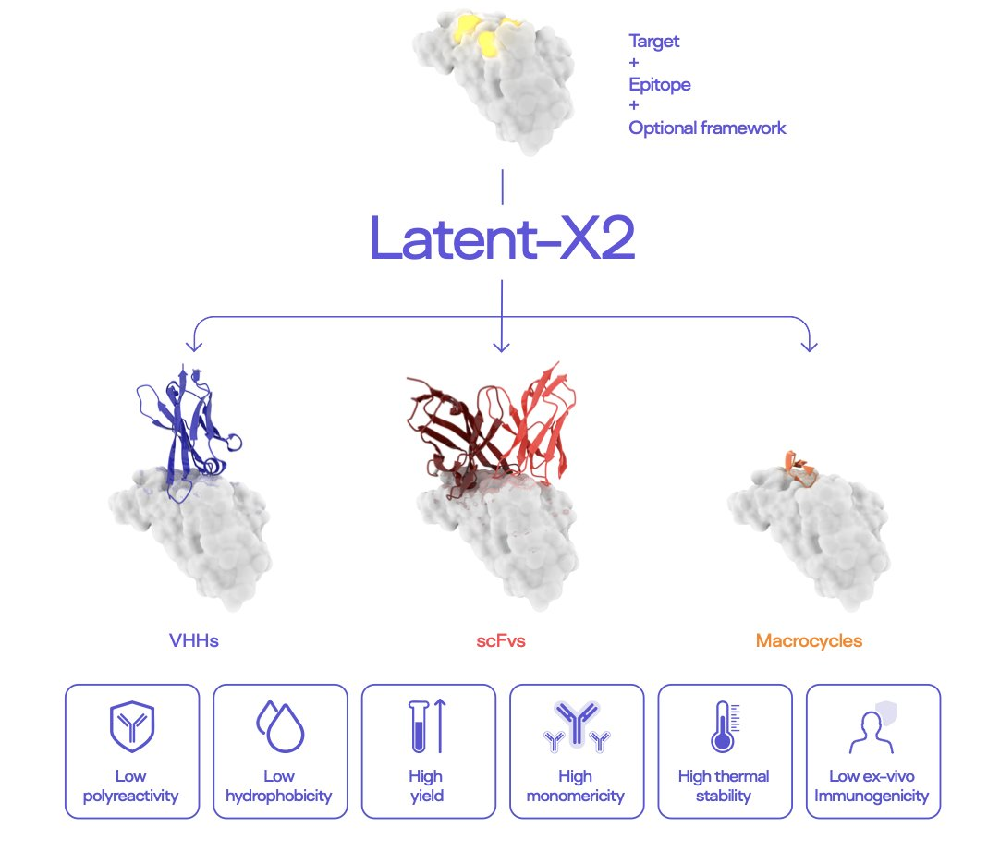

#### 目录  
1. MolAct 框架让大模型扮演一个会用工具的「智能代理」，通过两阶段强化学习，先学基本功再做优化，证明了在分子设计中，模型不仅要「懂」化学，更要「会」操作。
2. ProBayes 模型通过统一的贝叶斯流框架，同时设计蛋白质的骨架、序列和侧链，解决了信息捷径问题，提升了全原子级别蛋白质设计的准确性和效率。
3. 从头设计的双功能蛋白可作为高效的靶向降解剂，为超越小分子 PROTACs 的药物开发提供了模块化新平台。
4. 通过将已知的 DNA 功能基序 (motif) 直接整合到词汇表中，研究者开发出一种新的分词器，它能让基因组语言模型更准确、更可解释地理解 DNA 序列。
5. Latent-X2 模型能一步生成高亲和力、低免疫原性且成药性好的抗体，无需后续优化，解决了 AI 制药的关键瓶颈。

## 1. MolAct：让 AI 像化学家一样思考和修改分子  
  
  

做药物发现，每天的工作本质上就是分子编辑。拿到一个苗头化合物，我们想办法这里加个基团，那里换个原子，看看能不能提高活性、改善 ADME 属性。这个过程充满了试错、推理和依赖经验。现在，一篇新论文提出的 MolAct 框架，试图让 AI 用一种非常类似化学家的方式来做这件事。  
  
这套方法的核心，是把 AI 变成一个「智能代理」 (Agent)。你可以把它想象成一个坐在电脑前的虚拟化学家。它不是简单地凭空生成一个新分子，而是像我们一样，一步一步地对现有分子进行修改。  
  
它的工作原理是这样的，分为两个阶段。  
  
第一阶段是「上学」。这个阶段，AI 的任务是学习最基本的化学操作：在一个分子上添加一个原子、删除一个官能团，或者把一个基团换成另一个。这时候它不追求任何优化目标，只要求做出的修改是化学上「合法」的。这就像我们刚开始学有机化学，先要掌握各种基本反应，知道什么能做，什么不能做。  
  
第二阶段是「做项目」。AI「学成毕业」后，就接到一个具体的优化任务，比如提高分子的脂水分配系数 (LogP)。它会看着起始分子，开始思考：「为了提高 LogP，我应该增加分子的疏水性。或许可以在这个苯环上加一个甲基？」于是，它执行「添加甲基」这个动作。  
  
接下来是关键一步：它会使用外部「工具」来评估结果。这些工具可以是化学信息学软件，用来检查修改后的分子是否依然有效，或者是一个预测模型，用来计算新的 LogP 值。得到反馈后——「很好，LogP 确实提高了」——它会基于这个新分子，规划下一步的修改。整个过程就是这样一个「思考 - 行动 - 反馈」的循环，直到达到目标或者用尽步数。  
  
这种整合外部工具的思路，让整个流程非常接近真实世界里的研发。我们化学家也是这样，有了想法，就在软件上画出结构，然后调用预测工具看看结果怎么样。MolAct 把这个工作流给自动化了。  
  
那么，效果如何？研究者发现，模型的大小至关重要。他们训练了一个 7B 参数的模型 (MolOptAgent-7B) 和一个 3B 的小模型。结果显示，7B 的大模型在执行多步优化任务时表现明显更好。  
  
这里有一个很有意思的现象：3B 的小模型其实「知道」什么样的分子更好（它的奖励模型拟合得不错），但它就是无法有效地规划出一系列操作来实现那个好结果。它常常在中间步骤卡住，或者很快就用完了互动次数。这完美诠释了「知道」和「做到」之间的差距。这就像一个初级化学家，他可能背了很多理论知识，但你让他设计一条合成路线，他就没思路了。而 7B 模型则更像一个资深化学家，不仅知识渊博，还能制定并执行一个多步计划。  
  
当然，这个框架也有它的局限。首先，它严重依赖外部工具的准确性。如果你的性质预测模型本身就不准，那 AI 代理就会被误导，所谓「garbage in, garbage out」。其次，它目前还没有考虑分子的合成可及性。一个在电脑上看起来再完美的分子，如果实验室里做不出来，那也是白搭。  
  
尽管如此，MolAct 提出的这种「代理」范式是一个重要的进步。它让 AI 的工作方式从神秘的「黑箱」生成，变得更像一个透明、可解释的化学家推理过程。这不仅让结果更可靠，也让我们更容易理解和控制 AI 的设计思路。  
  
📜Title: MolAct: An Agentic RL Framework for Molecular Editing and Property Optimization  
🌐Paper: https://arxiv.org/abs/2512.20135v1  

## 2. ProBayes：用贝叶斯流搞定全原子蛋白设计  
  
  

做蛋白质设计，就像是同时在玩三种不同的乐高：你需要先搭好骨架（Backbone），再决定用什么颜色和形状的积木（Sequence），最后还要把一些特殊的小零件（Side-chain）精确地安在特定位置上。这三者相互关联，缺一不可。过去很多计算模型在处理这个问题时，常常是分步走，或者在信息处理上走了「捷径」。比如，模型可能会偷懒，直接从侧链的结构信息里「猜」出序列，而不是真正学会从骨架出发设计序列。这就好比一个学生不做题，光靠抄答案来学习，结果可想而知。  
  
这篇研究介绍的 ProBayes 模型，就是为了解决这个根本问题而生的。研究者们建立了一个统一的生成框架，让骨架、序列和侧链的设计过程一气呵成。他们用了一种叫做「贝叶斯流」的技术，你可以把它想象成一个精密的管道系统。在这个系统里，信息的流动方向和顺序被严格控制。模型必须先根据骨架信息生成序列，然后再基于骨架和序列信息去生成侧链。这样一来，就堵死了「抄近道」的可能性，模型被迫去学习蛋白质结构与序列之间真正复杂的对应关系。  
  
其中一个巧妙的地方在于处理蛋白质骨架朝向（Orientation）这个难题。蛋白质骨架不是随便摆放的，它的旋转角度至关重要。直接在三维旋转空间（学术上叫 SO(3) 群）里做生成模型非常复杂。研究者们想了个办法，把这个复杂的旋转问题转化成了一个在高维球面上寻找对称点的问题。这个转化就像把一个棘手的立体几何问题变成了一个相对简单的平面几何问题，计算起来更直接也更稳定。  
  
最终的效果怎么样？是骡子是马拉出来遛遛。在多肽设计这个业界公认的测试平台 PepBench 上，ProBayes 的 DockQ 分数达到了 0.74，这个成绩在现有方法里是顶尖的。在更复杂的抗体设计任务中，它生成的蛋白质结构能量更低，序列恢复率也更高，这些都是评价设计好坏的关键指标。  
  
这项工作对于药物研发意义重大。无论是开发新的抗体药物，还是设计具有特定功能的酶，我们都需要精确控制蛋白质的每一个原子。ProBayes 提供了一个更高效、更准确的工具，让我们离「定制」功能性蛋白质的目标又近了一步。  
  
📜Title: Rationalized All-Atom Protein Design with Unified Multi-Modal Bayesian Flow  
🌐Paper: https://openreview.net/pdf/5427b0c4461e72ab1d2de811fb8dc817639a8e83.pdf  
💻Code: https://github.com/GenSI-THUAIR/ProBayes  

## 3. 蛋白乐高：从头设计蛋白降解剂，挑战 PROTAC  
  
  

在靶向蛋白降解（Targeted Protein Degradation, TPD）领域，我们最熟悉的就是 PROTAC 这类小分子。它的工作原理很简单，就像一个分子「手铐」，一头抓住目标蛋白，另一头抓住 E3 泛素连接酶，然后让细胞自身的垃圾处理系统（蛋白酶体）把目标蛋白给处理掉。  
  
这个策略很成功，但做过的人都知道，设计一个好的 PROTAC 分子是多么头疼。你要找一个分子，它既要能高亲和力地结合靶点，又要能抓住一个合适的 E3 连接酶，比如 VHL 或 CRBN。这两件事本身就很难，要把它们完美地塞进一个分子里，同时还要保证好的成药性，挑战巨大。而且，我们能用的 E3 连接酶也就那么几个，选择很有限。  
  
Mylemans 和他的同事们换了个思路：既然小分子这么难做，为什么不用蛋白质来做这件事呢？蛋白质本身就是执行各种复杂生物学功能的专家。  
  
他们的想法是，从头（de novo）设计一个全新的蛋白质，让它来扮演「手铐」的角色。  
  
首先，他们需要一个稳定可靠的「骨架」。他们设计了一个螺旋 - 转角 - 螺旋（helix-turn-helix）的结构。你可以把它想象成一个非常稳定的乐高积木底座，结构刚性好，不容易在细胞内散架。这个底座本身基于一种叫做卷曲螺旋（coiled-coil）的肽段，经过优化后热稳定性极高，确保它能在 37°C 的细胞环境中正常工作。  
  
有了底座，接下来就是往上面「拼插」功能模块。他们需要两个功能：一个用来抓目标蛋白，另一个用来抓 E3 连接酶。  
  
研究者选择的靶点是抗凋亡蛋白 BCL-xL，这是一个经典的癌症靶点。他们把 BCL-xL 的一个高亲和力结合片段整合到了蛋白质骨架的一端。  
  
另一端，他们没有选择常见的 VHL 或 CRBN，而是盯上了 E3 连接酶 KLHL20。KLHL20 通常是通过识别一段特定的短线性基序（short linear motif, SLiM）来结合底物的。这是一个选择，因为设计一个能被 KLHL20 识别的短肽，远比设计一个能结合 VHL 的复杂小分子要直接。于是，他们把这个 SLiM 序列安到了蛋白质骨架的另一端。  
  
整个设计过程严重依赖计算工具。他们用 ProteinMPNN 和 AlphaFold2 这些强大的软件来设计序列、预测折叠结构，确保这个全新的双功能蛋白能够正确形成预想的三维构象。  
  
最终的产物就是一个定制的蛋白质：一个稳定的骨架，一头能抓 BCL-xL，另一头能招募 KLHL20。  
  
理论设计好了，关键看它在真实世界里行不行。研究者在体外和细胞实验中对它进行了验证。结果很理想。这种蛋白降解剂能够有效地把 BCL-xL 和 KLHL20 拉到一起，导致 BCL-xL 被泛素化并最终被降解。在肺癌细胞中，它成功诱导了细胞凋亡。  
  
更关键的对比是，它的效果与著名的小分子 PROTAC DT2216 相当。DT2216 也是靶向 BCL-xL 的降解剂。这个结果证明，蛋白质降解剂不仅在概念上可行，在效力上也完全可以和小分子药物掰手腕。  
  
这项工作的价值在于它提供了一种「平台化」的思路。这个蛋白骨架是模块化的。理论上，我们可以通过替换不同的结合域，去靶向任何我们感兴趣的蛋白质。我们也可以替换 SLiM 序列，去招募细胞内数百种 E3 连接酶中的任何一个。这就极大地拓宽了 TPD 的应用范围，为那些「不可成药」的靶点提供了新的解决方案。  
  
📜Title: De novo designed bifunctional proteins for targeted protein degradation  
🌐Paper: https://www.biorxiv.org/content/10.64898/2025.12.22.695915v1  

## 4. DNAMotifTokenizer：会说生物学语言的基因分词器  
  
  

我们训练大语言模型时，第一步都是「分词」 (Tokenization)。就是把一句话，比如 "I am a scientist"，切分成模型能理解的基本单元，像是 `["I", "am", "a", "scientist"]`。这个过程对模型的性能至关重要。  
  
那么，对于基因组序列——那串由 A, C, G, T 组成的生命密码——我们该如何分词呢？  
  
最简单粗暴的方法是 k-mer。直接把 DNA 序列切成固定长度（k）的片段。比如，对于 `ATTCGATT`，如果 k=3，就得到 `ATT`, `TTC`, `TCG`, `CGA`, `GAT`, `ATT`。这种方法的问题很明显，它完全忽略了生物学上的功能单元，就像把 "unforgettable" 机械地切成 "unf", "org", "ett", "abl", "e"。  
  
后来，大家开始用 BPE (Byte Pair Encoding)。这是一种从数据中学习最高频组合的算法。它可能会把 `GATTACA` 这段经常出现的序列学成一个独立的词元 (token)。这比 k-mer 进了一步，但它依然是个「统计学家」，而不是「生物学家」。它不知道 `GATTACA` 可能恰好是一个重要的转录因子结合位点，也不知道 `GAT` 和 `TACA` 拆开后就失去了生物学意义。  
  
这篇新工作提出的 DNAMotifTokenizer，就是为了解决这个问题。  
  
它的核心思想：我们为什么不直接告诉模型，哪些 DNA 片段是重要的呢？  
  
在生物学中，我们已经知道成千上万个有特定功能的短 DNA 序列，我们称之为「基序」 (motifs)。最典型的例子就是转录因子 (Transcription Factor, TF) 的结合位点。这些位点就像是基因调控网络中的「开关」或「路标」。  
  
DNAMotifTokenizer 的工作原理是这样的：  
1.  **构建一个专家词典**：它不再从零开始学习，而是先将一个包含大量已知转录因子基序的数据库（比如 JASPAR）直接塞进它的初始词汇表里。这些基序就是它的「核心词汇」。  
2.  **贪心匹配**：拿到一条新的 DNA 序列后，它会用一种贪心算法来分词。算法会优先在序列中寻找并匹配词汇表里那些最长的、已知的生物学基序。这就像一个懂拉丁词根的语言学家在阅读，他会一眼认出 "bio-" 和 "-logy"，而不是把 "biology" 拆成 "biol" 和 "ogy"。  
  
这种做法的好处是显而易见的。分词的结果不再是统计上的偶然，而是有了坚实的生物学基础。模型从一开始接触的就是有意义的生物学「单词」，而不是随机的字母组合。  
  
为了证明这种方法的优越性，研究者进行了一系列严格的基准测试。他们还为此专门构建了一个全面的基准数据集 SCREEN，涵盖了各种人类功能基因组学的调控任务。  
  
结果显示，在相同的预训练条件下，使用 DNAMotifTokenizer 的模型在几乎所有下游任务中都击败了使用 BPE 分词器的模型。更有趣的一个发现是，即便对于 BPE，用一个规模更小但生物学意义更明确的数据集（比如只用启动子区域的序列）来训练分词器，其性能也优于用整个基因组这种大而全的数据集训练出的分词器。  
  
这再次印证了一个观点：对于特定领域的 AI 应用，高质量、带领域知识的数据，远比海量的通用数据更重要。  
  
对于药物研发来说，这意味着什么？一个能更深刻理解基因调控语言的模型，可以帮助我们更精准地预测非编码区突变的功能影响，找到新的药物靶点，或者更好地理解现有药物的作用机制。模型的可解释性也大大增强了，当我们看到模型对某个 TF 基序给予了高权重时，我们能立刻将其与已知的生物学通路联系起来，而不是对着一堆无意义的 k-mer 序列发愁。  
  
📜Title: Dnamotiftokenizer: Towards Biologically Informed Tokenization of Genomic Sequences  
🌐Paper: <https://arxiv.org/abs/2512.17126>  

## 5. AI 一步生成可成药抗体，破解免疫原性  
  
  

做抗体药物发现，行内人都知道，找到一个能结合靶点的分子只是第一步。真正的挑战在于后面一系列的优化：提高亲和力、降低免疫原性、解决生产和稳定性问题。这个过程漫长、昂贵，而且充满不确定性。每一步都可能失败。  
  
这篇论文里的 Latent-X2 模型，看起来想把这些步骤一口气全做完。  
  
**从「大海捞针」到「按图索骥**」  
  
传统抗体筛选，比如噬菌体展示，库的规模动辄上万亿。你得从这么大的库里筛选，工作量可想而知。而 Latent-X2 的玩法完全不同。研究者针对 18 个不同的靶点，每个靶点只让模型生成 4 到 24 个候选分子。  
  
结果是，目标级别的成功率达到了 50%。这意味着，你随便挑一个新靶点，让模型算几十个分子，就有一半的希望能找到有效的候选。而且这些分子的亲和力都在皮摩尔到纳摩尔级别，这个活性数据已经足够好了，可以直接推到后续阶段。  
  
**真正的考验：免疫原性**  
  
对于任何一个蛋白类药物，免疫原性都是悬在头顶的达摩克利斯之剑。如果药物被病人的免疫系统识别为「外来物」，轻则失效，重则引发致命的免疫风暴。过去，我们用各种计算工具来预测免疫原性，但终究要靠实验说话。  
  
这篇工作最亮眼的地方，就是他们真的去做了实验。研究者将 AI 生成的 VHH 抗体（靶向 TNFL9）与从多个人类捐赠者身上分离的 T 细胞放在一起培养。这是一种 *ex vivo*（离体）实验，模拟药物进入人体后可能发生的情况。  
  
结果显示，这些 T 细胞既没有出现明显的增殖，也没有释放炎性细胞因子。这可不是简单的计算机打分，而是实打实的生物学证据，证明 Latent-X2 设计出的抗体有很大概率不会在人体内引起免疫反应。这是我见过的第一个声称解决了免疫原性，并且用人类细胞数据来证明的 AI 模型。  
  
「**出厂即优秀」的成药性**  
  
一个分子光有活性和安全性还不够，它必须得「好用」。这里的「好用」指的是成药性（developability）：  
  
这些指标中的任何一个出问题，都可能让一个项目死在 CMC (化学、制造和控制) 阶段。通常，这些问题需要通过繁琐的蛋白质工程来逐一修复。Latent-X2 生成的分子，在这些成药性指标上，天然就和已经上市的抗体药物相当，甚至更好。这说明模型在学习序列和结构时，已经隐式地学到了这些决定成药性的「物理规则」。  
  
**不止是抗体**  
  
更有意思的是，Latent-X2 的能力不限于抗体。研究者用它来设计大环肽，去攻击 K-Ras 这种出了名的「不可成药」靶点。结果显示，其表现可以和万亿规模的 mRNA 展示技术相媲美。这说明 Latent-X2 可能是一个更通用的结合分子生成平台，潜力巨大。  
  
简单说，这项工作让我们看到了 AI 制药的理想状态：输入一个靶点，直接输出一个高活性、高安全性、高成药性的候选药物。从漫长的筛选和改造，到精准的设计和生成，这或许就是未来药物发现的样子。  
  
📜Title: Drug-like antibodies with low immunogenicity in human panels designed with Latent-X2  
🌐Paper: <https://arxiv.org/abs/2512.20263v1>
