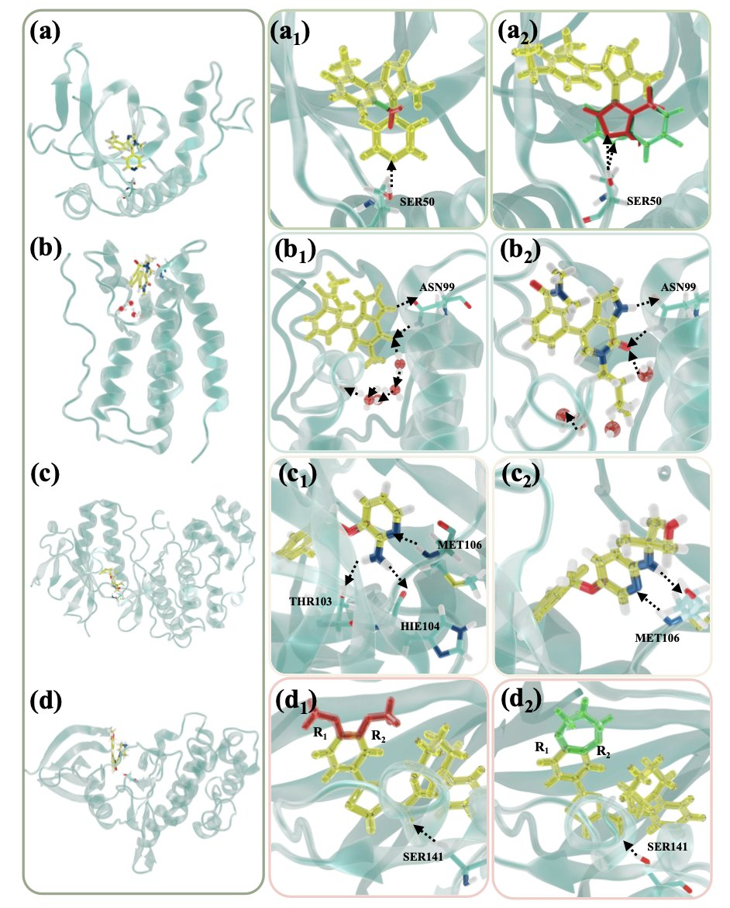
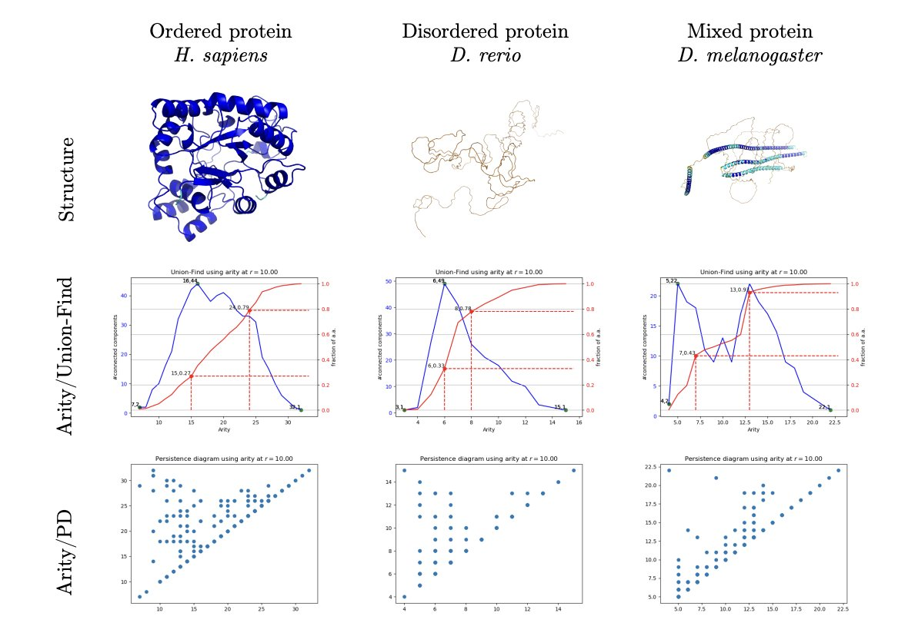
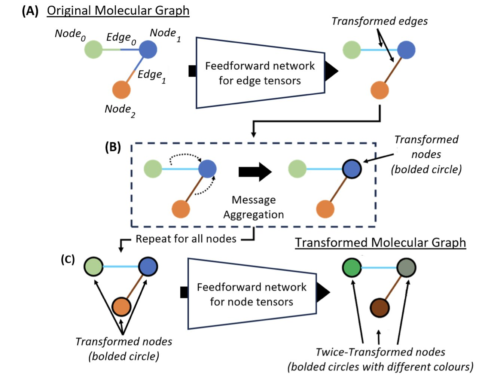
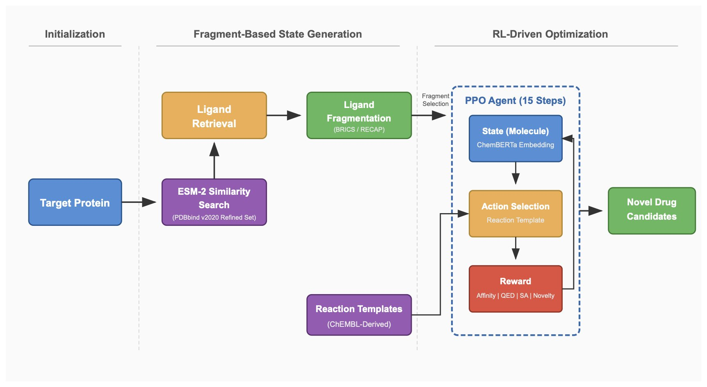
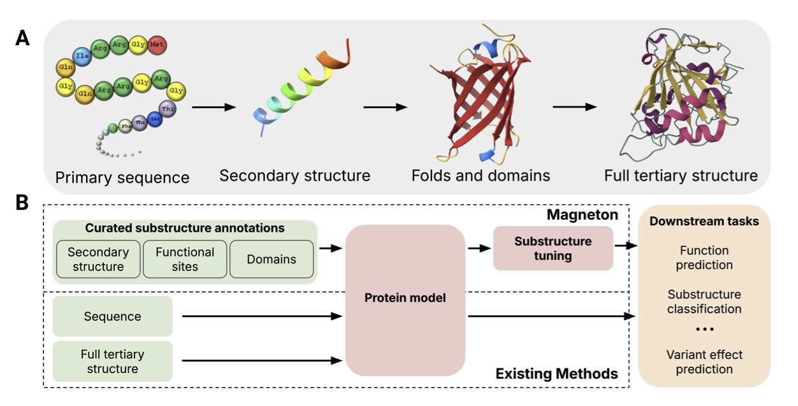

#### 目录  
1. Dual-LAO 方法将相对结合自由能（RBFE）计算提速 15-30 倍，同时保持高精度，让复杂分子改造的快速评估在药物研发中成为可能。
2. Arity Map 利用简单的原子堆积密度，快速区分了 AlphaFold 预测中真正的无序区和单纯的折叠错误，解决了 pLDDT 分数模棱两可的难题。
3. 研究者提出一种名为 LKM 的自知识蒸馏方法，它通过混合图神经网络（GNN）不同层级的知识，在不增加任何计算成本的前提下，显著提升了分子属性预测的准确性。
4. ReACT-Drug 将化学反应规则整合进强化学习，让 AI 生成的分子不仅有效，而且能被合成，还省去了为每个靶点单独训练的麻烦。
5. 通过显式地教导模型识别蛋白质的功能亚结构 (substructure)，研究者让蛋白质语言模型在功能预测任务上实现了性能飞跃，其效果甚至超过了仅依赖全局结构信息的模型。

## 1. Dual-LAO: 相对结合自由能计算提速 30 倍  
  
  

在药物发现领域，我们总是在玩一种高风险的「分子乐高」游戏：如何修改一个已知的活性分子，让它效果更好、副作用更小？计算化学家尝试用相对结合自由能（Relative Binding Free Energy, RBFE）来预测这些修改的效果，这相当于在电脑里预演药物和靶点的结合紧密程度。问题是，这个过程太慢了，尤其是当分子结构变化很大时，比如换掉整个骨架（scaffold-hopping）。  
  
这个工作提出的 Dual-LAO 方法，就是为了解决这个「慢」的问题。  
  
它的工作原理是这样的：想象一下，你要把分子 A 慢慢「变形」成 分子 B，来计算它们的结合能差异。这个过程在计算中被称为「炼金术转换」（alchemical transformation）。在中间状态，分子既不是 A 也不是 B，结构很奇怪，很容易从靶点蛋白的结合口袋里「漂」走，导致整个计算失败。这就是自由能计算收敛慢、结果不准的主要原因之一。  
  
作者们想出了一个很办法。他们采用了双拓扑设置，相当于在模拟体系里同时放了分子 A 和分子 B 的「幽灵」。然后，通过一个叫 dual-DBC 的约束方案，给这两个分子套上了一根看不见的「缰绳」。这根缰绳不会把分子死死地固定住（那样会引入偏差），而是温和地限制它们，确保它们在变形过程中，始终待在应该在的位置。这就像在引导一个新手司机停车，你只扶着方向盘给他一点方向，而不是直接抢过来替他开。  
  
这个方法最大的亮点在于，它极大地加速了自由能的收敛。因为中间态稳定了，采样效率就高了。作者报告的速度提升是 15 到 30 倍，这是一个巨大的飞跃。这意味着，以前需要跑几周的计算，现在可能一两天就出结果了。  
  
更重要的是，它不仅快，而且准。作者在一系列复杂的测试中验证了这一点，包括片段分子的改造、埋藏水分子的替换、甚至电荷变化。最终得到的预测值和实验值的均方根误差（RMSE）只有 0.51 kcal/mol，这在业内是相当可靠的水平。  
  
对于一线的药物化学家和计算科学家来说，这意味着我们可以更大胆地探索化学空间。以前不敢轻易尝试的骨架跃迁，现在可以用 Dual-LAO 快速评估一下可行性。在先导化合物优化阶段，当面临几十上百个改造方案时，这个工具可以帮助我们快速筛选掉那些没有希望的分子，集中资源去合成和测试真正有潜力的那几个。  
  
另外，研究者将这个方法整合进了 Tinker-HP 模拟软件包，并与先进的 AMOEBA 可极化力场联用。AMOEBA 力场能更精确地描述分子间的相互作用，尤其是在处理电荷分布变化时，这为计算的准确性又上了一道保险。  
  
Dual-LAO 并非凭空创造了一个全新的理论，而是在现有框架上做了一个精妙的工程学创新，漂亮地解决了自由能计算中一个长期存在的痛点。它让 RBFE 这个强大的工具变得更实用、更亲民了。  
  
📜Title: Fast, Systematic and Robust Relative Binding Free Energies for Simple and Complex Transformations: Dual-LAO  
🌐Paper: https://arxiv.org/abs/2512.17624v1  

## 2. Arity Map：一眼识破 AlphaFold 的折叠错误  
  
  

AlphaFold 改变了游戏规则，但我们都知道，它的 pLDDT 置信度分数不是万能的。当看到一段 pLDDT 分数很低的「面条」时，一个核心问题就摆在面前：这部分是蛋白质天然的柔性无规卷曲（IDR），还是 AlphaFold 没能正确预测出来的折叠错误？这个问题对于药物发现至关重要，因为一个是潜在的结合位点，另一个则是需要被丢弃的计算垃圾。  
  
这篇论文的研究者们想了个巧妙的办法来解决这个问题。他们没有去分析复杂的能量函数，而是回归到一个非常基本的物理性质：局部堆积密度。简单说，就是一个氨基酸残基周围有多「拥挤」。他们计算了每个 Cα 原子 10 Å 范围内的邻居数量，然后取这个分布的第 25 和第 75 百分位数，用这两个值构建了一个二维坐标图，称之为「Arity Map」。  
  
这张图的效果出奇地好。所有蛋白质结构都被清晰地分到两个区域：  
1.  **天然折叠区 (Native Sector**)：这里的结构堆积紧密、规整。研究者用 PDB 数据库里的实验结构进行验证，发现它们几乎全部落在这个区域。这就像是给地图做了一个「已知地标」的校准。  
2.  **异构区 (Heterogeneous Sector**)：这里的结构堆积松散、不均匀。所有低 pLDDT 分数的区域都落在这里，但关键在于，这里面鱼龙混杂。  
  
通过进一步分析，研究者发现，AlphaFold 预测出的所谓「无序区」，有很大一部分其实是折叠错误。比如，一些本该紧凑的结构域被错误地拉伸成线圈，或者形成一些在生物学上不合理的构象，比如弯曲的α-螺旋。这些结构在 Arity Map 上与真正的无序蛋白（来自 DisProt 数据库）占据了不同的位置。这意味着，AlphaFold 有点像个过于谨慎的学生，遇到一点不确定性，就倾向于给出「无序」这个安全但模糊的答案。  
  
更有意思的是，现有的结构质量评估工具，比如 PROCHECK 或 VoroMQA，几乎完全抓不住这些错误。它们要么觉得一切正常，要么把问题归咎于「堆积不佳」，无法提供更深度的见解。  
  
为了让这个工具更实用，研究者基于 Arity Map 的 22 个特征，训练了一个新的单残基评分系统，叫做「abstraqt」。这个分数比 pLDDT 更「懂行」，它能专门识别出那些看起来很奇怪但不违反基本化学原理的结构。比如一个本该笔直的α-螺旋在中间拐了个不自然的弯，pLDDT 可能觉得没问题，但 abstraqt 就能把它标记出来。  
  
对于做药物研发的人来说，这意味着现在我们有了一个快速、可靠的工具，可以在几分钟内对整个蛋白质组的 AlphaFold 预测进行「质检」。在进行大规模虚拟筛选或结构设计之前，我们可以先用 Arity Map 把那些看起来可疑的「假阳性」无序区过滤掉，从而把计算资源集中在真正有价值的结构上。  
  
📜Title: Fold or Flop: Quality Assessment of AlphaFold Predictions on Whole Proteomes  
🌐Paper: https://www.biorxiv.org/content/10.64898/2025.12.19.695427v1  
💻Code: https://sbl.inria.fr/applications/alphafold_analysis.html  

## 3. GNN 新玩法：零成本提升分子属性预测精度  
  
  

做计算化学和药物发现，我们一直在和 GNN (Graph Neural Networks) 打交道。它能很好地理解分子结构，但大家总在想一个问题：怎么才能让它看得更准，同时又不会把模型搞得又大又慢？最近一篇论文提出的 Layer-to-Layer Knowledge Mixing (LKM) 方法，给出了一个相当答案。  
  
我们先回顾一下 GNN 是怎么「看」分子的。你可以把 GNN 的每一层想象成一个不同焦距的镜头。第一层看到的是一个原子的直接邻居，也就是化学键相连的原子。第二层就能看到「邻居的邻居」，视野扩大了一圈。层数越多，它看到的分子全局信息就越完整。  
  
过去，这些「镜头」都是各自为政，信息单向地从浅层流向深层。这篇论文的作者就想，为什么不让这些不同尺度的观察者互相「通通气」呢？  
  
这就是 LKM 的核心思想。它把每一层都看作一个独立的「专家」：浅层是「局部细节专家」，深层是「全局结构专家」。LKM 做的，就是让这些专家在训练时互相学习、互相「校准」。  
  
具体怎么做呢？方法非常直接。在训练过程中，LKM 增加了一个约束，要求不同层的隐藏嵌入（hidden embeddings）——也就是它们对分子的内部表示——尽可能地彼此靠近。这就像强制要求只看细节的分析师去理解全局战略，也要求战略规划师不能忽略一线的具体情况。通过这种方式，每一层都 مجبور吸收了其他层的信息，最终得到的分子表示既包含了精确的局部化学环境，又兼顾了整体的拓扑结构。  
  
这个过程被称为「自知识蒸馏」，因为模型是在用自己的一部分（深层）去「教」另一部分（浅层），反之亦然，完全不需要一个额外的、更强大的「教师模型」。  
  
效果怎么样？数据最有说服力。研究者在几个主流的 GNN 架构（如 DimeNet++, MXMNet）上测试了 LKM。在 QM9 数据集上，预测误差降低了近 10%；在 MD17 的能量预测任务上，误差更是降低了 45.3%。这些都是我们行内常用的标准数据集，能取得这样的提升相当不容易。  
  
最吸引我的一点是，LKM 是个「零成本」的改进。它没有增加任何新的模型参数，计算开销也几乎可以忽略不计。这意味着我们可以把它像一个插件一样，直接用到现有的 GNN 模型上，马上就能获得性能提升。在处理大规模化合物库的工业界研发场景，这种「免费午餐」的价值极高，因为它直接关系到筛选效率和成本。  
  
总的来说，LKM 提供了一个简单、有效且通用的策略来增强 GNN 的能力。它不是那种需要巨大计算资源才能复现的「屠龙之技」，而是一个我们马上就能在自己项目里尝试的实用技巧。  
  
📜Title: Layer-to-Layer Knowledge Mixing in Graph Neural Network for Chemical Property Prediction  
🌐Paper: https://arxiv.org/abs/2510.20236  

## 4. ReACT-Drug: 用化学反应模板教 AI 设计可合成的新药  
  
  

做计算辅助药物设计 (CADD) 的都有过类似的经历：AI 模型给出了一个预测结合活性超高的分子，打分爆表，结构新颖。但当把这个分子交给合成化学家时，他们会告诉你：「这东西在现实世界里根本造不出来。」这个问题长期困扰着 AI 制药领域——如何让 AI 设计的分子不仅「好看」，而且「能做」？  
  
这篇论文提出的 ReACT-Drug 框架，给出了一个非常巧妙的解决方案。它的核心思路是，不让 AI 天马行空地去拼接原子，而是给它一套「化学家工具箱」，也就是一系列经过验证的化学反应模板。  
  
**这是它的工作原理**：  
  
整个流程的第一步是解决新靶点的冷启动问题。当你有一个新靶点，但手上没什么活性数据时，传统模型通常很难办。ReACT-Drug 的做法是，先用 ESM-2（一个强大的蛋白质大语言模型）去计算目标蛋白的嵌入表示。你可以把它理解为给每个蛋白质生成一个独特的「指纹」。然后，模型会在一个巨大的数据库里寻找那些「指纹」最相似的蛋白质。  
  
找到了这些「亲戚」蛋白后，模型会去看已知的、能与这些「亲戚」结合的配体是什么。这些配体被拆解成一系列化学片段，构成了一个初始的分子「积木池」。这个方法很聪明，因为它基于一个合理的假设：结构相似的蛋白，其结合口袋也可能相似，那么能结合其中一个的分子片段，很可能在另一个的口袋里也有用。  
  
接下来，强化学习 (Reinforcement Learning) 智能体登场。它会从「积木池」里挑选一个片段作为起点，然后开始「分子生长」游戏。关键就在于，智能体每一步的决策，不是简单地添加一个原子或一个官能团，而是从一个预设的「反应模板库」里选择一个真实的化学反应来执行。比如，它可能会选择执行一个「铃木反应 (Suzuki coupling)」来连接两个片段，或者用一个「酰胺化反应 (amidation)」来引入一个酰胺键。  
  
智能体每构建出一个新分子，就会通过分子对接 (docking) 计算它与靶点的结合亲和力。这个亲和力分数就是给智能体的「奖励」。通过成千上万次的尝试，智能体逐渐学会了如何组合运用这些化学反应，才能稳定地生成与靶点结合紧密的分子。  
  
**这个框架的价值在哪**？  
  
首先，它极大地提升了生成分子的可合成性。因为整个分子的构建过程就是一连串真实化学反应的模拟，所以最终的产物在理论上是可以通过对应的路线合成出来的。论文报告称，其生成分子的化学有效性 (validity) 和新颖性 (novelty) 达到了 100%，这在生成模型里是相当不错的成绩。  
  
其次，它「靶点无关 (target-agnostic)」的特性让它非常灵活。对于那些研究不多、数据稀缺的新靶点，这个方法依然可以快速启动，并给出靠谱的候选分子。研究者们在 6 个不同类型的靶点上测试了 ReACT-Drug，包括 5-HT 受体、阿片受体和几种激酶。结果显示，它生成的分子结合亲和力分数在 -9.13 到 -10.4 kcal/mol 之间。这个数值意味着什么？它相当于一个非常不错的苗头化合物 (hit compound) 的水平，为后续的药物化学优化提供了很好的起点。  
  
当然，这个框架的成功也高度依赖于那个「反应模板库」的质量和广度。如果库里的反应太少或太偏，AI 能探索的化学空间就会受限。但作为一个整合了蛋白质语言模型、强化学习和合成化学规则的自动化设计平台，ReACT-Drug 无疑为 AI 制药的实际落地，又向前推进了一步。  
  
📜Title: ReACT-Drug: Reaction-Template Guided Reinforcement Learning for de novo Drug Design  
🌐Paper: https://arxiv.org/abs/2512.20958v1  
💻Code: https://github.com/YadunandanRaman/ReACT-Drug  

## 5. 教 AI 认蛋白质「乐高块」，功能预测能力飙升！  
  
  

我们做计算辅助药物发现的，每天都在和各种蛋白质模型打交道。这些模型，比如 ESM，很强大，能从氨基酸序列里读出很多信息。但它们有时候像一个刚学外语的学生，能读懂句子的大概意思，却抓不住其中的关键词和固定搭配。蛋白质也是一门语言，而那些真正执行功能的「关键词」和「固定搭配」，就是生物学家们研究了几十年的功能亚结构（substructures），比如各种结构域 (domains) 和基序 (motifs)。  
  
一个蛋白质不是一根均匀的氨基酸链条。它更像是由不同功能的「乐高块」拼起来的。有的「块」负责结合 ATP，有的「块」负责催化反应。长久以来，我们一直有个疑问：现在的 AI 模型，到底有没有真正理解这些「乐高块」？还是说它们只是通过暴力学习，从海量数据里学到了一些模糊的关联性？  
  
这篇新工作给了我们一个答案。研究者们建立了一个名为 Magneton 的环境。有什么用？ 
  
首先，他们整理了一个庞大的数据库，包含 53 万个蛋白质和 170 万个已知的亚结构注释。这相当于给 AI 准备了一本超厚的「词典」，每个词（亚结构）都有详细的释义（功能）。  
  
然后，他们提出了一个简单直接的训练方法，叫「亚结构微调」 (substructure-tuning)。具体怎么做呢？就是拿一个已经预训练好的蛋白质模型（比如 ESM），然后用这本「词典」对它进行再教育。通过监督学习的方式，强制模型去关注和理解这些特定的功能亚结构。这就像告诉一个学生：「别光顾着通读全文，把这些高频词汇和固定用法给我圈出来，记住它们的意思。」  
  
效果立竿见影。以酶功能分类（Enzyme Commission, EC）预测为例，一个标准的 ESM 模型，其 Fmax 分数是 0.688。经过亚结构微调后，这个数字飙升到了 0.815。在分子功能本体（Gene Ontology, GO）预测上，也从 0.429 提升到了 0.525。这可不是小数点后第三位的优化，而是实打实的性能飞跃。  
  
最有意思的一点是，研究者们验证了亚结构信息和全局 3D 结构信息之间的关系。很多人可能觉得，只要有了蛋白质的精确三维结构（比如 AlphaFold 预测的），模型就应该能自己搞明白一切。但实验结果显示，并非如此。即使是已经整合了全局结构信息的模型，在接受了亚结构微调之后，性能还能继续提升。  
  
这说明什么？亚结构信息是一种独特的、互补的信号。打个比方，全局结构告诉你一栋建筑的整体外观和轮廓，而亚结构信息则告诉你哪个房间是厨房、哪个是卧室，以及厨房里的炉灶和水槽具体在什么位置。两者对于理解这栋建筑的「功能」都至关重要，缺一不可。  
  
更厉害的是，这种方法训练出来的模型还具备了泛化能力。当研究者用一些模型在训练中从未见过的亚结构去测试它时，模型依然能给出非常一致和准确的表征。这意味着模型不是在死记硬背「题库」，而是真正学会了识别功能单元的底层规律。它开始理解什么样的氨基酸组合和空间排布能构成一个有特定功能的「零件」。  
  
这项工作最大的价值在于，它把几十年来生物学家辛辛苦苦积累的关于蛋白质功能的知识，用一种高效的方式「注入」到了现代的 AI 模型中。他们还把整个环境、数据集和模型都开源了，任何人都可以拿来用。对于一线研发人员来说，这意味着我们可以训练出更懂生物学的模型，用来做更精准的靶点功能注释、设计更好的酶，或者寻找药物作用的潜在位点。这是个非常漂亮的工程学成果，也是对经典生物信息学知识的一次致敬。  
  
📜Title: Greater Than the Sum of Its Parts: Building Substructure into Protein Encoding Models  
🌐Paper: https://arxiv.org/abs/2512.18114  
💻Code: 未提供
