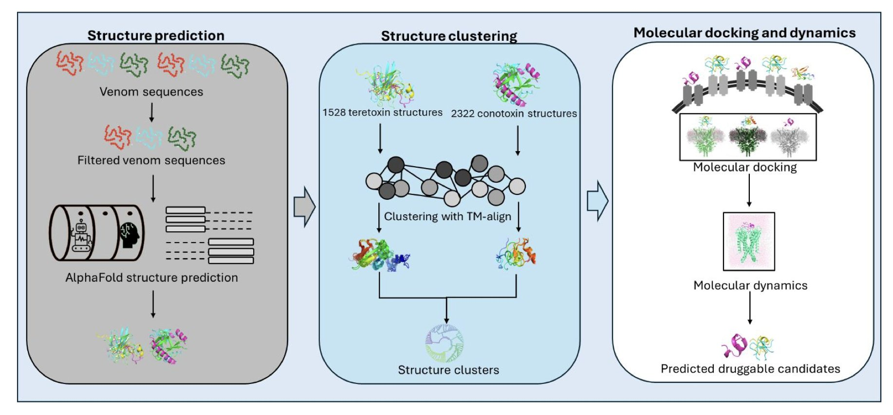
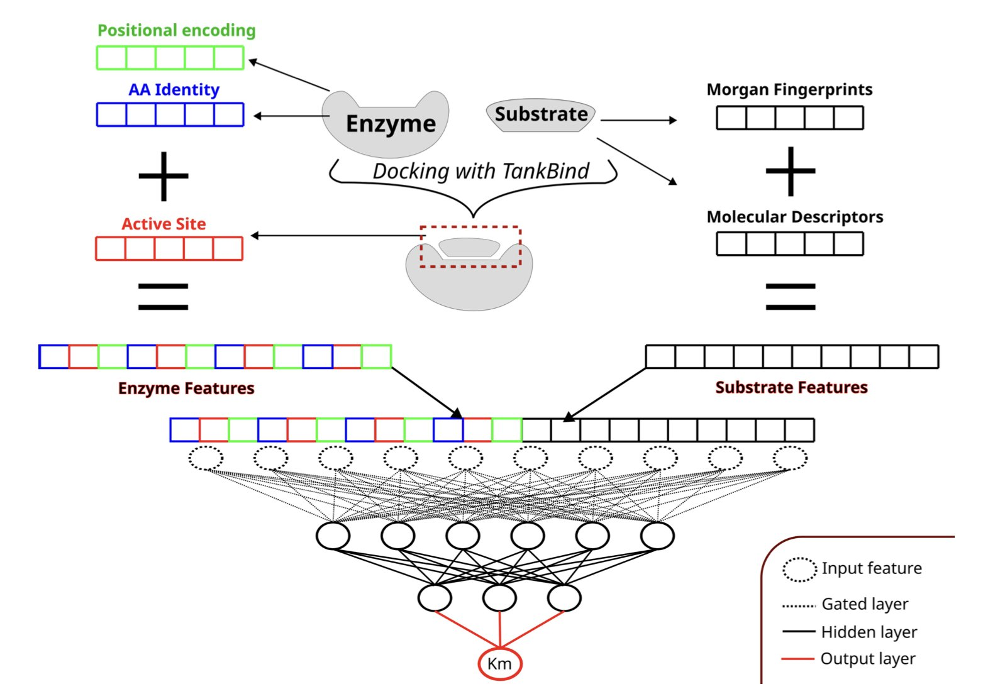
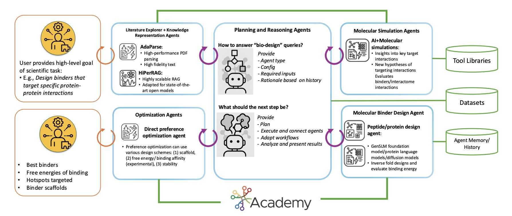
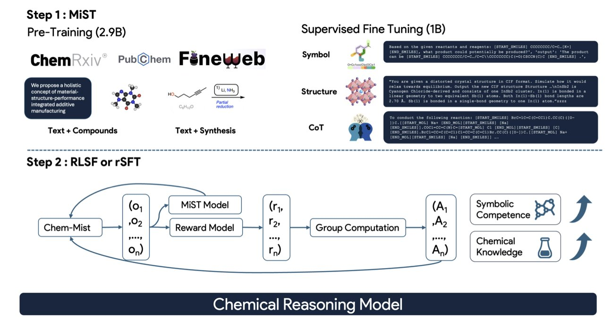
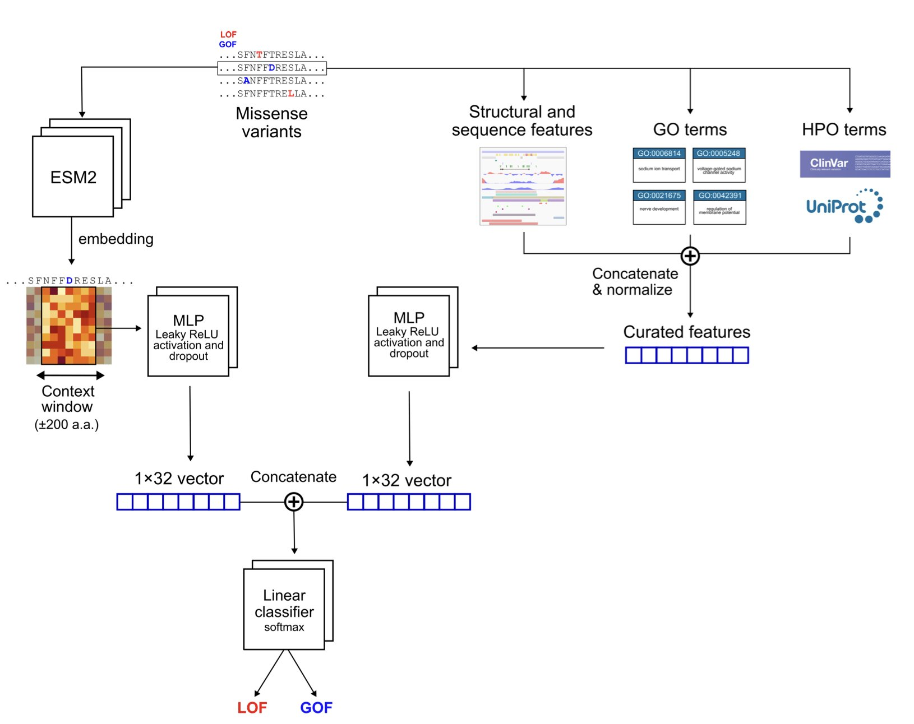

#### Contents
1. Using AlphaFold2 and large-scale computing, we can now systematically decipher the function of thousands of unknown venom peptides, opening a new path for drug development.
2. By directly integrating enzyme active site information into deep learning models, we can more accurately predict a substrate's Michaelis constant (Km), but the model's generalization is still limited by the diversity of substrates in existing databases.
3. A new multi-agent AI system designs biologics for "undruggable" intrinsically disordered proteins (IDPs) by simulating teamwork, and its performance in computational tests has already surpassed that of human experts.
4. If we put large language models through "chemistry grad school," teaching them the language and rules of chemistry first, they can start to think like real chemists.
5. The MissION model integrates a protein language model with biological knowledge to predict the function of ion channel missense mutations with high accuracy, offering a powerful tool for diagnosing and treating channelopathies.

## 1. AlphaFold2 Unlocks a Venom Treasure Trove: Mining for Gold in Cone Snail Toxins

Anyone in drug discovery knows that nature is an endless treasure trove, especially animal venoms. Millions of years of evolution have made these venom peptides incredibly efficient and precise, making them great starting points for new drugs. But there’s a big problem: venom is a highly complex cocktail with thousands of peptides, and we only understand the function of a small fraction of them. For the vast majority, we only have their sequence. We know almost nothing about what they look like or what they do. It’s like having a huge ring of keys but not knowing which locks they open.

Now, that might be about to change. This preprint paper presents a strategy that uses AlphaFold2 for a large-scale, systematic decoding of this "black box."

The authors did something bold: they gathered nearly 4,000 venom peptide sequences from marine cone snails, including the familiar conotoxins and the lesser-known tereotoxins. Then, they fed all these sequences to AlphaFold2 to predict their 3D structures. This would have been an unimaginable amount of computation just a few years ago, but now it’s possible.

The real work began after they had these thousands of structures. Just looking at structures doesn't mean much; the key is how to find the gold. The authors used structural clustering. You can think of it as an automatic organizing system that groups peptides with similar shapes. The results were clear: both tereotoxins and conotoxins formed multiple distinct structural clusters. These clusters share a stable backbone made of cysteine and disulfide bonds. This backbone determines the peptide's core fold and is the foundation of its function.

For the relatively mysterious tereotoxin family, this is the first time anyone has provided a detailed structural map, which is a significant step.

The most brilliant part of this work is how it uses a byproduct of AlphaFold2: its prediction of disulfide bond connectivity. In peptide drugs, how disulfide bonds are linked directly determines the 3D conformation and biological activity. For a long time, a large number of sequences in the conotoxin database ConoServer were poorly classified because their disulfide bonds were unknown. The authors used AlphaFold2's predicted connectivity to directly annotate the function of these "cold cases." This cleared up a lot of old confusion and made the database much more useful.

Even more exciting, through structural alignment, they found that some tereotoxin structures are very similar to known conotoxins. For instance, one tereotoxin could almost perfectly overlap with a conotoxin known to have Kunitz-type peptide activity. The Kunitz domain is a classic protease inhibitor motif. This strongly suggests that these previously function-unknown tereotoxins might also be protease inhibitors.

To test this idea, they performed molecular docking and dynamics simulations. The results showed that certain tereotoxins and conotoxins could indeed bind to trypsin, just like the Kunitz domain of the amyloid beta-protein precursor. This not only revealed a new biological function for these venom peptide families but also directly linked them to targets in human diseases.

The value of this study goes far beyond cone snail toxins. It establishes a scalable analytical framework: first, use AlphaFold2 for large-scale structure prediction, then perform structural clustering, and finally, use phylogenetic analysis to deorphanize molecules with unknown functions. This workflow can be applied to any large library of peptide molecules. It shifts work that used to require extensive experimental screening to the computational stage, pointing the way for subsequent drug discovery experiments at a lower cost and faster speed.

Of course, computational prediction is the starting point for experimental validation. Next, biochemists and pharmacologists will need to pick up their pipettes to verify these predicted protease inhibitory and neurotoxic activities. But this paper provides a very clear roadmap for systematically mining drug leads from massive libraries of natural product sequences.

📜Title: Large-scale structure and sequence-based comparative analysis enables functional annotation of animal venom peptides
🌐Paper: https://doi.org/10.26434/chemrxiv-2025-9gd3c

## 2. AI Predicts Enzyme Kinetics: Stop Guessing, Look Directly at the Active Site

In enzymology and drug discovery, accurately predicting how well a molecule, or substrate, binds to an enzyme is critical. The Michaelis constant (Km) is a key metric for this binding affinity, but measuring it experimentally is time-consuming and labor-intensive. For years, we've tried to use computational models to predict Km, but the results have often been disappointing.

So, what's the problem? Many models are like asking a detective to solve a case using only a city map and suspect photos, without telling them the location of the crime scene. They only take the entire enzyme's amino acid sequence and the substrate's chemical structure as input, ignoring the small "pocket" where the chemical reaction actually happens—the active site.

Now, a new paper introduces a model called AS4Km, which is based on a simple idea: why not just tell the model the location of the "crime scene"?

#### The Core Idea: Focus on Key Information

How the model works is straightforward. First, the researchers use tools like TankBind or P2Rank to accurately identify the key amino acid residues that make up the active site from the enzyme's structure. Then, they feed the features of this active site, along with a chemical description of the substrate, into a multilayer perceptron (MLP) model.

This is like giving the model a magnifying glass, allowing it to focus on the most important interaction interface. The model no longer has to blindly search for signals in a massive sequence of thousands of amino acids; it can directly analyze the chemical compatibility between the substrate and the active site. As a result, AS4Km achieved the best predictive performance to date on an independent test set.

#### What Really Matters? The Active Site Itself

The most interesting part of this study is its ablation study. The researchers systematically removed parts of the model's input information to see which part had the biggest impact on the final result.

They found something interesting: even when they completely removed the enzyme's full sequence information, the model's predictive performance remained excellent as long as the active site features were kept. This shows that for an enzyme's catalytic function, the small region of the active site, optimized over billions of years of evolution, contains an extremely rich and critical amount of information. The rest of the protein largely serves as a "scaffold" to maintain its specific 3D shape.

In contrast, if the model was only given the substrate's chemical features without any information about the enzyme, its performance was much worse. This confirms a long-held intuition: the interaction between an enzyme and its substrate is about the fit between a "lock" and a "key." Studying only the "key" is not enough.

#### The Unavoidable Problem: Data Bias

Of course, any data-driven model depends on high-quality data. Here, the authors frankly point out the biggest challenge currently facing the field: data bias.

Existing public enzymology databases have a serious problem: a lack of substrate diversity. Researchers typically only report "successful" substrates that react well with the enzyme, while the numerous "failed" cases of poor or no binding are rarely documented. This means a trained model might just be "memorizing" these common substrate types instead of truly learning the physicochemical principles that govern binding affinity.

It's like training an image recognition model by only showing it pictures of cats and then expecting it to accurately identify dogs. When faced with a potential substrate that is structurally very different from the training data, the model's predictive ability will drop sharply.

#### Future Outlook

Despite the data limitations, the approach of AS4Km still points the field of enzyme engineering and biocatalysis in the right direction. By combining data-driven methods with explicit physicochemical information (like the active site), we can build more powerful and interpretable predictive models.

In the future, this technology could help us quickly screen for potential new substrates for a given enzyme, accelerating the development of novel biocatalysts. But to realize its full potential, the entire research community needs to work together to build larger and more chemically diverse enzyme-substrate interaction databases. We need to document more "failed" experiments, because when it comes to training models, failure data is just as valuable as success data.

📜Title: Leveraging active site information for deep learning prediction of enzyme-substrate Michaelis constants
🌐Paper: <https://doi.org/10.26434/chemrxiv-2025-vrbqv>

## 3. AI Agents Design Drugs for IDPs, Tackling 'Undruggable' Targets

In drug development, Intrinsically Disordered Proteins (IDPs) have always been a tough nut to crack. These proteins lack a stable 3D structure and are constantly changing shape, like a shifting cloud of smoke. Traditional drug design methods, which rely on fixed target structures, are often useless against IDPs.

Now, a new paper introduces a system called StructBioReasoner, which offers a fresh approach to this problem.

#### Assembling an AI Expert Team

The way this system works is like putting together a team of experts, each with a unique skill. The team is made up of different AI agents, and each agent is responsible for a specific task.

For example, one agent uses AI to predict protein structures, another runs Molecular Dynamics (MD) simulations to observe molecular interactions, and a third analyzes whether a designed drug molecule is stable.

These agents don't work in isolation. They collaborate through a middleware platform called Academy, which acts like a project manager, coordinating tasks, allocating resources, and ensuring the whole team runs efficiently.

#### Using a "Tournament" to Select the Best Solution

Faced with the vast conformational space of IDPs and infinite design possibilities, how do you find the best solution? StructBioReasoner uses a reasoning framework similar to a tournament.

The system generates a huge number of candidate designs and then has them "compete" against each other. Through rounds of calculation and evaluation, it eliminates poor-performing designs and ultimately screens for the most promising candidate molecules. This method efficiently explores the vast design space without resorting to blind searching.

#### How Did It Perform?

The proof is in the results. The researchers tested StructBioReasoner on two real IDP targets.

1.  **For the Der f 21 protein**: More than 50% of the binders designed by the system performed better than a human-expert-designed reference on the key metric of binding free energy. This shows that, on a purely computational level, the AI's design ability can match or even exceed that of humans.
2.  **For the NMNAT-2 protein**: This was a more complex target. From nearly 100,000 candidate solutions, the system successfully identified three main binding modes. One of these was an interaction interface that had already been validated by experiments. This proves the system can not only find good designs but also uncover valuable scientific insights from massive amounts of data.

#### Built for Supercomputing

Designing drugs for IDPs requires enormous computing power. Another highlight of this system is its scalability. The researchers tested it on the Aurora supercomputer in the United States.

The results showed that the MD simulation agent achieved 80.4% efficiency when running on 256 nodes, while the binder design agent's efficiency was even higher at 84.4%. This means the system can effectively use large-scale parallel computing resources, turning previously impossible computational tasks into reality.

In short, this is not a small theoretical model. It's a heavy-duty system built to solve industrial-scale problems.

This paper provides a powerful example of automated scientific discovery, especially for tackling "undruggable" targets. It shows how to integrate multiple AI tools and domain knowledge into a scalable framework that allows a machine to perform complex scientific reasoning on its own. While it still faces engineering challenges like data read/write bottlenecks, this direction undoubtedly opens new doors for the future of drug development.

📜Title: Scalable Agentic Reasoning for Designing Biologics Targeting Intrinsically Disordered Proteins
🌐Paper: https://arxiv.org/abs/2512.15930v1

## 4. A New Paradigm for AI in Chemistry: The MiST Framework Helps LLMs Truly Understand Chemistry

We've all tried asking Large Language Models (LLMs) to do some chemistry work, like designing a synthesis route or predicting a reaction product. The results are often disappointing. The molecular formulas or reaction equations the model generates are frequently invalid or even completely made up. The reason is simple: a general-purpose model is like a person who knows the 26 letters of the alphabet but has never studied grammar or literature. If you ask them to write a novel, of course they can't. They don't know which letter combinations form valid words (symbolic competence in chemistry), let alone understand the meaning and logic behind the words (latent chemical knowledge).

The MiST framework proposed in this paper has a much clearer approach. Instead of forcing a "layman" to do an expert's job, the researchers designed a systematic "chemistry grad school" program for it.

**Step 1: Foundational courses to build basic knowledge.**
The researchers first continue pre-training the model on a massive corpus of specialized chemistry literature. This is like making an undergraduate read all the core chemistry textbooks and papers to build a solid foundation. This process fills the model's "brain" with latent chemical knowledge, giving it a general understanding of the field.

**Step 2: Advanced seminars to learn problem-solving methods.**
This is the most clever part of the MiST framework. The researchers didn't just feed the model a bunch of question-answer pairs. Instead, they gave it a large number of "reasoning traces." This is like watching an experienced chemist solve a problem, writing out every step of their thought process on a blackboard: "First, analyze functional groups A and B in the reactants; second, based on the reaction conditions, determine this is a nucleophilic substitution reaction; then, predict the likely products and byproducts..." By learning these complete chains of thought, the model learns how to analyze and reason like a chemist, not just memorize answers.

**Step 3: A research project with advisor feedback.**
The final step is Reinforcement Learning (RL). The model starts trying to solve chemistry problems independently, with a "tutor" model (based on scientific feedback) nearby to judge whether its answers are right or wrong, good or bad. It gets a reward for a correct answer and a penalty for a wrong one. Through this continuous process of trial and error, the model's ability to solve complex chemistry problems is further refined and strengthened.

To prove the effectiveness of this process, the researchers also developed two diagnostic tools, which makes the work very solid. One is the Symbolic Competence Score (SCS), which evaluates whether the chemical formulas (like SMILES strings) written by the model are valid. The other is the Chemical Competence Score (CCS), which assesses whether the model can determine if a chemical description is correct.

The results are clear. After being trained with MiST, the model's accuracy on several difficult chemistry tasks, such as naming organic reactions and generating inorganic materials, increased by up to 29%. More importantly, the model can also output an explainable reasoning process. This means we not only get its answer but can also see how it arrived at that answer step by step. This is critical for scientific research because we can review its logic and know when to trust it and when it might be "hallucinating."

This work shows that through specialized "mid-stage scientific training," even medium-sized models can unlock powerful scientific reasoning abilities. It tells us that instead of pursuing infinitely large general-purpose models, designing better training methods for specific scientific domains may be a more effective path. This is how we can make AI a truly helpful assistant in our labs.

📜Title: MiST: Understanding the Role of Mid-Stage Scientific Training in Developing Chemical Reasoning Models
🌐Paper: <https://arxiv.org/abs/2512.21231>

## 5. AI Accurately Predicts Ion Channel Mutations, Solving a Diagnostic Puzzle for Genetic Diseases

In the world of ion channels, the change of a single amino acid can have vastly different consequences. Does it make the channel overactive (Gain-of-function), or does it cause it to shut down completely (Loss-of-function)? The answer to this question directly affects the diagnosis and treatment of diseases like epilepsy and arrhythmia, known as channelopathies. For a long time, accurately predicting this functional change has been a challenge.

Recently, a new study introduced the MissION model, which is like having an experienced expert consultant for ion channel mutations.

Its approach is to cleverly combine three different dimensions of information.

The first is information from a Protein Language Model (PLM). You can think of a PLM as an AI that is fluent in the "grammar" of proteins. By reading massive numbers of protein sequences, it has learned which amino acid changes are like harmless dialect variations and which are like a typo that causes ambiguity. The `ESM-2` model used by MissION provides this deep contextual understanding based on evolutionary patterns.

The second is classic biophysical features. This information is very straightforward: the changes in physicochemical properties like charge, size, and hydrophobicity of the amino acid before and after the mutation. This is fundamental, the hard facts of the molecular world, and provides a factual basis for the model's judgments.

The third, and the masterstroke of this model, is biological knowledge at the gene level. The researchers integrated terms from the Human Phenotype Ontology (HPO) and Gene Ontology (GO). This is like telling the model that this protein is not just a string of amino acids; it has a specific role in the cell (like "voltage-gated potassium channel activity") and is linked to certain diseases. The introduction of this biological context prevents the model from working blindly and significantly boosts its predictive performance.

The model's architecture shows a clear design philosophy. It has two independent channels: one processes sequence information from the PLM, and the other handles biophysical and functional annotation features. The information from both channels is integrated only at the very end for classification. The benefit of this approach is that it ensures both types of information, which are completely different in nature, can be fully learned without interfering with each other.

The model's performance is indeed impressive. It was trained on the largest dataset to date (containing 3,176 mutations across 47 genes) and achieved a ROC-AUC (Area Under the Receiver Operating Characteristic Curve) of 0.925, which is significantly better than the previous best model (0.897).

Even more important is its ability to generalize. The researchers conducted a "zero-shot learning" test, where they deliberately removed all data for a particular gene during training and then asked the model to make predictions for this "unseen" gene. Even under these demanding conditions, MissION still achieved an accuracy of 70.8%. This shows that it learned the general principles of ion channel mutations, not just "test-taking skills" for specific genes. This is hugely valuable for the rare and understudied gene mutations encountered in the clinic.

Ablation studies also confirmed that the GO terms were key to the model's superior performance. Once this information was removed, the model's performance dropped significantly. This clearly shows that combining deep biological knowledge with powerful machine learning models is the right direction for solving these types of problems in the future.

For clinicians and geneticists, MissION is a powerful assistant for interpreting "variants of uncertain significance (VUS)." For drug developers, accurately determining whether a mutation is "gain-of-function" or "loss-of-function" is the first step in developing precision medicines. For example, a gain-of-function mutation requires an inhibitor, while a loss-of-function mutation needs an activator. MissION is already available as a web tool, providing predictions for over 600,000 ion channel mutations, which will greatly facilitate the work of researchers.

📜Title: Functional Effect Predictions For Ion Channel Missense Variants Using a Protein Language Model
🌐Paper: https://doi.org/10.1101/2025.10.16.25337735
