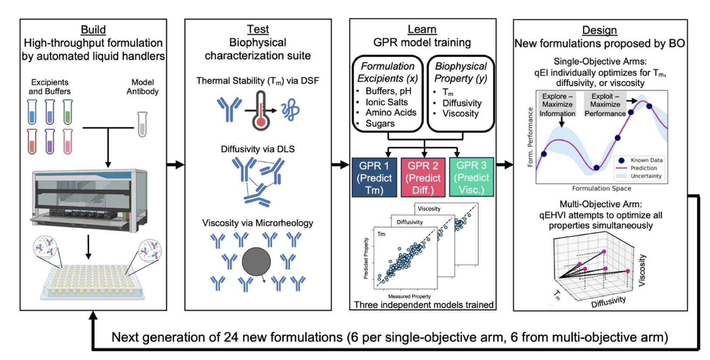
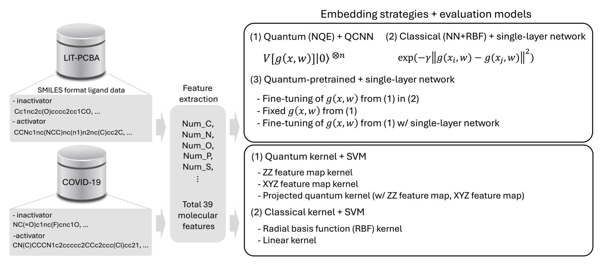
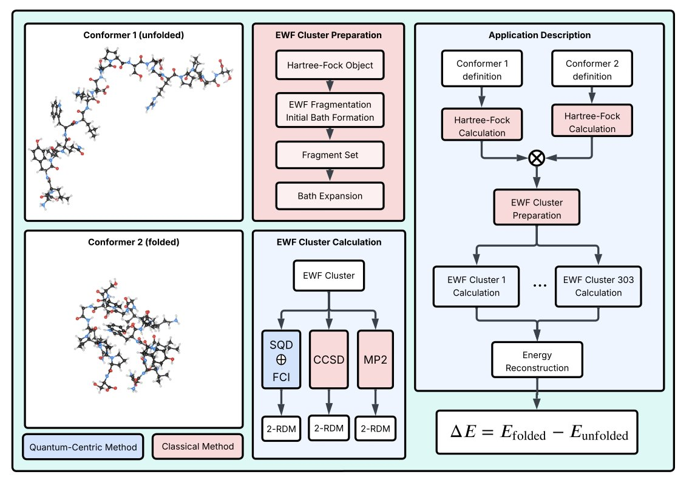
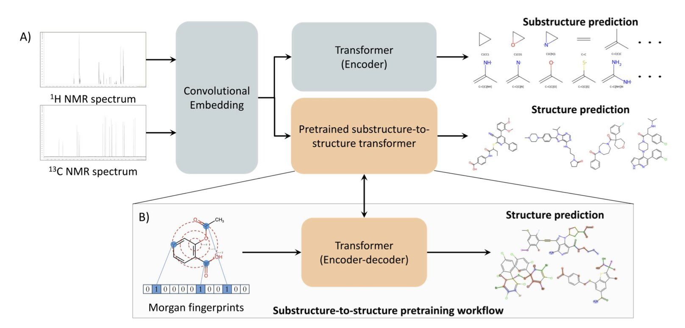
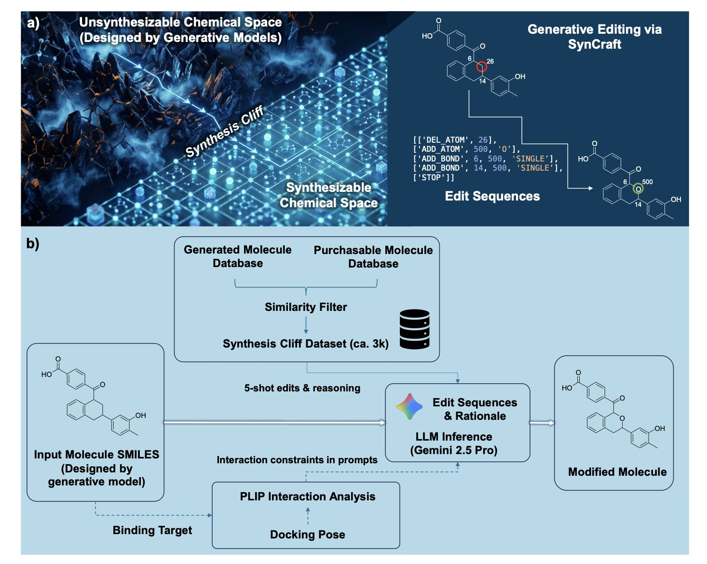

#### 目录  
1. 研究者将机器学习与自动化机器人结合，打造了一个高通量抗体配方发现平台，能以极高的效率筛选并优化出兼顾稳定性、粘度和扩散性的最优解。
2. 研究者们将量子线路与神经网络结合，为分子设计了更具表达力的「量子指纹」，在数据稀疏时能更准地筛出活性分子。
3. 研究者首次利用量子计算机，成功模拟了蛋白质的电子结构，为解决药物研发中复杂的生物问题开辟了一条新路。
4. 一种新 AI 能像翻译语言一样解读 1D NMR 谱图，直接输出分子结构，让自动化结构解析迈出关键一步。
5. SynCraft 教会了大语言模型像资深化学家一样思考，通过精确的原子级编辑来优化分子，而不是粗暴地重新生成。

## 1. AI 赋能抗体配方开发，加速生物药研发  
  
  

做过抗体药配方开发的同行都清楚，这活儿有多折腾。我们面对的是一个巨大的、充满未知的设计空间，里面有各种辅料、pH 值、缓冲液，它们之间还相互作用。目标也多，既要药物稳定、又要粘度低方便注射，还得保证药物活性。传统的方法就像在黑暗中摸索，依赖研究员的经验和大量试错，不仅慢，而且成本高。  
  
这篇论文的作者们想解决的就是这个问题。他们的思路很直接：让机器人和 AI 来干这件苦差事。  
  
他们建立了一套「设计 - 构建 - 测试 - 学习」（Design-Build-Test-Learn, DBTL）的全自动流程。  
  
1.  **设计（Design**）：首先，由机器学习算法，特别是贝叶斯优化（Bayesian Optimization），来提出一批有潜力的配方组合。这不像我们拍脑袋想配方，算法会根据已有数据，预测哪些新组合最有可能成功。  
2.  **构建（Build**）：然后，自动化机器人系统会上场，精确地执行配方指令，把各种溶液混合好，制备出待测样品。这个过程告别了繁琐的手动移液，速度和精度都大大提高。  
3.  **测试（Test**）：机器人接着会自动对样品进行一系列生物物理特性表征，比如测量熔解温度（Tm）、粘度和扩散系数（diffusivity）。  
4.  **学习（Learn**）：最后，测试数据被反馈给机器学习模型。这套系统采用了主动学习（Active Learning）策略，模型会分析新数据，更新自己的认知，然后更聪明地设计下一轮实验。它会集中火力去探索那些信息量最大、最可能找到最优解的「无人区」。  
  
整个过程形成了一个闭环，一轮接一轮地自我迭代和优化。  
  
效果怎么样？数据很能说明问题。仅仅跑了两轮主动学习，配方的性能就有了肉眼可见的提升。平均扩散系数增加了 22.2%，平均粘度降低了 13.7%，而平均熔解温度（代表热稳定性）也提高了 1.43°C。在配方开发中，每一点改进都来之不易，这个结果相当亮眼。  
  
更有价值的是，他们还引入了可解释 AI 技术，具体来说是 SHAP 值。这东西能告诉我们，在最终的最优配方里，每一种辅料到底贡献了多少「好」或「坏」的影响。这就把 AI 从一个提供答案的「黑箱」变成了一个可以和我们对话、传授知识的「老师」。我们不仅得到了配方，还理解了「为什么」这个配方好，这对于我们积累知识、指导未来的项目至关重要。  
  
当然，配方开发最大的挑战之一是平衡多个相互冲突的目标。比如，有时候提高稳定性的辅料可能会增加粘度。这项工作在多目标优化上也做得很好，归一化超体积（normalized hypervolume）增益达到了 73.3%。这个指标听起来很玄，但它通俗地讲，就是 AI 找到了一大片「甜点区」，在这个区域里的配方，在稳定性、粘度等多个维度上都表现得不错。这给了研发人员一个丰富的备选清单，而不是一个「要么接受，要么放弃」的单一答案。  
  
总的来看，这项工作为生物药配方开发提供了一个强大的新范式。它展示了如何用自动化和智能算法来撬动这个传统上依赖大量人力和时间的领域，让药物开发变得更快、更准。下一步，就是把这套方法应用到更多抗体分子和更高浓度的配方开发中去，那才是真正考验技术实力的地方。  
  
📜Title: Automation and Active Learning for the MultiObjective Optimization of Antibody Formulations  
🌐Paper: https://doi.org/10.26434/chemrxiv-2023-rxq1t  

## 2. 量子计算赋能虚拟筛选：新一代药物发现引擎  
  
  

在药物发现的早期阶段，我们就像在茫茫大海里捞针，要从数百万甚至数十亿的分子库里找到有潜力的候选化合物。虚拟筛选 (Virtual Screening) 就是我们的探鱼雷达，帮我们缩小搜索范围。  
  
传统方法，比如基于分子指纹的相似性搜索，就像是给分子拍了一张二维的「大头照」，信息量有限。现在，有研究者想给分子拍个「量子 CT」，看看能不能得到更丰富、更立体的表示。  
  
这篇论文的核心思路，是把分子信息「编码」到量子比特 (qubit) 上，形成一种所谓的量子嵌入 (Quantum Embedding)。想象一下，经典计算机用 0 和 1 来表示信息，而量子比特可以同时是 0 和 1，还能相互纠缠。这就意味着，量子嵌入能用更少的资源捕捉分子结构中更复杂、更微妙的关联。  
  
但怎么编码才是最优的？这就是这篇工作的亮点。他们提出了一种叫神经量子嵌入 (Neural Quantum Embedding, NQE) 的方法。你可以把它理解成一个「校准」过程。它通过一个叫「核 - 目标对齐」 (kernel-target alignment) 的数学工具，不断调整量子线路的参数。目标很明确：让活性分子的量子态和非活性分子的量子态在空间中尽可能地分开，离得越远越好。这样一来，后续的分类模型，比如支持向量机 (SVM)，就更容易画出一条清晰的界线，把「好分子」和「坏分子」分开。  
  
口说无凭，我们来看看数据。研究者在两个公开数据集 LIT-PCBA 和 COVID-19 上验证了他们的想法。结果显示，无论是纯量子模型还是量子 - 经典混合模型，表现都比传统的经典方法要好。特别是在数据量有限或者活性分子凤毛麟角（也就是类别不平衡）这种药物研发的常见困境下，量子方法的优势更明显。这很关键，因为在很多新靶点的早期项目中，我们手头往往就只有那么几个已知的活性分子。  
  
更有意思的是，他们还玩了一个「降维打击」的把戏。他们发现，可以先用 NQE 训练一个神经网络来学习如何进行量子嵌入，然后把这个训练好的网络「移植」到经典计算机上使用。这种「量子预训练」 (quantum-pretrained) 的模型，性能居然比直接在经典计算机上训练的模型还要好。这为我们提供了一条非常务实的路径：在量子计算机还不够强大的今天，我们可以先利用它的原理来「赋能」我们现有的经典计算工具。  
  
所以，这东西能马上用到我们的项目里吗？可能还不行。目前的量子计算机还处在「婴儿期」，噪音大、比特少。但这项工作指明了一个方向：量子计算不只是一个用来做因子分解的数学玩具，它有可能从根本上改变我们理解和表示分子的方式。它提供了一种全新的「语言」来描述化学结构。下一步，我们需要看看这种量子「指纹」到底捕捉到了哪些我们过去忽略掉的分子特征，以及如何设计对硬件更友好的量子线路。路还很长，但这绝对是值得关注的一步。  
  
📜Title: Optimizing Quantum Data Embeddings for Ligand-Based Virtual Screening  
🌐Paper: https://arxiv.org/abs/2512.16177v1  
💻Code: https://github.com/Jungguchoi/Optimizing-Quantum-Data-Embeddings-for-Ligand-Based-Virtual-Screening  

## 3. 量子计算首次模拟蛋白质，药物发现新纪元？  
  
  

在药物研发领域，我们总是在和分子打交道。想准确预测一个药物分子如何与靶点蛋白结合，最根本的方法是精确计算它们的电子结构。但这非常困难。经典的计算化学方法，比如密度泛函理论（Density Functional Theory, DFT），在精度上常常捉襟见肘。而更精确的方法，比如耦合簇理论（Coupled Cluster），计算量会随着体系的增大而指数级爆炸，处理一个几百个原子的蛋白质几乎是不可能的。  
  
这篇论文终于把量子计算用在真正的蛋白质上了。  
  
这篇研究的目标是 Trp-cage，一个只有 20 个氨基酸的微型蛋白质。它虽然小，但五脏俱全，是研究蛋白质折叠的经典模型。研究者的思路很巧妙，他们没有试图用量子计算机一口气吃掉整个蛋白质。这在目前的技术水平下是不现实的。  
  
他们的做法是「分而治之」。  
  
首先，他们使用了一种叫「基于波函数的嵌入」（Wave function–based Embedding, EWF）的片段化方法。你可以想象成把一个复杂的乐高模型拆成一个个小组件。对于那些结构简单、化学环境不复杂的「组件」，他们直接用经典的「全配置相互作用」（Full Configuration Interaction, FCI）方法在普通计算机上算。这种方法很精确，但只适用于小体系。  
  
真正的挑战在于那些化学上最复杂、最关键的「组件」，比如色氨酸残基所在的疏水核心。这里电子间的相互作用极其复杂，经典计算机算起来非常吃力。这时候，量子计算机就该登场了。  
  
他们用了一种叫做「基于采样的量子对角化」（Sample-based Quantum Diagonalization, SQD）的技术。它的工作原理是这样的：让量子硬件去探索这个复杂片段中电子可能存在的所有排布方式，并「采样」出那些最有可能的构型。量子计算机最擅长处理这种指数级复杂的搜索问题。  
  
拿到这些关键的电子构型样本后，工作又交还给经典计算机。它会对这些样本进行后处理，剔除量子硬件带来的噪声和错误，然后计算出最终的能量。  
  
整个流程就像一个高效的混合团队：经典计算机负责处理常规任务和最后的数据整合，而量子计算机则专门攻克最核心的难题。  
  
那么结果如何？他们用这套混合工作流计算了 Trp-cage 折叠和非折叠两种构象的能量。结果显示，这个方法能够准确地区分这两种状态的能量高低，这与已知的实验和经典计算结果是一致的。这证明了这套方法的有效性。它不是在玩具分子上自娱自乐，而是真的能解决有生物学意义的问题。  
  
当然，我们离用量子计算机设计药物还有很长的路要走。目前的量子计算机还很嘈杂，能处理的比特数也有限。但这项工作是一个里程碑。它展示了一条清晰可行的路径，告诉我们如何利用现有的、不完美的量子硬件，去解决那些纯经典计算无法触及的难题。这就像第一辆汽车被发明出来，虽然它跑得不快，还老抛锚，但它证明了内燃机这个概念是可行的。这篇论文做的就是同样的事情。它为未来用量子计算精确模拟酶催化反应、药物 - 靶点相互作用等复杂生命过程，打下了基础。  
  
📜Title: Molecular Quantum Computations on a Protein  
🌐Paper: https://arxiv.org/abs/2512.17130v1  

## 4. AI 当化学家：只用 1D NMR 谱图就能解出分子结构  
  
  

做合成的应该都清楚，解析一个未知物的结构有多费神。拿到核磁（NMR）谱图，就像面对一张藏宝图，化学位移、裂分、耦合常数都是线索，需要靠经验和逻辑一点点拼凑出最终的分子结构。这个过程既是科学也是艺术，但坦白说，它很耗时。  
  
现在，一篇新论文展示了一种很有意思的思路，他们想让 AI 来做这件事。  
  
核心想法是把结构解析当成一个翻译问题。你可以把 NMR 谱图想象成一种「外语」，而分子结构就是「中文」。研究者用了一个 Transformer 模型，也就是驱动大语言模型（LLM）的那种 AI 架构，来当这个「翻译官」。输入是 ¹H 和 ¹³C NMR 谱图数据，输出直接就是分子的 SMILES 式。  
  
要让 AI 看懂化学，得先让它学会化学的「语法」。研究者用了一个很方法：预训练。在接触任何谱图之前，他们先给模型喂了大量的摩根指纹（Morgan fingerprints），这是一种分子的数字化表示。他们让模型只看指纹，然后把完整的分子结构画出来。这个任务的准确率高达 97.8%。这步操作确保了模型在开始「学习」谱图之前，就已经对什么是合理、稳定的化学结构有了深刻的理解。  
  
训练完成后，模型在模拟谱图上的表现不错。对于一个给定的谱图，它给出的前 15 个候选结构中，包含正确答案的概率是 55.2%。这个数字看起来不是 100%，但在实际工作中，这已经能帮上大忙了。它相当于给你一个高可信度的候选列表，你不再需要从零开始大海捞针，而是可以集中精力验证这几个可能性最高的结构。  
  
当然，模型真正的价值要看它在真实世界数据上的表现。实验室里测出来的谱图总会有各种噪音和不完美。研究者只用了 50 个真实的实验谱图对模型进行微调，准确率就达到了 20%。这证明模型有很好的泛化能力，不是一个只能处理干净模拟数据的「理论派」，有潜力直接用到我们的日常工作中。  
  
这个框架还能处理最多 40 个非氢原子的分子，这个尺寸范围覆盖了药物化学中绝大多数的小分子。  
  
还有一个细节特别值得一提。这个模型不只是给出一个最终答案，它还会同步预测分子中的子结构。这非常接近我们人类化学家的工作流：看到谱图里的某个信号，我们会下意识地想「这看起来像个苯环」或者「那应该是个叔丁基」。模型能提供这种中间分析过程，让它的「思考」过程更透明，也为我们验证结果提供了更多线索。  
  
📜Title: Pushing the Limits of One-Dimensional NMR Spectroscopy for Automated Structure Elucidation Using Artificial Intelligence  
🌐Paper: <https://arxiv.org/abs/2512.18531>  

## 5. AI 分子编辑，跨越合成悬崖  
  
  

做药物发现，我们都遇到过这种头疼事：计算团队用 AI 筛了半天，扔过来一个活性预测得分爆表的分子，结构看着也漂亮。你把分子拿给合成化学家，他看了一眼就说：「这东西做不出来，换一个。」  
  
这种分子，活性再高也只是个幻影。很多 AI 工具的通病就是这样，它们擅长在虚拟空间里创造出「理想」分子，却常常忽略了现实世界的合成约束。一个微小的结构差异，比如一个难以构建的螺环或者一个不稳定的官能团，就能让一个分子从「触手可及」变成「天方夜谭」。这就是作者们所说的「合成悬崖 (synthesis cliff)」。  
  
以往的解决方法很粗暴。要么是设置一个合成难度过滤器，直接把那些看起来难做的分子扔掉，但这可能会错杀很多好苗子。要么是把分子强行投影到已知的、可合成的骨架上，但这又会损失结构的独特性和多样性。  
  
现在，SynCraft 提供了一个更思路，它让大语言模型 (Large Language Models, LLM) 模仿我们药物化学家的工作方式：**不去重新设计，而是去编辑和修改**。  
  
它的工作原理是这样的：  
  
第一步，SynCraft 会分析一个给定的分子，识别出那些让合成化学家头疼的「合成累赘 (synthetic liabilities)」。  
  
第二步，它不会直接生成一个新的 SMILES 字符串。我们都知道，LLM 处理 SMILES 这种严格语法的文本时很容易出错，就像让一个诗人去写代码，少个括号整个程序就崩了。SynCraft 绕开了这个问题，它生成的是一个**可执行的编辑序列**。比如，「将第 8 位的叔丁基替换为异丙基」，或者「断开 A 环和 B 环之间的那个螺环连接」。  
  
这套操作是基于思维链 (Chain-of-Thought, CoT) 提示策略实现的。它引导 LLM 像人一样思考：先诊断问题，再制定修改计划，最后执行。整个过程的推理逻辑都是透明的，我们可以清楚地看到 AI 为什么要这么改，这对于建立信任至关重要。  
  
更关键的一点是，它懂得保留分子的「灵魂」。一个分子能起作用，靠的是它的药效基团 (pharmacophore) 和蛋白的精确结合。如果在优化合成路线时，把结合口袋的关键氢键供体给改没了，那这个优化就毫无意义。SynCraft 引入了一种「相互作用感知」策略，它能将三维的蛋白 - 配体相互作用信息转化为二维的结构约束，告诉 LLM：「这些地方你不能动，它们是结合的关键。」  
  
在实际案例中，比如优化 PLK1 抑制剂和 RIPK1 候选药物时，SynCraft 的表现很亮眼。它成功地把一些因为合成难度而被放弃的高分命中化合物「救」了回来，做出的修改与经验丰富的药物化学家的直觉高度一致。  
  
当然，这个工具也不是万能的。它的计算成本不低，所以不适合用来做千万级别的大规模虚拟筛选。它的用武之地，是在命中化合物优化 (hit optimization) 阶段。当我们手里有几个活性不错但合成有挑战的宝贵苗子时，SynCraft 就能派上大用场，像一位资深的合成策略顾问，给出精准、可靠的优化建议。  
  
📜Title: SynCraft: Guiding Large Language Models to Predict Edit Sequences for Molecular Synthesizability Optimization  
🌐Paper: https://arxiv.org/abs/2512.20333
