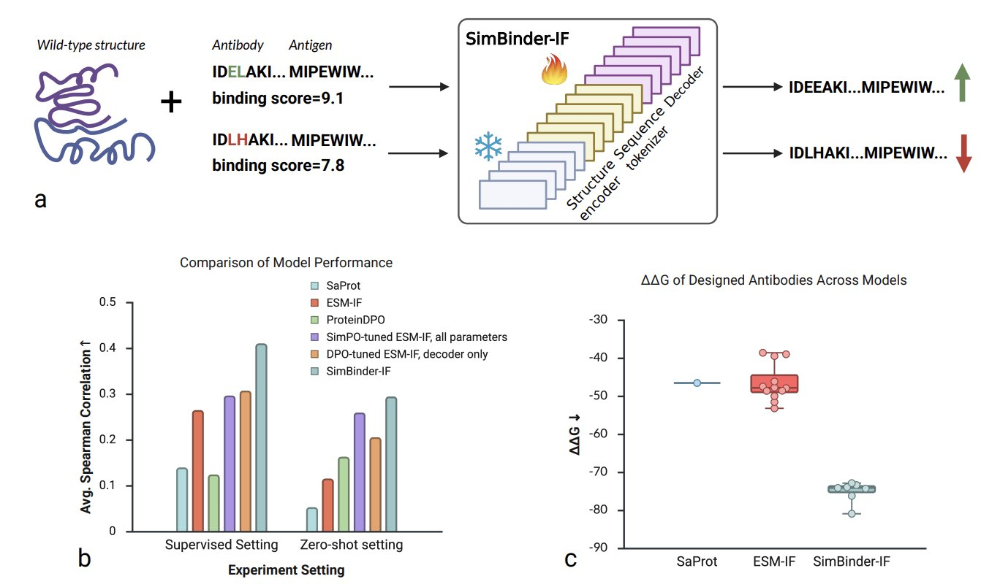
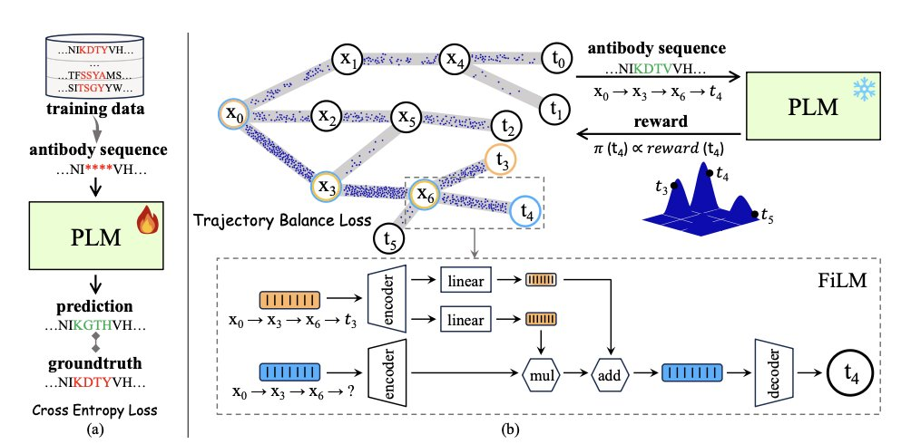
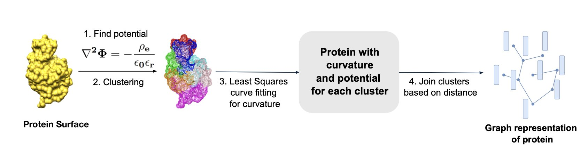
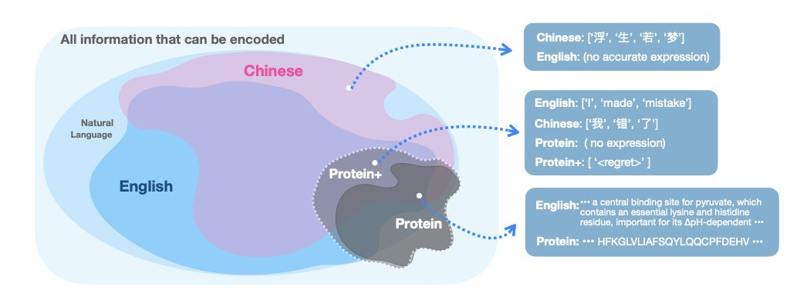
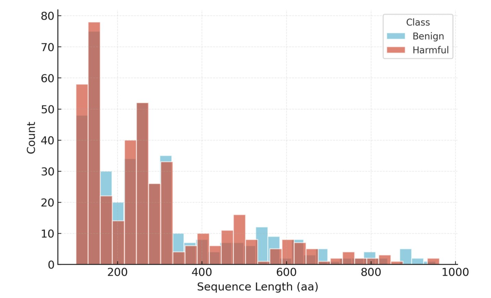

#### Table of Contents
1. Researchers have turned a basic protein design model into a highly effective tool for antibody affinity optimization using a clever preference optimization method, showing strong performance on unseen targets.
2. Researchers combined GFlowNet with a protein language model to develop a new AI framework that generates diverse and effective antibodies without relying on specific training data.
3. The CurvePotGCN model provides an efficient and accurate new method for predicting protein-protein interactions (PPI) by focusing on two fundamental physicochemical properties of the protein surface: curvature and electrostatic potential.
4. By introducing "reflection" and "correction" steps into the training data, biological sequence models can now perform logical reasoning like large language models, significantly improving prediction accuracy.
5. SafeBench-Seq provides a more realistic and stringent benchmark for protein hazard screening models by simulating "never-before-seen" threats, addressing the over-optimism caused by traditional random-split methods.

## 1. A New Approach to AI Antibody Design: SimBinder-IF Boosts Affinity Prediction by 156%

In antibody drug discovery, we're always playing a high-stakes game: how do you pick the one candidate that binds tightest to its target from thousands of options? Traditional methods are slow and laborious, and computational simulations are often not very accurate. A recent paper proposes a model called SimBinder-IF, which offers a very practical solution.

The starting point for this work is interesting. Instead of building a new large model from scratch, the researchers took an existing, powerful protein inverse folding model, ESM-IF, and performed what you could call "minor surgery" on it.

ESM-IF itself is like a translator who is fluent in structural biology. You give it a protein's backbone structure (its 3D coordinates), and it can translate it back into the amino acid sequence most likely to form that structure. This is useful for designing new proteins, but it doesn't directly care about binding affinity.

Here’s how the researchers modified it:

First, they split the ESM-IF model into two parts: a "structure understanding" module (the structure encoder) and a "sequence generating" module (the sequence decoder). They figured that ESM-IF's ability to understand structure was already good enough, so they didn't touch it. They simply froze this part. This left only 18% of the parameters needing to be trained, which solves the problem of computational resources and time. The entire training process can run on a single GPU, with each epoch finishing in under 13 hours. This is a huge draw for R&D teams that need to iterate fast.

The second step, and the most important one, was to introduce a training strategy called Simple Preference Optimization (SimPO). Many previous methods, like DPO, need a reference model to show the main model what "bad" looks like. It's like teaching a child to draw by not only showing them good examples but also a pile of bad ones. SimPO simplifies this. It doesn't need the "bad example" model. Instead, it directly tells the model: out of all the options, A is better than B, and B is better than C. The training goal is just to get the model to learn this ranking, pushing sequences with a high log-likelihood (you can think of this as the model's "confidence" in a sequence) to the top. The benefit is that the training objective aligns perfectly with the final evaluation metric we want (high affinity ≈ high log-likelihood). As a result, it corrected nearly half of the incorrect rankings made by the DPO strategy.

So, how well does this modified model perform? The data speaks for itself.

On AbBiBench, a public benchmark with 11 different antibodies, the Spearman correlation between SimBinder-IF's predicted log-likelihood and experimentally measured binding affinity jumped from the baseline model's 0.264 to 0.410—a 55% increase.

The performance in zero-shot tests was even more striking. The researchers used four antigen-antibody complexes the model had never seen during training. In this "unseen exam," the correlation shot up from 0.115 to 0.294, a 156% improvement. This shows that SimBinder-IF isn't just memorizing answers; it has actually learned some general rules about antibody affinity and can apply them to new targets. For drug development, that is invaluable.

In practice, what we care about most is whether a model can help us pick out the truly effective designs from a large pool. SimBinder-IF also clearly outperformed other models like ESM-IF and ProteinDPO in Top-10 prediction accuracy. This means that candidate molecules selected by this model have a higher chance of success in experimental validation.

To further test this, the researchers did a case study on optimizing a known antibody, F045-092, which targets the pdmH1N1 influenza virus. The new sequences designed by SimBinder-IF had an average change in binding free energy (ΔΔG), calculated by FoldX, of -75.16 kcal/mol. For comparison, sequences designed by the standard ESM-IF only reached -46.57 kcal/mol. The more negative this number, the tighter and more stable the binding.

Of course, a good antibody design isn't just about affinity. Its 3D structure must be stable, not like a wet noodle, and its binding interface with the target must be credible. The researchers checked the quality of the designed structures using a series of metrics (pLDDT, ipLDDT) and found that the increase in affinity did not come at the cost of structural stability. Even more interesting, the binding sites designed by the model tended to cluster on the head region of the influenza hemagglutinin (HA) protein—the primary target for the immune system. This seems to suggest that the model's design strategy, in a way, mimics the body's natural immune response.

The method has its limitations. For instance, it might have an excessive preference for certain immunodominant epitopes, which may not be ideal for antibodies that need broad-spectrum activity. It also currently optimizes for only a single objective: affinity. Future work might introduce multi-objective optimization, considering affinity, stability, and off-target effects at the same time.

This work provides a lightweight, efficient, and effective tool for optimizing antibody affinity. It’s not a one-size-fits-all model, but rather a focused, precise scalpel, well-suited for rapidly screening and optimizing lead compounds in a real-world R&D workflow.

📜Title: Structure-Aware Antibody Design with Affinity-Optimized Inverse Folding
🌐Paper: https://arxiv.org/abs/2512.17815v1

## 2. AI Antibody Design: GFlowNet and Large Models Unlock Diversity

In antibody discovery, we're always playing a numbers game. The sequence space of an antibody's Complementarity-Determining Regions (CDRs) is enormous. Finding a candidate in this space with high affinity, high specificity, and good developability is like finding a needle in a haystack. Traditional generative models, like Generative Adversarial Networks (GANs) or Variational Autoencoders (VAEs), tend to suffer from "mode collapse" when exploring this space. They repeatedly generate similar "optimal" solutions, leading to a lack of diversity among the candidates.

The new framework proposed in this paper, PG-AbD, offers an interesting solution. It introduces Generative Flow Networks (GFlowNets).

A GFlowNet works differently from traditional models. Think of it as a hiker, not a tourist who only sticks to the main roads. It doesn't just want to find the highest peak (the optimal solution); it wants to map out all the paths leading to different peaks and decide how often to explore each path based on its "reward." This mechanism naturally encourages diversity because it samples proportionally from the entire space of high-quality solutions, instead of just focusing on one point.

But a GFlowNet alone is not enough; you also need a good map to guide it. This is where Protein Language Models (PLMs) come in.

A PLM, like ESM-2, is like an expert who is fluent in the "language of proteins." By learning from hundreds of millions of natural protein sequences, it understands the underlying rules of how amino acids combine and knows which sequence combinations are structurally stable and reasonable. This provides "global" guidance for the GFlowNet's exploration, ensuring it doesn't generate bizarre sequences that violate biological principles.

The clever part of PG-AbD is that it has two "experts"—a PLM and a Potts model—guiding the GFlowNet at the same time. The PLM ensures the overall sequence is plausible, while the Potts model focuses more on local details, like interactions between specific pairs of amino acids. This dual constraint of global and local guidance makes the GFlowNet's exploration both bold and reliable.

What about the results? The data shows that on RabDab and SabDab, two standard antibody database benchmarks, the diversity of sequences generated by PG-AbD was 13.5% to 31.1% higher than existing methods.

Diversity is critical in antibody drug development. You don't want to put all your eggs in one basket by getting a bunch of candidates that are structurally and functionally similar. Higher diversity means you have a better chance of finding unique molecules with new binding modes or the ability to overcome drug resistance.

One of the most appealing aspects of this framework is that it can work without specific training data. In many projects, especially those targeting a brand-new target or epitope, we simply don't have a large set of known antibody sequences for the model to learn from. PG-AbD's "zero-shot" capability makes it flexible enough to be used for designing entirely new antibodies as well as for optimizing existing lead compounds.

In short, PG-AbD gives us a more powerful searchlight to illuminate more of the previously unexplored corners of the antibody sequence universe. It generates candidates that are not only numerous but also "unusual" in a plausible way, which is exactly what's needed in the early stages of drug discovery.

📜**Title**: Synergy of GFlowNet and Protein Language Model Makes a Diverse Antibody Designer
🌐**Paper**: https://ojs.aaai.org/index.php/AAAI/article/download/34370/36525

## 3. A New Way to Predict Protein Interactions: CurvePotGCN Goes Back to Basics

In drug development, predicting how proteins interact with each other—known as protein-protein interaction (PPI)—has always been a central challenge. Many diseases are caused by proteins shaking hands when they shouldn't, or failing to embrace when they should. Traditional methods often rely on amino acid sequences, complex evolutionary information, or high-quality protein complex structures, all of which are expensive to obtain.

A recent paper proposes a model called CurvePotGCN that offers a refreshingly simple idea. The authors argue that at its core, protein interaction is about physics and chemistry. Whether two protein molecules will "click" largely depends on whether their surface shapes (curvature) and charge distributions (electrostatic potential) are complementary. It’s like two Lego bricks: they can only fit together if the bumps and hollows match up.

Here's how the model works:

First, it doesn't look at the complex atomic details inside the protein. It treats the protein surface like a map and uses a "coarse-graining" method to divide this map into different small patches (nodes).

Next, it gives each patch two key labels: whether the terrain here is a bump or a dip (surface curvature), and whether the "climate" here is positively or negatively charged (electrostatic potential).

Finally, it feeds these labeled patches into a Graph Convolutional Network (GCN). A GCN is good at learning relationships between nodes and the overall structure of a graph. Through training, it learns which combinations of curvature and potential patterns signal that two proteins are likely to interact.

This "back-to-basics" approach works surprisingly well. On a human protein interaction dataset, its AUROC (Area Under the ROC Curve, a common metric for a model's predictive power) reached 98%, and on a yeast dataset, it was 89%. These results are comparable to or even better than those from models that rely on much more complex features.

What I find striking about this model is its ability to directly use monomer structures predicted by AlphaFold2. This means we no longer need to go through the expensive and time-consuming process of determining crystal structures of protein complexes. As long as you have a reliable prediction of a single protein's structure, you can quickly and massively screen for its potential interaction partners. This is a huge help for finding new drug targets or understanding a drug's off-target effects.

The researchers now plan to extend this model to other species and even use it to predict cross-species protein interactions, such as those between pathogens and their hosts. This opens up a new door for developing anti-infective drugs.

📜Title: CurvePotGCN - A graph neural network to predict protein-protein interactions using surface curvature and electrostatic potential as node-features
🌐Paper: https://doi.org/10.26434/chemrxiv-2025-xr8r3

## 4. Reflection Pretraining: Teaching Protein Models to Think and Self-Correct

We've long wanted AI models in biology to have the same kind of reasoning and logical abilities that Large Language Models (LLMs) have with text. But there's a hurdle: the "vocabulary" of biology is tiny. DNA has just four bases (A, T, C, G), and proteins have only 20 amino acids. Compare that to the vast ocean of words in human language. This makes it hard for biological sequence models to learn complex chains of reasoning. They often just give a final answer without showing how they got there, leaving us in the dark.

This new work proposes a clever solution called "Reflection Pretraining."

The core idea is simple, much like how we teach a student to solve a problem. We don't just show them the correct answer. We also show them the steps to get there, and maybe even write out a wrong solution and then tell them, "See, this part was wrong. Here's how you should fix it."

That's exactly how the researchers trained their model. They added special "reasoning tokens" to the training data, deliberately creating errors and then guiding the model to reflect on and correct them. For example, the model might first generate an initial amino acid sequence. Then, a `<REFLECT>` token signals the start of reflection, where the model points out a potential issue in the sequence. Next, a `<CORRECT>` token guides the model to generate a revised, more accurate sequence.

The whole process is like the model talking to itself: "I predicted a leucine (L) here, but looking back at the mass spectrometry data, the signal seems to support isoleucine (I) more. I should change it."

This method sounds simple, but it works remarkably well. The researchers applied it to the classic problem of *de novo* peptide sequencing. This task is like piecing together a sentence from a bunch of fragmented clues and really tests a model's logical skills. The results showed that the model trained with reflection pretraining was far more accurate than standard models that just "solve the problem silently."

Even more interesting, the researchers found that deliberately increasing the proportion of errors during training actually made the model's self-correction ability stronger. This suggests the model is truly learning from its mistakes, not just memorizing answers.

What does this mean for people in drug development? It means we might have more reliable AI tools in the future. Whether we're designing new protein drugs or analyzing complex experimental data, a model that can "show its work" and "correct its own mistakes" is far more trustworthy than a black box. We can trace its decision-making path and understand why it made a certain prediction, which is critical in the rigorously validated field of drug R&D.

📜Title: Reflection Pretraining Enables Token-Level Self-Correction in Biological Sequence Models
🌐Paper: https://arxiv.org/abs/2512.20954v1
💻Code: The paper mentions that the code, model weights, and results are available on GitHub.

## 5. AI Protein Hazard Screening: Moving Beyond Random Tests to Real-World Challenges

In drug R&D and biosecurity, we deal with massive amounts of sequence data every day. A core task is to quickly determine if a new protein sequence is potentially hazardous, like a toxin. Everyone is using Machine Learning models for this now, but that raises a question: how do you know if your model is actually effective, or just fooling itself?

The SafeBench-Seq benchmark, proposed in this paper, is designed to solve this trust problem.

In the past, the most common way to evaluate these models was to randomly split a dataset. This is like giving a student a question bank to practice with, then testing them with a random selection of questions from that same bank. The student might get a high score, but they may have just memorized the answers, not actually learned the concepts. In the context of protein screening, a model might just memorize certain "surface features" of known toxin families. The moment it encounters a novel, never-before-seen hazardous protein, it's stumped. This evaluation method gives us a false sense of security, which can be dangerous in the real world.

SafeBench-Seq takes a completely different approach. It uses what's called a "homology-clustered split."

You can think of it this way: first, it groups all proteins into different families based on their "kinship" (homology). When splitting the dataset, it puts an entire family into either the training set or the test set. This way, the proteins in the test set are like a "new species" to the model. The model can no longer "guess the answer" from memory; it must learn to recognize the deeper, underlying rules that determine a protein's function.

The authors found that when tested this way, the models' performance showed a huge "robustness gap" compared to their performance on random splits. This directly proves how unreliable traditional evaluation methods are.

Beyond this core design, the benchmark has several other advantages that are highly relevant to front-line R&D.

First, it is based entirely on public data and only requires a CPU to run. This means any lab, regardless of its computational resources, can use it to validate its models. This greatly lowers the barrier to entry for biosecurity research.

Second, it puts a strong emphasis on "calibrated probability outputs." When screening high-risk sequences, we don't just want to know if the model thinks it "is" or "is not" a hazardous protein; we want to know how reliable its "confidence level" is. If a model says there's a "95% probability of being hazardous," we want its actual accuracy to be 95%. The authors used specific methods to calibrate the model's probability outputs, making the predictions more valuable for real-world decision-making.

Third, the researchers also designed "spurious-signal probes" to prevent the model from taking shortcuts. For instance, they would scramble the amino acid sequence of a hazardous protein while keeping the amino acid composition and length the same. If the model still gave a high-risk score in this case, it would suggest it's just relying on simple signals like composition, not truly understanding the sequence information. The tests showed that the models are indeed learning deep, sequence-level signals, which gives us more confidence in their abilities.

Finally, while advancing the technology, this work also gives full consideration to biosecurity. The authors only released metadata like protein index numbers and cluster information, without directly distributing any hazardous sequences. This responsible approach sets a good example for the industry.

Overall, SafeBench-Seq is not just a new dataset; it represents a more honest and realistic way of thinking about evaluation. It reminds us that in a field like biosecurity with very little room for error, we must measure our tools with the strictest possible ruler.

📜Title: SafeBench-Seq: A Homology-Clustered, CPU-Only Baseline for Protein Hazard Screening with Physicochemical/Composition Features and Cluster-Aware Confid...
🌐Paper: <https://arxiv.org/abs/2512.17527v1>
💻Code: <https://github.com/HARISKHAN-1729/SafeBench-Seq>
