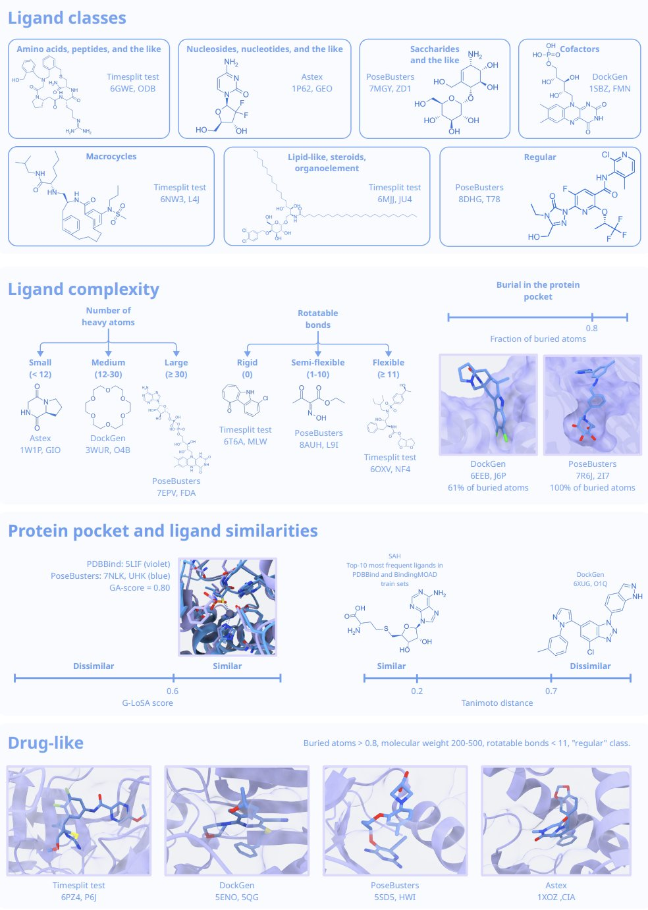
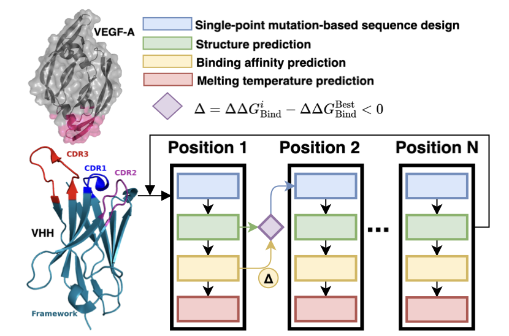
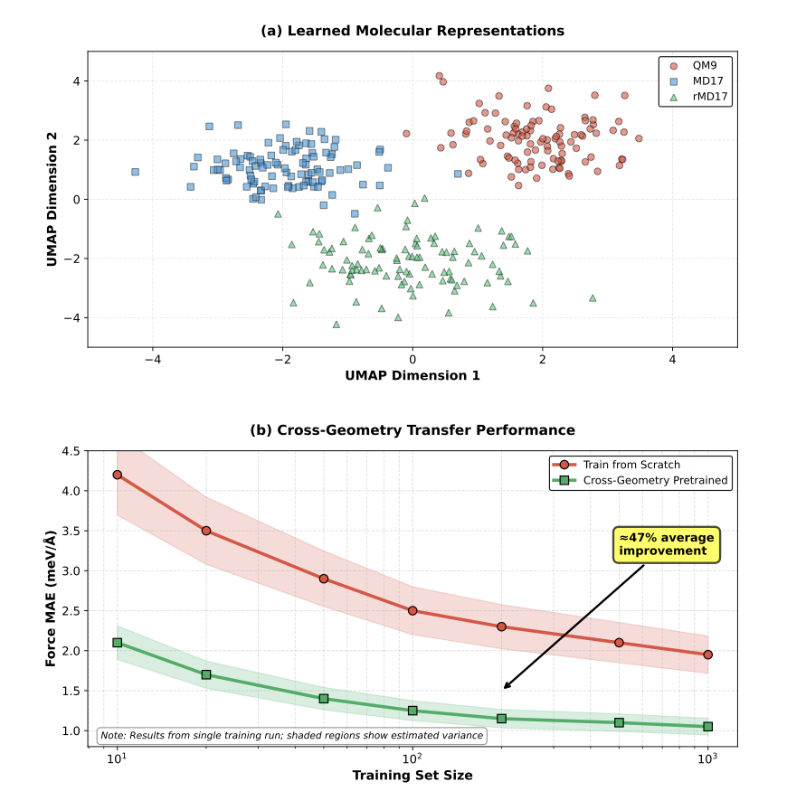
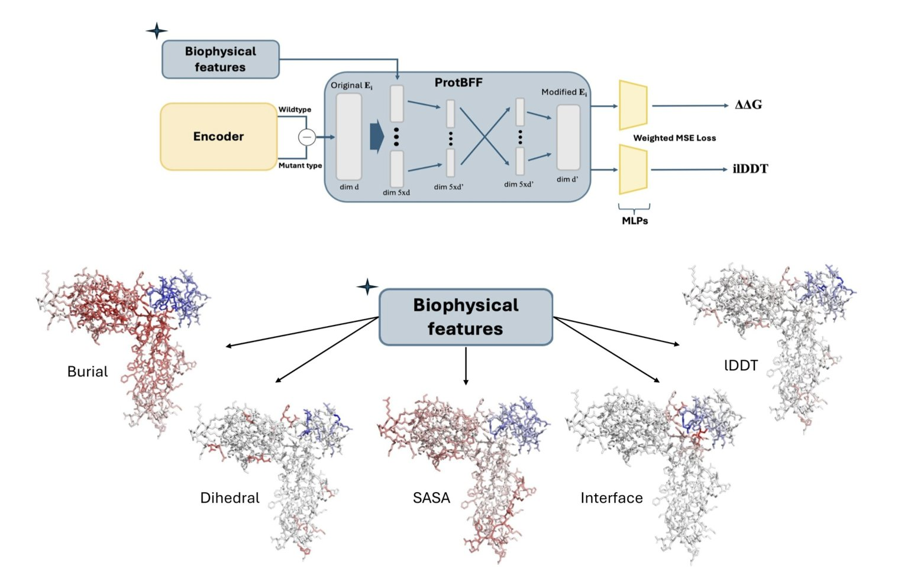
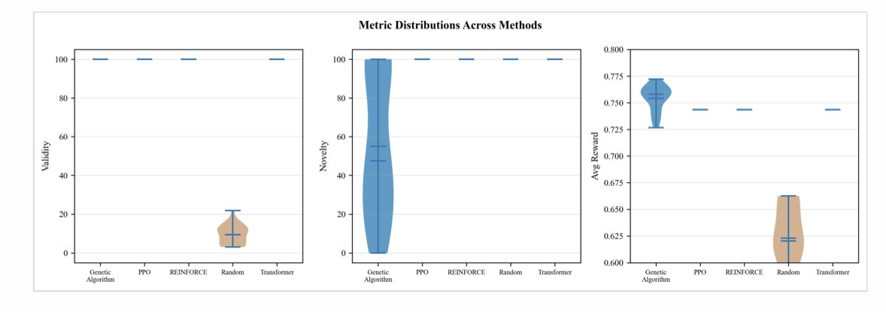

#### Contents
1. The BENTO benchmark shows that all current molecular docking tools (both AI and classical) struggle to generalize to unseen protein pockets, which is the real challenge in drug development.
2. Researchers used a deep learning model to successfully increase the affinity of an anti-VEGF nanobody by several orders of magnitude without sacrificing stability, offering a new approach for rational antibody design.
3. By pre-training on diverse molecular geometries, an equivariant neural network can accurately predict properties for new molecules with very low computational cost.
4. Injecting basic biophysical knowledge (priors) into existing models can significantly improve the accuracy of predicting protein mutation effects and reduce dependency on flawed datasets.
5. There's no one-size-fits-all model for molecular generation. Genetic algorithms excel at optimization, while reinforcement learning excels at exploration. A hybrid approach is the practical strategy for solving problems.

## 1. A New Benchmark for AI Drug Discovery: Why Even AlphaFold3 Struggles with New Targets

If you work in drug discovery, you deal with computational tools every day. From classical molecular docking to the hot AI models of today, our toolkit is growing. But which of these tools actually work well? Especially when you're facing a brand-new target, who can give you a reliable answer?

Recently, a new benchmark study called BENTO gave us a pretty sobering answer. It doesn't just run some scores and rank the tools like many past benchmarks. BENTO did something more important: it carefully curated and split its datasets specifically to test the "generalization ability" of these tools.

**Is the problem in the data, not the algorithm?**

Many previous benchmarks had a hidden problem: the test sets were too similar to the training sets. This is like an open-book exam. The model is just looking up answers to questions it has already "memorized," so of course it gets a high score. But that doesn't tell us how the model will perform when it encounters a completely new, never-before-seen protein binding pocket.

The BENTO researchers knew what they were doing. They strictly controlled the structural similarity between the protein pockets in the test set and the training set. They also stratified the data by the complexity of the ligand molecules. Once they did this, the true performance of the models was exposed.

**The real-world performance of different tools**

BENTO evaluated 11 mainstream tools, which can be grouped into three categories:

1.  **Classical Docking Tools:** These are our old friends, based on physics principles and very fast. The results show that they are stable and reliable for handling small, drug-like molecules. For virtual screening projects that need to screen millions of compounds, they are still the workhorses.
2.  **Deep Learning Docking Tools:** Represented by Gnina, these are the rising stars of recent years. In the BENTO test, Gnina performed very well, especially on drug-like molecules, ranking high in both accuracy and robustness. But they have a fatal flaw: they tend to overfit. As soon as they encounter a pocket type not seen in the training data, their predictions can be wildly wrong.
3.  **Co-folding Algorithms:** The star player here is, of course, AlphaFold3. These methods don't just dock; they "fold" the protein and ligand together. Their strength is in handling complex, flexible ligands, which is a weak spot for traditional docking methods. The results confirmed this; co-folding algorithms did perform better on complex ligands.

**The real challenge: Pocket-level generalization**

The most critical finding from this test is that all tools, without exception, ran into big trouble when generalizing to new pockets.

What does this mean for those of us in drug discovery?

If you're working on a well-studied target family, like kinases, then existing AI and classical tools work just fine. That's because the models have already "seen" a large number of similar pockets during training.

But if you're tackling a first-in-class target with a unique binding pocket structure, you have to question any model's prediction. An AI model might give you a false "high score" due to overfitting, while a classical method might be wrong because of inaccurate force field parameters.

**How should we use these tools?**

BENTO gives us a clear roadmap:

The greatest value of the BENTO study isn't about telling us who's number one. It's about revealing the common challenge facing the entire field. It gives us a more rigorous evaluation framework that's closer to real-world R&D scenarios, helping us squeeze the "hype" out of AI models and see their true capabilities and limitations.

📜Title: BENTO: Benchmarking Classical and AI Docking on Drug Design–Relevant Data
🌐Paper: https://www.biorxiv.org/content/10.64898/2025.12.30.696741v1

## 2. AI-Powered Nanobody Engineering: A Win-Win for Affinity and Stability

In antibody drug development, we're always playing a balancing act: on one hand, we want higher affinity; on the other, we need to maintain the molecule's stability. It's like supercharging a race car engine—you get more power, but the engine might overheat and fail at any moment. Traditional affinity maturation methods, like phage display, are essentially brute-force screening. They blindly search for the best combinations in massive mutation libraries, which is time-consuming, labor-intensive, and often produces a bunch of unstable molecules that can't be developed into drugs.

The work in this paper aims to make this process more "rational" using computational methods.

Their approach is straightforward. The first step is to get the 3D structure of the antibody and its target. The researchers used ColabFold, a simplified version of AlphaFold2, which is fast and accurate for predicting protein structures—a standard tool in the field now. With the structure, they had a foundation for making changes.

The second step was to perform virtual mutation screening. They used a tool called DDgPredictor to calculate the effect of amino acid mutations on binding free energy (ΔΔG). This process is like doing experiments on a computer: you swap one amino acid for another at a specific position and then calculate if the new molecule will bind more tightly to the target. Their goal was to find the "golden mutations" that significantly lower the binding energy.

But they didn't stop there, and this is what I think makes their work so smart. They didn't just focus on affinity. They trained a sequence-based deep learning model specifically to predict the nanobody's melting temperature (Tm), which is a measure of thermal stability. If an antibody isn't stable enough, it might degrade quickly in the human body, making high affinity useless. Their Tm prediction model achieved a Pearson correlation coefficient of 0.772. While not perfect, it's good enough to serve as a filter.

So, the entire workflow looks like this:
1.  Predict the structure with ColabFold.
2.  Perform extensive virtual mutations in the complementarity-determining regions (CDRs).
3.  Use DDgPredictor to screen for mutations that improve affinity.
4.  Use the Tm predictor to filter out mutations that might cause instability.

By doing this, they achieved a dual-objective optimization: high affinity and good stability.

What were the results? Quite good. They found some mutation combinations that could lower the binding energy by as much as -4.92 kcal/mol. What does that mean? In thermodynamics, every ~1.4 kcal/mol decrease in binding free energy corresponds to a 10-fold increase in affinity. A drop of -4.92 kcal/mol means an affinity improvement of over 1000 times. That's a huge leap in drug discovery.

This study also offers a valuable piece of practical advice: the CDR3 region of a nanobody is not only critical for binding but also has a major impact on the molecule's overall stability. Their data showed that certain positions in CDR3 are highly sensitive to mutation. This is like a core load-bearing wall in a building—you can't just knock holes in it. This finding helps us identify "danger zones" to avoid when designing other nanobodies in the future.

Of course, these are still computational results. The critical next step is to go into the wet lab, synthesize these predicted "super-mutants," and use experimental data to verify if they are as effective as predicted. Regardless, this work shows us a more efficient and intelligent paradigm for antibody engineering. It brings us one step closer to the goal of designing the perfect drug on a computer.

📜Title: A Deep Learning Approach for Rational Affinity Maturation of Anti-VEGF Nanobodies
🌐Paper: https://www.biorxiv.org/content/10.1101/2025.10.20.683442v1

## 3. A New Way to Train AI: How to Build a General Molecular Model in Under 100 Hours

Anyone in computational chemistry or AI drug discovery knows this pain point: every time you start working on a new series of compounds or a new target, you often have to gather new data and train a new model from scratch. It's like making a new key for every lock—it takes time and effort, and when data is scarce, the model's performance is poor.

What we've been hoping for is a more general-purpose model—one that has learned the basic principles of physics and chemistry and can be quickly fine-tuned for a new molecule. This work by Kushal Raj Roy and colleagues is a solid step in that direction.

The core idea is called "Cross-Geometry Pretraining." You can think of it like teaching a child what a "chair" is. If you only show them dining chairs, they might think a chair must have four legs and a back. But if you show them dining chairs, office chairs, armchairs, and even beanbags, they will learn the more fundamental rule that "a chair is for sitting."

That's exactly how the researchers "taught" their AI model. Instead of using just one dataset, they mixed QM9 (containing many small molecules with different scaffolds) and MD17 (containing molecular dynamics trajectories, which are data of the same molecule in different conformations).

This approach forced the model (a hybrid of EGNN and PaiNN) to learn the underlying geometric patterns and physical laws that are independent of any specific molecular scaffold. It stopped just fitting the data and started learning a kind of "intuition."

The results were immediate. The paper shows that when dealing with a brand-new molecule, this pre-trained model needed to see only a few examples (few-shot learning) to predict intermolecular forces with an accuracy that was, on average, 47% higher than a model trained from scratch.

What's even more attractive is the cost. All of this was achieved in under 100 hours on a single GPU. For many academic labs or startups with limited computing resources, this is a huge benefit.

There's another clever design in this work: multi-task learning. During training, the model wasn't just asked to predict energy. It also had to simultaneously predict forces between atoms, the HOMO-LUMO gap, and other properties. This is like a student preparing for an exam. If they only practice math problems, they might be clueless about physics. But if they study math, physics, and chemistry at the same time, they'll develop a deeper, more integrated understanding of the underlying scientific principles. This strategy makes the model's internal representations more robust and more consistent with physical and chemical reality.

Of course, this method is still in its early stages. It has mainly been validated on small molecules, and more experiments are needed to see if it can be directly extended to large molecules, protein-ligand complexes, or materials science. But it provides a clear and feasible blueprint: through carefully designed pre-training, we can develop more versatile and powerful tools for predicting molecular properties with limited resources.

The authors have open-sourced all their code and training procedures, which is very valuable for advancing the entire field. This isn't just a win for an algorithm; it's a step forward for a whole research paradigm.

📜Title: Cross-Geometry Pretraining for Equivariant Neural Networks: Improving Molecular Property Prediction Under Computational Constraints
🌐Paper: https://doi.org/10.26434/chemrxiv-2025-pk8gk
💻Code: https://github.com/kroy3/GeoShift

## 4. Giving AI a Physics Lesson Makes Protein Mutation Predictions Reliable

In drug development, especially when designing antibodies or engineering enzymes, we always face a core question: "If I change this amino acid to another one, will the protein binding get stronger or weaker?" This is the problem of predicting changes in binding free energy (∆∆G), and it's a routine task in protein engineering.

In recent years, we've seen many deep learning models claim to solve this problem, with high Pearson correlation scores reported in papers. But when you try to use these models in your own projects, the results are often disappointing. What's the problem? This study by Feldman et al. pulls back the curtain on an industry-wide issue.

**The root of the problem: The dataset is the "answer key"**

Many models are trained and tested on a public dataset called SKEMPI2. The authors point out, bluntly, that this dataset has serious data leakage issues.

What does that mean? Imagine you're training a student for a math exam. If 90% of the practice problems you give them are almost identical to the questions on the final exam, just with different numbers, they're sure to get a high score. But does that mean they truly understand algebra? Clearly not.

SKEMPI2 acts as that "answer key." It contains a large number of protein complexes with highly similar sequences or structures. When a model trains on this data, it's essentially "memorizing" the features of these samples rather than learning the underlying principles of protein-protein interactions.

The researchers proved this. They used stricter criteria to de-duplicate and cluster the SKEMPI2 dataset, removing all the "similar problems." As a result, the performance of nearly every model plummeted. This shows that the previous "high scores" were largely an illusion, achieved through memorization, not understanding.

**The solution: Give the model a "physics tutor"**

If we can't expect a model to figure out the laws of physics from a messy pile of data on its own, why not just teach it directly? This is the design philosophy behind ProtBFF (Protein Biophysical Feature Framework).

ProtBFF is not a new, massive model. It's more like a lightweight "plug-in" or "add-on" that can be integrated into general protein language models like ESM. Its core function is to force-feed the model some of the basic biophysical knowledge (priors) that we already know.

Specifically, it integrates five key physical features, such as:
1.  **Interface Score:** Is this amino acid residue at the binding interface between two proteins? This is obviously a primary factor in determining binding affinity.
2.  **Burial Score:** Is this residue exposed on the protein surface or buried deep in the core? This directly affects its stability and accessibility.

ProtBFF uses a cross-embedding attention mechanism to force the main model to "consult" these physical features when analyzing each amino acid. It's like putting sticky notes all over the 3D structure of the protein, telling the model, "Pay attention, this spot is a binding hotspot!" or "Be careful, this residue is buried deep; changing it might mess up the folding!"

**The result? The model moves from "rote memorization" to "understanding and applying"**

The effect was immediate. After integrating the ProtBFF module, the predictive accuracy of the general models improved noticeably.

More importantly, the model learned to generalize. The researchers applied it to a completely new task: predicting how mutations in the SARS-CoV-2 spike protein affect its binding to the human ACE2 receptor. This is a classic "out-of-distribution" task.

The results showed that even with only a small amount of new data (few-shot learning), the model that had been "tutored" by ProtBFF could make quite accurate predictions. This is what we really want—a tool that can solve new problems, not just re-do old ones.

This work is a reminder that in the field of AI drug discovery, simply chasing bigger models and higher leaderboard scores might be leading us astray. Getting back to basics and cleverly integrating the decades of biophysical knowledge that human scientists have accumulated into our model designs might be the right way to make AI models smarter and more reliable.

📜Title: Biophysically Grounded Deep Learning Improves Protein–Protein ∆∆G Prediction
🌐Paper: https://www.biorxiv.org/content/10.64898/2025.12.23.696257v1

## 5. Which AI Is Best for Making Molecules? Genetic Algorithms vs. Reinforcement Learning

In drug discovery, we're always searching for new molecules. Now we have all sorts of AI generative models that claim to help us design better ones. But that leads to a question: with so many methods, which one is actually good? It's like having a toolbox with a hammer, a screwdriver, and a wrench—you need to know which tool to use for which job. This paper does something very practical: it puts several major molecule generation methods in the same ring and compares them head-to-head using rigorous statistical methods.

**A duel of two philosophies: Refinement vs. Blue-sky thinking**

The researchers primarily compared two types of algorithms: Genetic Algorithms (GA) and Reinforcement Learning (RL).

A **Genetic Algorithm** works a lot like animal breeding. You start with a population of molecules ("parents"), then create new molecules ("offspring") through "crossover" (stitching parts of two molecules together) and "mutation" (randomly changing a few atoms or bonds). Then, you keep only the "offspring" with the best properties and let them continue to reproduce. As this process repeats, the properties of the molecules get better and better. According to the data, GA performed impressively, achieving the highest average reward score (0.754) and generating molecules that were 100% valid. But its problem is its novelty score, which was only 55%. This means it's very good at finely optimizing and decorating a known, promising chemical scaffold, but it struggles to think outside the box and create entirely new scaffolds. It's more like a skilled medicinal chemist doing SAR (structure-activity relationship) studies on a mature series.

**Reinforcement Learning** is a completely different beast. It works by having the model build a molecule atom by atom, like building with blocks. With each step, if it follows chemical rules and improves the molecule's properties, it gets a "reward." If not, it gets a "penalty." Through trial and error, the model learns how to "play" this block-building game well. The advantage of this method is that it's not constrained by any existing scaffolds and can freely explore the vast chemical space. As a result, its novelty score was a perfect 100%. But its downside is that this free exploration can be inefficient, and the "optimal solution" it finds often doesn't have as high a reward score as what GA can achieve. It's more like a creative chemist full of wild ideas, always proposing new structures you've never seen before.

**The "chemical intuition" of models**

The study also made another important discovery: these models are highly versatile. The researchers tested them on the ZINC (a library of common drug-like molecules), QM9 (a library of quantum chemistry properties for small molecules), and an agrochemical database. They found that the performance of the models varied by less than 2% across these different datasets.

What does this mean? It means these models aren't just "memorizing" the molecular patterns from their training sets. They have actually learned some fundamental, universal chemical principles, like which ring systems are stable or which functional groups can be combined. This gives drug hunters a lot of confidence. It means we can take a model trained on a general database and apply it to a very specific drug design problem for a new target, without worrying that it won't be a good fit.

**How to use these tools effectively?**

So, which one should you choose for a real project? This paper suggests a hybrid strategy.

In the early stages of a drug discovery project, when you know little about the target or the chemical space, you should start with methods like reinforcement learning. Let it explore freely and generate a wide variety of novel chemical scaffolds to give you as many new starting points as possible. At this stage, we're aiming for "breadth."

Once you've screened these new scaffolds and identified a few promising series, you can switch to a genetic algorithm. Use GA to finely optimize these series, dig deep into their potential, and find the single molecule with the best activity and drug-like properties. At this stage, we're aiming for "depth."

First use RL for Exploration, then use GA for Exploitation. This process perfectly resolves the "exploration-exploitation" dilemma in molecule design. This isn't just an AI strategy; it actually mirrors the way we human chemists think and work in practice.

📜Title: Comparative Evaluation of Molecular Generation Methods for Bioactive Compound Design: A Rigorous Statistical Benchmark Across Drug, Agrochemical, and Small Molecule Datasets
🌐Paper: https://doi.org/10.26434/chemrxiv-2025-t30lx
