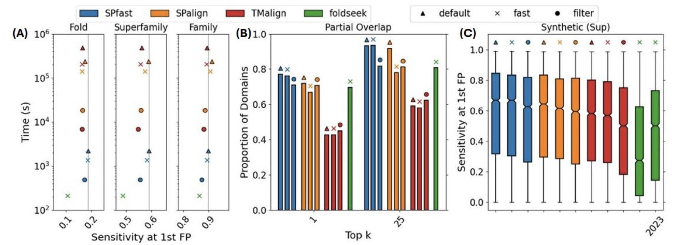
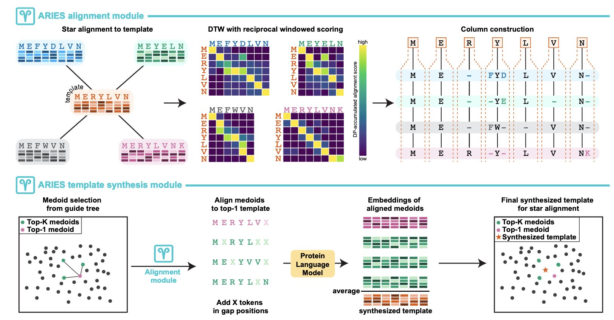
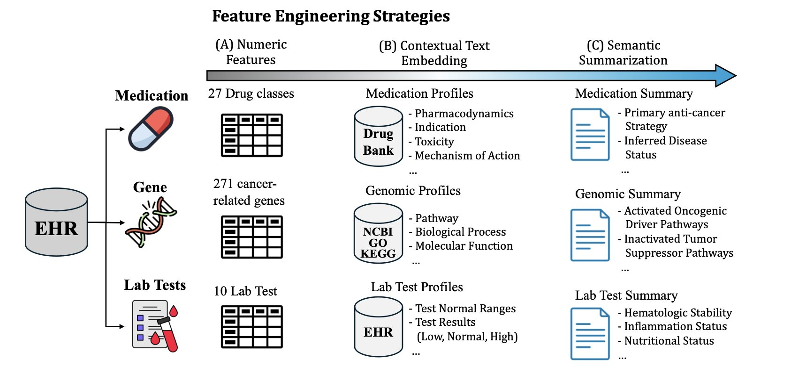
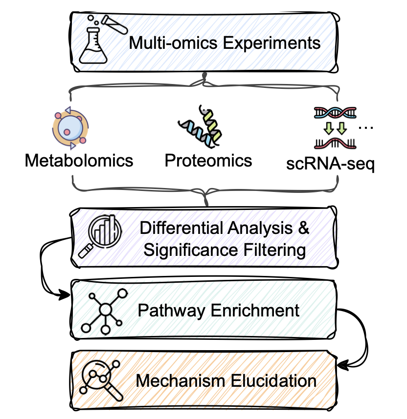
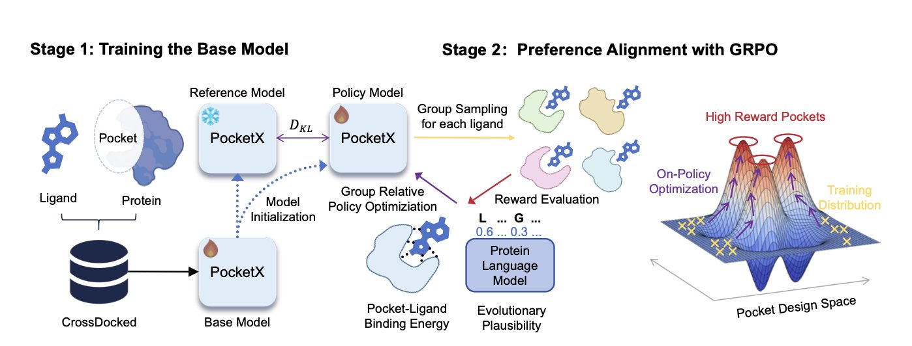

#### Table of Contents  
1. SPfast speeds up protein structure alignment by over two orders of magnitude while improving sensitivity, using a novel segmented coarse-graining method and block-sparse optimization. This opens the door for large-scale structural database mining.
2. ARIES uses deep representations from protein language models to bypass the limits of traditional alignment, offering a more accurate and faster solution for low-homology sequences.
3. This paper presents a new approach where a large language model acts as a "knowledge curator," extracting deep semantic meaning from clinical data to improve lung cancer outcome predictions.
4. The new BIOME-Bench benchmark uses real scientific papers to create a "test" for large language models, showing they still struggle to accurately reason about complex biological pathway mechanisms.
5. PocketX uses reinforcement learning to fine-tune AI-generated protein pockets, much like an experienced chemist would. The result is a design that not only binds a ligand but is also more biologically sound.

## 1. How Does SPfast Make Protein Structure Alignment 100 Times Faster?  
  
  

If you work in computer-aided drug discovery (CADD) or structural biology, you deal with protein structures every day. A fundamental task is structure alignment: seeing how similar two proteins look in 3D space. This is the basis for function annotation, evolutionary analysis, and target discovery. Our common tools, like TM-align, are accurate but slow. Then came Foldseek, which is much faster but sometimes lacks sensitivity. Tools in this field always have to balance speed and accuracy.  
  
Now, a new paper introduces SPfast, which seems to break this trade-off.  
  
Its core performance data is straightforward: it's over two orders of magnitude faster than both TM-align and Foldseek. That isn't a 10% or 20% improvement; it's 100 times faster. At the same time, its sensitivity—the ability to find true structural similarities—is also higher. So how does it work?  
  
**Step 1: Use a "sketch" to quickly find targets**  
  
Traditional alignment methods often treat a protein as a string of Cα atoms and then compare their spatial positions. When the protein or the database is large, this becomes computationally expensive.  
  
SPfast's approach is to ignore the details at first. It simplifies the protein structure into a "sketch" that retains only the most critical structural elements: α-helices and β-sheets. The researchers defined idealized key points for these secondary structure units to represent entire structural segments.  
  
The benefit is that a protein with hundreds of amino acid residues can now be described by just a few dozen key points. The computational complexity drops instantly. It's like trying to find two similar city layouts on a map. You wouldn't compare every single building; you'd first check if the main roads and core districts align. SPfast uses this method to quickly find potentially similar candidates from a massive number of structures.  
  
**Step 2: Use a "detailed drawing" to restore details**  
  
Looking only at the "sketch" isn't enough, as you lose precision.  
  
After quickly identifying candidates with the coarse-graining method, SPfast moves to a second step: full-atom-level refinement. Here, it uses a technique called block-sparse optimization. This technique can efficiently align two proteins at the atomic level, restoring all the details missed during the "sketch" phase and ensuring the final alignment is accurate.  
  
The whole process is "coarse-to-fine." It starts with a very fast but rough filtering method and then applies a more detailed, time-consuming but accurate calculation to a small number of promising candidates. This is a classic and effective strategy in computer science, and SPfast has successfully applied it to structure alignment.  
  
**This is more than just a faster tool**  
  
The quality of a tool is measured by whether it can solve real problems. The developers of SPfast used it to perform over 100 billion pairwise alignments between a large annotated structure library and a database full of proteins with unknown functions.  
  
This scale of computation was previously hard to imagine. And they found new things. For instance, they identified new toxin-antitoxin systems and type III secretion systems in some pathogenic bacteria. These discoveries were not just computational similarities; they were supported by genomic sequence context. The researchers even used the latest AlphaFold3 to successfully predict the structures of these protein complexes, providing strong evidence for their functional discoveries.  
  
This shows that the speed and sensitivity improvements of SPfast translate into real biological discovery capabilities. It can help us illuminate the functions of the thousands of "dark proteins" (structures known, functions unknown) in the AlphaFold database. This is valuable for both basic biology research and new drug target discovery.  
  
📜Title: Ultra-fast and highly sensitive protein structure alignment with segment-level representations and block-sparse optimization  
🌐Paper: https://www.biorxiv.org/content/10.1101/2025.03.14.643159v2  

## 2. How AI is Reshaping Sequence Alignment: ARIES Tackles Low Homology  
  
  

Anyone in structural biology or protein evolution knows how important multiple sequence alignment (MSA) is. It's a foundational tool for understanding protein families and predicting structure and function. But we also know its pain point: once sequence similarity drops below 20-30%, into the so-called "twilight zone," traditional methods based on scoring matrices like BLOSUM62 are basically useless. They are like a translator who can only recognize spelling but doesn't understand the deeper meaning of words. The results are often a mess.  
  
Now, a new method called ARIES offers a fresh approach. It stops focusing on matching individual amino acids and instead tries to understand the contextual meaning of amino acids within the protein "sentence."  
  
How does it do this? With Protein Language Models (PLMs).  
  
You can think of a PLM as an AI researcher that has read a massive number of protein sequences. It not only recognizes each amino acid but also understands its "meaning" in specific structural and functional contexts. The PLM compresses each amino acid and its context into a high-dimensional vector, or "embedding." This embedding is the foundation of how ARIES works.  
  
ARIES's first step is to have a PLM generate a set of embeddings for each sequence to be aligned. What comes next is the clever part.  
  
It doesn't use traditional algorithms like Needleman-Wunsch or Smith-Waterman. Instead, it designed a "windowed reciprocal weighted embedding similarity" metric. In simple terms, when comparing the embeddings of two amino acids, it considers not just the amino acids themselves but also their neighbors. This makes the alignment more robust and less likely to be thrown off by small, local differences.  
  
Then, it uses Dynamic Time Warping (DTW) to perform the sequence alignment. DTW was originally used in speech recognition and is very good at comparing two time series that have similar patterns but different speeds. Using it here cleverly avoids the most frustrating part of traditional alignment: gap penalties. Setting the right gap penalties has always been a bit of an art, but DTW doesn't need them at all. It naturally handles insertions and deletions in sequences.  
  
What about the results? The researchers tested it against a range of popular MSA tools on standard benchmarks like BAliBASE, HOMSTRAD, and QuanTest2. The results show that ARIES performs well, with a significant accuracy improvement on low-homology datasets.  

And it's computationally efficient. The algorithm's complexity is nearly linear with the number of sequences. This means it won't crash your server when you're dealing with large families containing hundreds or thousands of sequences.  
  
From my perspective, the value of ARIES is that it neatly connects two worlds: the representation power of deep learning and the classic bioinformatics problem of alignment. It proves that PLM embeddings can be used not just for structure prediction but also directly for the more fundamental problem of sequence alignment. For drug development, a more accurate MSA means more reliable homology modeling, more precise functional site prediction, and a deeper evolutionary understanding of target protein families. This is an exciting direction.  
  
📜Title: Fast, accurate construction of multiple sequence alignments from protein language embeddings  
🌐Paper: https://www.biorxiv.org/content/10.64898/2026.01.02.697423v1  

## 3. A New Role for Large Models: Acting as a Knowledge Curator to Predict Lung Cancer Outcomes  
  
  

In drug development and clinical practice, we deal with massive amounts of heterogeneous data every day. Lab reports, gene sequencing results, patient medication histories—this data is mixed, messy, and often incomplete. When traditional machine learning models handle this kind of data, they usually convert everything into cold numbers and feed them into an algorithm. This is like throwing a pile of unprocessed ingredients into a pot and hoping for a good soup; the result is often disappointing because the numbers alone can't capture the underlying clinical logic and medical meaning.  
  
The authors of this paper tried a different approach. Instead of using a Large Language Model (LLM) as a black-box magician that directly predicts outcomes, they gave it a more fundamental and critical role: a "Goal-oriented Knowledge Curator" (GKC).  
  
Here's how it works:  
  
Instead of feeding raw data directly to a prediction model, we first have the LLM "read" and "understand" each type of data separately. For example, given a gene sequencing report, we ask the LLM to summarize the mutations most relevant to "lung cancer treatment outcome." Given a long medication record, we ask it to extract key treatment regimens and potential signs of drug resistance.  
  
Here, the LLM acts like an experienced junior doctor or a research assistant. It helps you take a patient's thick medical file and, based on your request (like "predict treatment response"), organize it into a few concise, logical summaries. These summaries are no longer scattered data points but high-quality "semantic features" with clinical meaning.  
  
The benefits are obvious.  
  
First, prediction accuracy improves significantly. When a prediction model receives high-quality information that has been "pre-digested" and "refined," its learning efficiency and accuracy naturally increase. The paper reports an AUC-ROC of 0.803, which is a good result for sparse, real-world clinical data.  
  
Second, and I think more valuable, is its interpretability. When a traditional AI model makes a prediction, it's hard to know how it arrived at its conclusion. But the GKC framework is different. If the model predicts a poor prognosis for a patient, we can go back and look at the summary generated by the LLM. Was it because the summary mentioned a known resistance mutation? Or did lab data show persistently high inflammation levels? This ability to trace the model's reasoning makes it less of a black box. Clinicians can use these summaries to verify, understand, or even question the model's judgment. This is essential for getting AI tools adopted in clinical settings because it builds trust between humans and machines.  
  
The study also used ablation experiments to show that combining information from lab tests, genomics, and medication history yields the best results. This aligns perfectly with our clinical intuition. A patient's outcome is determined by their physiological state, genetic background, and the interventions they receive. This framework successfully integrates all three.  
  
For those of us in computer-aided drug discovery, this idea is inspiring. It's essentially a more advanced form of feature engineering. We no longer have to be limited to simple one-hot encodings or fixed embeddings to represent complex biomedical entities. Instead, we can use the knowledge within LLMs to generate dynamic features that are highly relevant to a specific task. This has huge potential in areas like target discovery and patient stratification.  
  
📜Title: Enhancing Lung Cancer Treatment Outcome Prediction through Semantic Feature Engineering Using Large Language Models  
🌐Paper: https://arxiv.org/abs/2512.20633v1  

## 4. Can Large Language Models Understand Biological Pathways? A New Benchmark Says: Not Yet.  
  
  

Biologists will be familiar with this scenario.  
  
You've just finished your transcriptomics or proteomics experiment and have a long list of differentially expressed genes or proteins. The next step is usually to feed this list into a pathway enrichment analysis tool. You get back a bunch of statistically significant KEGG pathway names, like "MAPK signaling pathway" or "PI3K-Akt signaling pathway."  
  
And then what? Nothing.  
  
These tools can only tell you that your gene list is "related" to certain pathways, but they can't tell you what's actually happening. For example, which upstream molecule activated which downstream one? How does the upregulation of one gene lead to a specific cellular phenotype through a series of steps? These critical mechanistic questions are left unanswered by traditional tools. You still have to go back and read the literature, one paper at a time.  
  
Now, everyone is hoping that Large Language Models can change this. In theory, since they've read a massive amount of literature, they should be able to connect these dots and tell a complete biological story.  
  
But can they really do it? Or are they just confidently making things up?  
  
To answer this, researchers developed a specialized benchmark called BIOME-Bench. You can think of it as an "exam" for large language models, specifically on the topic of biological pathway mechanisms.  
  
What makes this exam special is that all its questions and answers are derived from real scientific literature. The researchers built it using a four-step process:  
1.  **Search Literature**: Find papers describing specific pathway mechanisms.  
2.  **Extract Information**: Pull out key biological entities (like proteins and genes), their states (like being phosphorylated), and the relationships between them (like A activates B).  
3.  **Build Knowledge**: Organize this scattered information into a structured knowledge graph that clearly shows the causal chain.  
4.  **Validate**: Ensure all information is accurate and true to the original text.  
  
With this high-quality exam, they could start testing the various large language models on the market. The test had two main subjects:  
  
**Subject 1: Biomolecular Interaction Inference**  
This part tests the "details." It gives the model a pathway context and two molecules, then asks: what is the relationship between these two?  
  
This isn't a simple "related/not related" question from a database. It requires the model to precisely determine if the interaction is "activation," "inhibition," "binding," or something more specific. This is critical for drug development; getting one interaction wrong can invalidate an entire mechanistic hypothesis.  
  
**Subject 2: Multi-Omics Pathway Mechanism Elucidation**  
This part tests "big-picture thinking and logic." It gives the model an observed experimental phenomenon (like changes in the expression levels of several genes) and a relevant pathway context, then asks the model to generate a paragraph explaining how it all happened.  
  
This is like being a detective with a few scattered clues (the changing genes) who needs to reconstruct the entire case (the pathway mechanism). It tests not only the model's memory of facts but also its logical reasoning and language organization skills.  
  
So, what were the results?  
  
Not great. The experiments showed that even top models like GPT-4 performed poorly on both tests.  
  
In "Subject 1," the models struggled to distinguish between subtle but critical types of relationships. They might know two proteins interact, but they couldn't accurately describe how, often mixing them up.  
  
In "Subject 2," the mechanistic explanations they generated were either too general and lacked detail, or they contained factual errors with broken logical chains. For scientific work that requires a rigorous chain of evidence, this level of output is not very useful.  
  
This is where the value of BIOME-Bench lies. It's not meant to prove that large language models are "bad," but to provide a standard, quantifiable evaluation tool. It clearly points out the current shortcomings of these models in the biomedical field: **a lack of understanding of fine-grained biological concepts and a lack of rigorous logical reasoning ability**.  
  
With this yardstick, when we develop new biomedical-specific large language models in the future, we'll know which direction to focus on and be able to objectively measure who is doing better. For researchers on the front lines, this means we are one step closer to a truly useful AI research assistant, even if the road ahead still looks long.  
  
📜Title: BIOME-Bench: A Benchmark for Biomolecular Interaction Inference and Multi-Omics Pathway Mechanism Elucidation from Scientific Literature  
🌐Paper: https://arxiv.org/abs/2512.24733v1  

## 5. PocketX: How Reinforcement Learning Makes Protein Pocket Design More Than Just a Blueprint  
  
  

In protein design, especially *de novo* design of a pocket to bind a specific small molecule, we often face an awkward problem: the AI model's generated structure looks perfect on the computer, but when you test it in a wet lab, the results are a mess. Either the protein doesn't express, or it has no activity at all. The reason is simple: many generative models have learned to mimic the "form" but haven't learned the underlying rules of physics, chemistry, and biology. They produce designs that look good but don't work.  
  
PocketX is an attempt to solve this problem. Its approach is direct and interesting.  
  
The process is split into two steps. In the first step, they use a basic generative model to simultaneously design the 3D structure of a pocket and its amino acid sequence, based on a target small molecule (ligand) you provide. This step is like quickly drawing a rough sketch of the design, solving the "from scratch" problem.  
  
The key is the second step: "refinement." Here, the authors introduce a Reinforcement Learning (RL) framework, specifically a new method they developed called "Group Relative Policy Optimization" (GRPO).  
  
The way reinforcement learning works is a lot like training an expert who understands trade-offs. You have the model generate a design, and then you use a reward function to score how good that design is. For instance, we could use the calculated binding energy as a score. A high score gets the model a "reward," letting it know "this direction is right, keep going." A low score gets a "penalty," telling it "this path isn't working, try something else."  
  
GRPO's innovation is in how it provides these rewards. Traditional preference alignment methods, like Direct Preference Optimization (DPO), usually give the model two designs and tell it "A is better than B." This is like a multiple-choice question with two options. But GRPO goes a step further. It shows the model a group of designs at once and then tells it the relative ranking of that entire group. For example, "A is better than B, and B is better than C."  
  
This "ranking" style of feedback contains much more information than a simple "A vs. B" comparison. It gives the model a clearer optimization gradient, making the training process more stable and efficient, and less likely to get stuck in a local optimum. Think of it like teaching a novice to taste wine. You don't just tell them "this one is better than that one." Instead, you have them taste five wines at once and then give them the complete ranking from best to worst. This way, they can build a holistic understanding of what a "good wine" is much faster.  
  
The results show that this strategy works. On the commonly used CrossDocked2020 benchmark, PocketX, after being fine-tuned with GRPO, generated pockets that not only had significantly better binding energy (a measure of how strongly a drug binds to its target) than other models but also performed well on "Evolutionary Plausibility." This second metric is important; it measures how much your designed amino acid sequence resembles sequences found in nature. A more "natural" sequence usually means the protein is more likely to be folded and expressed correctly by a cell, which directly impacts whether your design can move from the computer to reality.  
  
This framework has another advantage: its modular design. This means we can easily add other properties we care about—like solubility, selectivity, or avoiding toxic structures—into the reinforcement learning reward function. This opens up a lot of possibilities for designing more complex and ideal proteins in the future.  
  
PocketX shows how to combine generative models and reinforcement learning to create a powerful new tool for the old problem of protein design. It doesn't just generate structures; it continuously "iteratively optimizes" them during the generation process based on the physical and biological goals we set, bringing the designs one step closer to being truly usable.  
  
📜Title: PocketX: Preference Alignment for Protein Pockets Design through Group Relative Policy Optimization  
🌐Paper: https://www.biorxiv.org/content/10.64898/2025.12.28.696754v1
