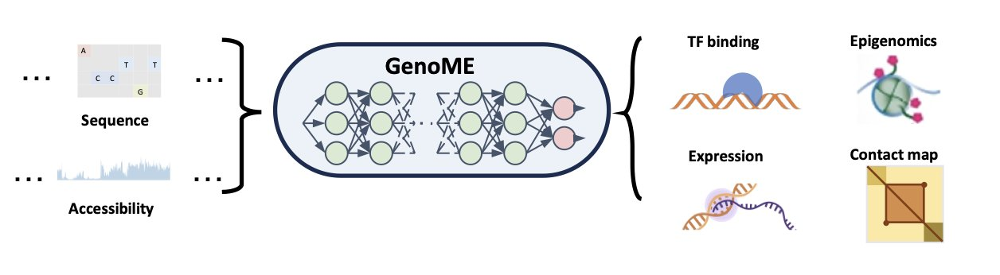
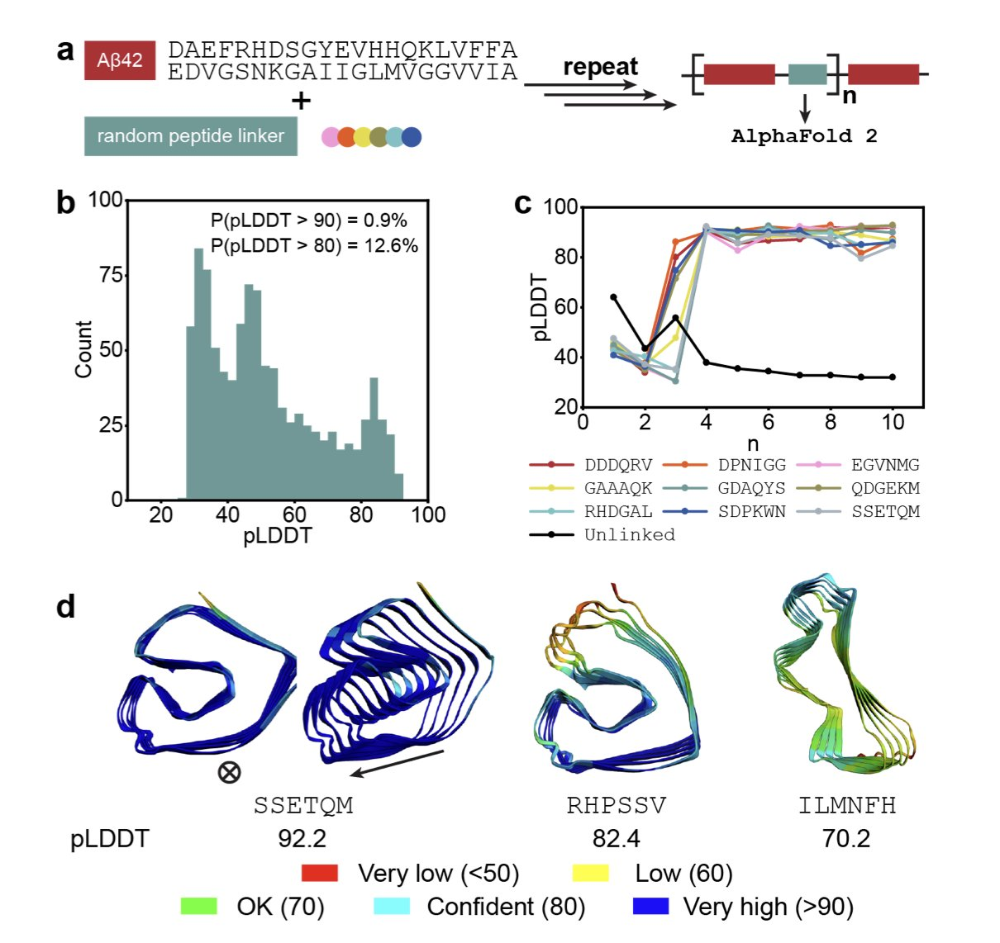
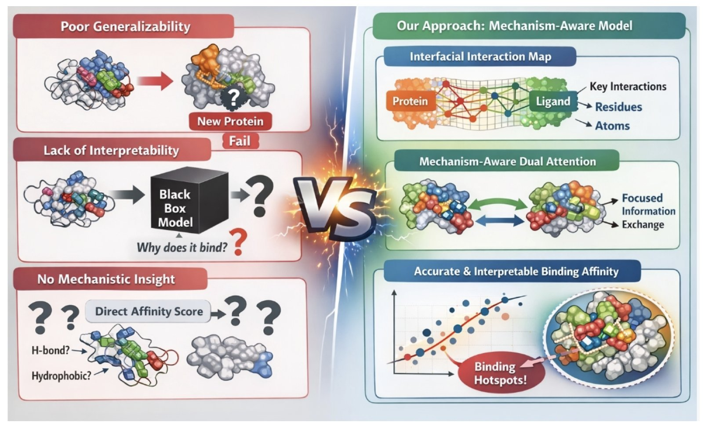
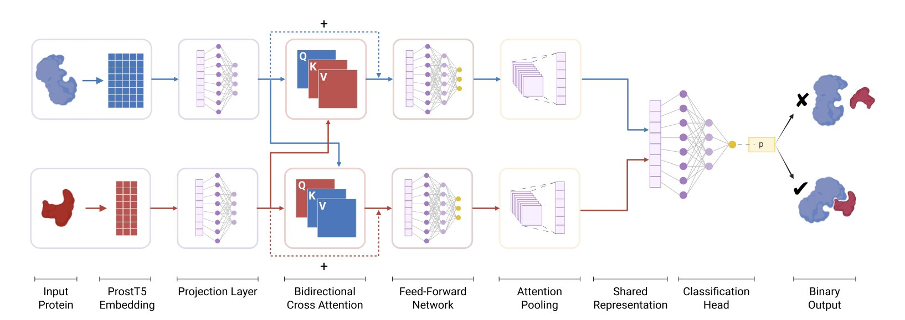
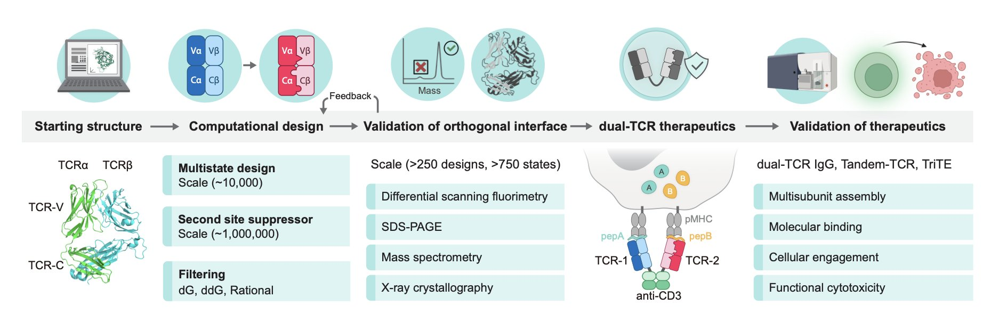

#### 目录  
1. 这个叫 GenoME 的新 AI 模型，只用染色质开放性数据 (ATAC-seq) 就能预测一个全新细胞类型的全套基因调控活动，还能在电脑里直接模拟基因突变的后果。
2. 研究者利用淀粉样蛋白的自组装特性，结合 AlphaFold 的结构预测能力，开发出一种高效的从头设计方法，能快速生成大量结构新颖且稳定的蛋白质。
3. BindMecNet 通过强制模型学习原子 - 残基间的相互作用机制，显著提升了结合亲和力预测的准确性和泛化能力。
4. 这款专为细菌设计的 B-PPI 模型，利用蛋白质语言模型和交叉注意力机制，能更准、更快地筛选蛋白质相互作用，完胜那些用人类数据训练的老模型。
5. 通过计算设计，研究者成功改造了 T 细胞受体 (TCR) 的蛋白接口，强制其α/β链正确配对，为开发更安全、更有效的多特异性 T 细胞疗法铺平了道路。

## 1. GenoME: 用一个模型预测所有细胞的基因调控  
  
  

做基因组学研究，我们总会遇到一个头疼的问题：模型不通用。一个在 T 细胞上训练得很好的基因表达预测模型，扔到神经元上基本就废了。预测组蛋白修饰和预测三维染色质结构又是两套不同的工具。这就像你修车，发动机、变速箱、电路系统各有各的维修手册，而且每个品牌的车手册还完全不同，效率极低。  
  
现在，一篇新论文里的 GenoME 模型，想做的就是那本通用的「汽车维修总纲」。  
  
#### 它是怎么工作的？  
  
研究者把问题简化为两个核心输入：细胞的「硬件」——DNA 序列，以及细胞的「当前运行状态」——染色质可及性（通过 ATAC-seq 测量）。你可以把 DNA 序列想象成一座图书馆里所有的藏书，而 ATAC-seq 数据则告诉你此刻哪些书是打开的、可以阅读的。  
  
GenoME 的架构很聪明，用的是混合专家模型 (Mixture of Experts, MoE)。你不用把它想得太复杂。传统的神经网络就像一个全科医生，什么都懂一点，但可能什么都不精。MoE 框架则像一个专家会诊团队。它里面有很多「专家」子网络，每个子网络可能特别擅长处理某一类细胞（比如免疫细胞或上皮细胞）的调控逻辑。同时，还有一个「门控网络」 (gating network)，它会先分析输入的 ATAC-seq 数据，然后判断：「嗯，这个细胞的特征，应该交给 3 号和 5 号专家组合处理最合适。」  
  
通过这种方式，模型不仅能在不同任务（预测基因表达、染色质结构等）之间共享知识，还能把从一种细胞类型学到的调控规律，巧妙地应用到另一种新的细胞类型上。  
  
#### 真正的亮点：预测未知  
  
这个模型最厉害的地方在于它的泛化能力。通常的 AI 模型在训练集上表现优异，但一遇到没见过的数据类型就「翻车」。GenoME 能够仅凭一个它从未「学习」过的细胞类型的 ATAC-seq 数据，就准确预测出这个细胞的基因表达、组蛋白修饰等一系列状态。  
  
这对我们做研发意味着什么？比如，我们想研究某个罕见病患者的特定细胞，但缺乏该细胞类型的大规模公开数据集来训练模型。用 GenoME，我们只需要对患者细胞进行 ATAC-seq 测序，就能得到一个相当不错的全景式基因调控图谱。这为个性化医疗打开了一扇新的窗户。  
  
#### 在电脑里做 CRISPR 实验  
  
GenoME 另一个强大的功能是「虚拟扰动」 (in silico perturbation)。这基本上等于给了你在电脑里做基因编辑的能力。  
  
举个例子，GWAS 分析发现某个非编码区的 SNP 位点与疾病风险强相关，我们怀疑它影响了一个增强子的功能，但这个增强子到底调控哪个基因？传统的实验验证周期很长。  
  
现在，你可以直接在 GenoME 模型里「修改」这个 SNP 位点，或者干脆「敲除」整个增强子区域的序列，然后让模型重新预测。如果预测结果显示某个特定基因的表达量发生了显著变化，那你就找到了确凿的因果证据链。这能帮我们快速筛选和验证潜在的药物靶点或功能性遗传变异，把实验室里几周的工作缩短到几分钟。  
  
GenoME 不只是又一个预测模型。它提供了一个框架，让我们能以一种接近因果推断的方式，去探索和理解复杂的人类基因组调控逻辑。对于药物研发、功能基因组学和精准医疗领域的人来说，这无疑是个值得关注的强大工具。  
  
📜Title: GenoME: a MoE-based generative model for individualized, multimodal prediction and perturbation of genomic profiles  
🌐Paper: https://www.biorxiv.org/content/10.64898/2025.12.28.696482v1  

## 2. AlphaFold 新玩法：用淀粉样蛋白搭积木，设计全新蛋白质  
  
  

在药物研发领域，从头设计（de novo design）蛋白质一直是个硬骨头。我们通常的目标是设计一个能完成特定任务的蛋白质，比如结合某个靶点。但这个过程很慢，失败率也高。现在，这篇论文的作者们换了个思路：我们能不能先不管功能，就纯粹为了「好玩」，或者说「好奇心」，去创造一些全新的、结构稳定的蛋白质骨架？  
  
他们的想法很巧妙，甚至有点反直觉。他们选用的基础材料是 β-淀粉样蛋白 42（amyloid β42），就是那个在阿尔茨海默病患者大脑里形成斑块的「坏蛋白」。这种蛋白有个特点，就是特别喜欢自我聚集，形成稳定的 β-折叠结构。研究者们正是看中了它的这种「结构稳定性」。  
  
**这是它的工作原理**：  
  
第一步，他们把两个 Aβ42 单元拿出来，当成两块「积木」。  
  
第二步，用一段随机生成的六肽链（hexapeptide linker）把这两块「积木」连起来。这就像用一根短绳子把两块积木拴在一起。  
  
第三步，把这个拼接出来的序列扔给 AlphaFold 2。他们并不问「这个蛋白质能干什么？」，而是问「这个序列能折叠成一个稳定的三维结构吗？」AlphaFold 会给出一个高置信度的预测，就代表它认为这个结构是稳定存在的。  
  
结果出人意料地好。在完全随机的连接下，超过 12% 的设计方案都获得了 AlphaFold 的高分认可。对于从头设计来说，这是一个非常可观的「命中率」。  
  
**接下来是更有趣的部分：计算进化**  
  
有了第一批稳定的结构，研究者们并没有停下。他们引入了基因算法（genetic algorithm），在计算机里模拟「进化」。  
  
他们对成功的结构进行小范围的「突变」（segmental mutations），然后再次用 AlphaFold 进行筛选，保留那些能形成更好、更稳定结构的突变体。这个过程不断重复，就像自然选择一样，只不过速度快了无数倍，而且完全在计算机里完成。  
  
通过这种方式，他们「进化」出了一系列结构迥异的新蛋白质。如上图所示，这些蛋白质拥有多种多样的折叠方式，包括 β-螺线管（β-solenoids）和反平行 β-折叠片（antiparallel β-sheets）。这相当于凭空创造了一个全新的蛋白质结构库。  
  
**这些设计靠谱吗**？  
  
AlphaFold 的预测毕竟只是预测。为了验证这些新设计的蛋白质在真实物理世界里是否也稳定，研究者们进行了分子动力学（Molecular Dynamics, MD）模拟。MD 模拟就像是在计算机里对分子进行压力测试，看看它在模拟的生理环境下会不会散架。  
  
结果再次证明了这个方法的稳健性。大多数从头设计的蛋白质在模拟中都保持了其预期的三维结构，说明它们不仅在计算上看起来很美，在物理上也是稳定的。  
  
对于做药的人来说，这意味着什么？这意味着我们有了一种全新的、高效的工具来生成蛋白质骨架。我们可以先用这种「好奇心驱动」的方法，快速、低成本地生成海量的、结构新颖且稳定的蛋白质骨架。然后，再在这些骨架的基础上，去设计功能域，比如加上一个可以结合靶点的 loop，把它们改造成多肽药物或者酶。  
  
这改变了过去「功能先行」的设计范式，变成了一种「结构先行」的策略。我们不再是先有靶子再去找箭，而是可以先造一个巨大的箭筒，里面装满了各式各样、前所未见的「箭」，需要用的时候再挑选合适的进行打磨。这为开发新型多肽药物和功能性生物材料打开了一扇新的大门。  
  
📜Title: Curiosity-driven de novo protein design via polymerized amyloids  
🌐Paper: https://doi.org/10.26434/chemrxiv-2025-tbfjt  

## 3. 先预测作用力再打分：AI 预测亲和力的新思路  
  
  

做药物发现，预测分子和蛋白靶点的结合亲和力，一直是我们这个领域的核心问题之一。传统的对接打分函数（scoring function）用了几十年，大家都清楚它的局限性。最近几年，深度学习模型层出不穷，在各种数据集上刷出了好看的数字，但我们总有个疑虑：这些模型真的「理解」了分子间的相互作用吗？还是只是在特定数据集上过拟合的「黑箱」？  
  
最近一篇名为 BindMecNet 的工作，给出一个思路。作者们没有让模型直接去猜那个最终的结合亲和力数值。他们给模型增加了一个前置任务：你得先告诉我，小分子上的哪个原子和蛋白上的哪个氨基酸残基发生了相互作用。  
  
这就像教一个学生解复杂的物理题。你不能只让他报答案，你得让他先把受力分析图画出来。BindMecNet 的核心就是这个「画图」步骤，也就是它的「界面相互作用预测模块」（Interfacial Interaction Prediction Module）。这个模块会生成一个详细的相互作用图谱，标明了哪些原子和残基对是「关键人物」。  
  
然后，模型再利用这个图谱，通过一个「机制感知的双重注意力模块」，去计算最终的结合亲和力。这样做的好处是显而易见的。它给模型引入了一个很强的「机制归纳偏置」（mechanistic inductive bias）。也就是说，模型的预测不再是天马行空的模式匹配，而是被锚定在了物理化学的真实作用上。模型的注意力被强制引导到真正发生相互作用的区域，而不是去学习一些虚假的关联。  
  
更有价值的是他们的训练策略。做计算的同事都清楚，我们手里高质量的晶体结构数据（比如 PDBBind）很宝贵，但数量有限。而在实际项目中，我们大量处理的是 AlphaFold 这类工具预测出来的蛋白结构，这些结构没那么完美。  
  
BindMecNet 采用了两阶段训练法。第一步，先在 PDBBind 这种高质量数据集上进行预训练。这相当于让模型在「象牙塔」里把基础物理原理学扎实。第二步，再把它放到像 DUD-E 和 LNCaP 这种更具挑战性、甚至包含预测结构的数据集上进行微调。这就像是把一个理论功底扎实的毕业生扔到真实项目中去锻炼，让他学会处理各种不理想的状况。  
  
这种训练方式，大大提升了模型的泛化能力。结果也证明了这一点。BindMecNet 不仅在 PDBBind 的核心测试集上达到了顶尖水平，在更具挑战性的 DUD-E 基准和 LNCaP 数据集上也明显优于其他深度学习模型。这说明它不只是一个在特定考题上表现好的「做题家」，而是具备了解决新问题的能力。  
  
对于做药化的人来说，这个模型最吸引人的地方在于它的可解释性。它输出的那个相互作用图谱，其实就是一张「结合热点图」。我们可以直观地看到是分子的哪个基团、通过哪种作用力（氢键、疏水等）贡献了主要的结合能。这对于后续的分子优化和理性设计来说，价值千金。  
  
消融研究也证实了，无论是预训练步骤还是那个明确的相互作用预测损失函数，对于模型的性能和泛化能力都至关重要。少了任何一环，效果都会打折扣。  
  
BindMecNet 的设计思路，让 AI 从一个单纯的「打分器」向一个能提供洞察的「分析工具」迈进了一步。它试图在计算效率和预测能力之间找到一个平衡点，让 AI 的「思考」过程更接近我们人类化学家的直觉。  
  
📜Title: A Mechanism-Aware Dual Attention Deep Model for Molecular-Protein Binding Affinity Prediction with Enhanced Generalizability and Interpretability  
🌐Paper: https://www.biorxiv.org/content/10.64898/2025.12.29.696866v1  

## 4. 别再用人类 PPI 模型预测细菌了，试试 B-PPI  
  
  

做细菌研究的同行可能都有过这种经历：为了找到一个关键蛋白的互作搭档，你兴冲冲地把序列扔进一个热门的在线预测工具，结果却得到一堆不靠谱的候选。问题出在哪？很多这类工具都是用人类蛋白质数据训练的，让它去预测细菌，就像让一个只懂英语的人去翻译德语，结果自然不理想。  
  
B-PPI 这项工作就是来解决这个问题的。研究者们从头开始，专门为细菌系统量身打造了一个计算工具。  
  
它的工作原理是这样的。  
  
首先，模型需要一种方式来「读懂」蛋白质。研究者们用了 ProstT5 蛋白质大语言模型的嵌入 (Embeddings)。你可以把 ProstT5 理解成一个精通蛋白质「语言」的专家，它读过海量的蛋白质序列，不仅知道氨基酸的排列顺序，还能领会到序列背后隐藏的结构和功能信息。这样一来，输入给模型的就不再是干巴巴的氨基酸字母，而是信息量丰富得多的特征向量。  
  
然后，模型需要判断两个蛋白质是否「情投意合」。这里用到了一个叫双向交叉注意力 (Bidirectional Cross-Attention) 的机制。这个机制很巧妙，它允许模型在比较两个蛋白质时，模拟一种「相互审视」的过程。模型会同时关注蛋白质 A 的哪些区域对蛋白质 B 最重要，以及蛋白质 B 的哪些区域对蛋白质 A 最重要。这就像两个人握手，双方会下意识地关注对方的手和手臂来协调动作，而不是全身。通过这种方式，模型能精准定位到最可能发生相互作用的界面区域。  
  
一个好的模型离不开好的数据。研究者们构建了一个新的细菌 PPI 数据库 B-PPI-DB，包含超过 20 万个互作对。关键在于，他们没有采用学术界常见的 1:1 正负样本比，而是用了更符合现实的 1:10。在真实的细胞环境里，任意两个蛋白质大概率是不相互作用的。在这种「大海捞针」式的数据集上训练，能迫使模型学会识别真正有意义的信号，而不是靠猜。  
  
结果证明，这么做是值得的。在细菌数据集上，B-PPI 的表现远超基于人类数据训练的先进模型 TT3D，尤其在 AUPRC 和 F1-score 这两个关键指标上。而且，它的运算速度更快，这意味着我们可以用它来做全蛋白质组规模的大尺度筛选。  
  
为了验证模型的适应性，研究者还把它用在了幽门螺杆菌 (*H. pylori*) 的外部数据集上。只需稍作微调，B-PPI 就能很好地适应新的物种。这表明它有潜力成为一个预测各种细菌 PPI 的基础框架。  
  
当然，这个模型并非完美无缺。它的预测能力受限于训练数据的覆盖范围和潜在偏好。但对于药物研发科学家来说，B-PPI 是一个强大的过滤器。它能帮你从成千上万种可能性中，筛选出一份靠谱的、值得投入时间和资源去做湿实验验证的候选清单。这能极大地加速我们的研究进程。  
  
📜Title: B-PPI: A Cross-Attention Model for Large-Scale Bacterial Protein-Protein Interaction Prediction  
🌐Paper: https://www.biorxiv.org/content/10.64898/2025.12.23.696145v1  
💻Code: https://github.com/bursteinlab/B-PPI.git  

## 5. 双 TCR 疗法最大障碍被攻克？计算设计打造「正交」T 细胞受体  
  
  

做 T 细胞疗法，尤其是想让一个 T 细胞同时识别两种肿瘤抗原时，我们总会遇到一个头疼的问题：TCR 链的错配。  
  
一个天然的 T 细胞受体 (TCR) 由一条 α 链和一条 β 链组成。如果你想让 T 细胞识别两个靶点，就需要往里导入两套不同的 TCR：TCR-1 (α1/β1) 和 TCR-2 (α2/β2)。理论上，它们应该各自组装。但实际上，这四条链会随机组合，产生 α1/β2 和 α2/β1 这种我们不想要的错配对。这些错配的 TCR 不仅没用，还可能识别自身组织，引发危险的自身免疫反应。这个问题是开发双靶点 TCR-T 疗法的一大路障。  
  
这篇论文的作者们没有靠运气去筛选，而是像建筑师一样，用计算工具（Rosetta）去精准设计。他们的想法很简单：改造 α 链和 β 链的结合界面，让 α1 只跟 β1「看对眼」，α2 只跟 β2 配对。  
  
具体来说，他们是这么做的。  
  
首先，他们把改造的重点放在了 TCR 的恒定区 (constant domains)。这是个很选择，因为负责识别抗原的是可变区 (variable domains)。只改造恒定区，意味着这个设计方案可以像一个「通用底座」一样，适配各种不同靶点的 TCR，普适性很强。  
  
然后，他们利用多状态设计 (multistate design) 算法，在 α 和 β 链的结合界面上引入突变。这个过程就像是给拼图的接口设计独特的形状和电荷。比如，在一对 TCR 接口上引入正负电荷吸引，同时在另一对上引入两个正电荷，让它们相互排斥。这样一来，α1 就被设计成只会和 β1 紧密结合，而会排斥 β2。  
  
光有设计还不够，必须验证。作者筛选了超过 250 个设计变体，并进行了实验验证。结果很理想。他们用质谱 (mass spectrometry) 一测，发现正确配对率达到了约 95%。之后，他们还用 X 射线晶体学 (X-ray crystallography) 解析了蛋白结构，从原子层面确认了这些新引入的突变确实起到了「锁」的作用，强制了正确的配对。  
  
为了证明这个设计的实用价值，他们更进一步，构建了一个三特异性 T 细胞衔接器 (TriTE)。这个分子有三个「头」：两个头分别识别两种不同的癌 - 睾丸抗原 (cancer-testis antigens)，第三个头用来结合 T 细胞表面的 CD3 分子，把 T 细胞「拉」过来杀伤肿瘤。  
  
结果显示，这个 TriTE 分子表现出色。当肿瘤细胞同时表达两种抗原时，它的杀伤效果最强，EC50（半最大效应浓度）低至 380 fM。这是一个极低的浓度，说明它的效力很强，这得益于双靶点结合带来的亲和力优势 (avidity effect)。即便肿瘤细胞只表达其中一种抗原，它依然保持了很高的活性。  
  
这项工作提供了一个可靠的工程平台。它用计算先行的方法，解决了多特异性 T 细胞疗法中一个基础但关键的工程难题。这意味着未来我们可以更安全、更高效地开发针对肿瘤异质性的「双靶点」甚至「多靶点」免疫疗法。  
  
📜Title: Computational Design of Orthogonal TCR α/β Interfaces for Dual‐TCR Therapeutics  
🌐Paper: https://www.biorxiv.org/content/10.64898/2026.01.02.697397v1
