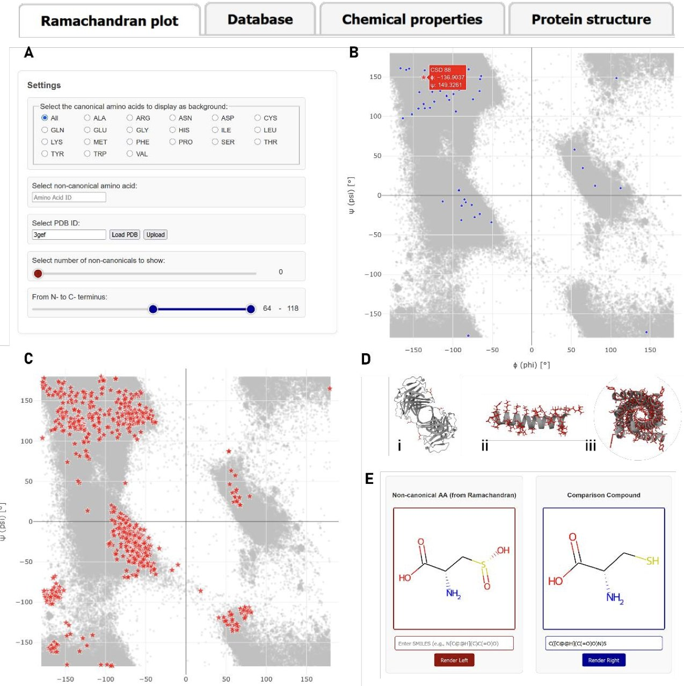
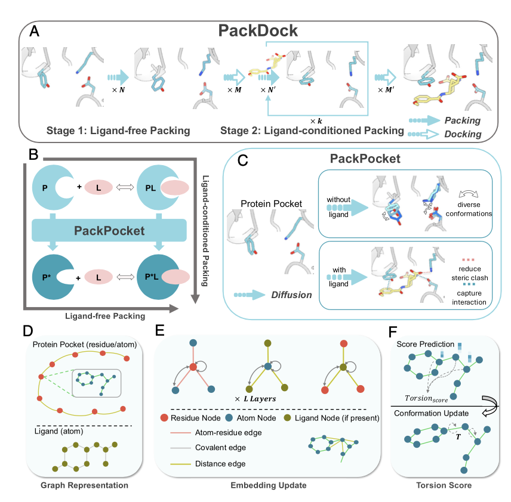
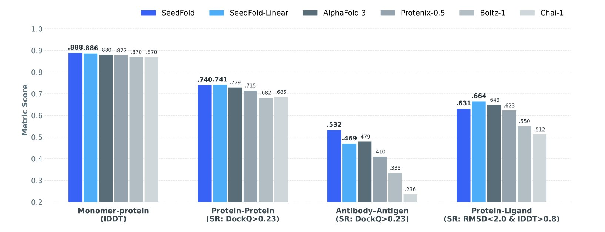
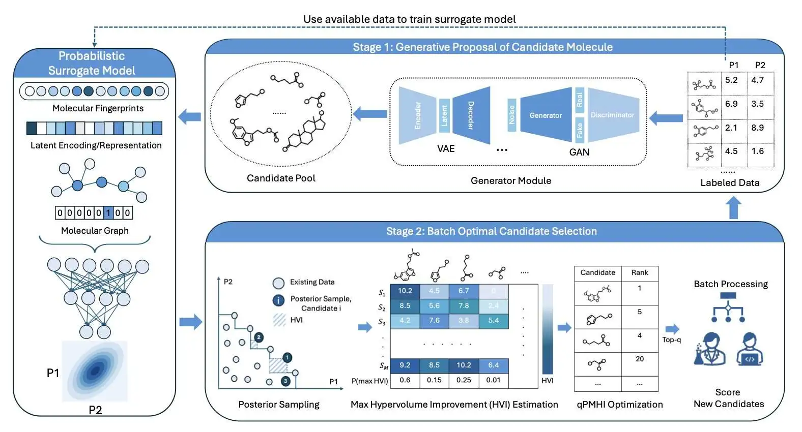
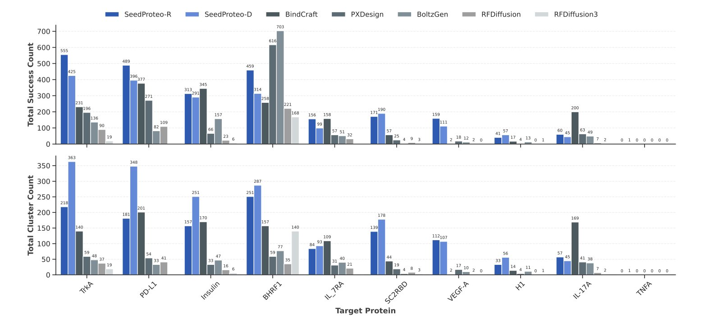

#### 目录  
1. MONDE·T 提供了一个包含实验验证数据的交互式平台，让研究人员能直观地分析非天然氨基酸 (ncAAs) 如何影响蛋白质的骨架结构。
2. PackDock 利用扩散模型解决了柔性对接中关键的侧链构象问题，即使只有 apo 结构也能精准预测，为药物发现开辟了新途径。
3. 通过更注意力机制和「横向扩展」的暴力美学，SeedFold 在多个关键任务上超越了 AlphaFold3，展示了大力出奇迹的另一种可能。
4. 这个新框架将分子「生成」与「筛选」两步分开，用一个排序算法，就能在巨大的化学空间里更快、更大批量地找到好分子。
5. SeedProteo 借鉴 AlphaFold3 的架构，通过一种巧妙的自引导和序列解码方法，实现了高精度的全原子蛋白质从头设计，尤其是在药物发现关注的蛋白结合物设计上表现出色。

## 1. 非天然氨基酸如何扭曲蛋白？这个新数据库给你答案  
  
  

做蛋白质研究和药物设计时，我们的大部分时间都在跟 20 种标准氨基酸打交道。但无论是自然界的翻译后修饰 (PTM)，还是实验室里的化学合成，蛋白质中常常会出现一些「非主流」的氨基酸。  
  
问题来了：当一个非天然氨基酸 (ncAA) 出现在肽链里，它会如何影响蛋白质的局部构象？是会像它「长得最像」的那个标准氨基酸，还是会把肽链骨架扭到一个全新的角度？过去要回答这个问题，过程很痛苦。你得自己去 PDB 数据库里大海捞针，手动收集零散的数据，效率极低。  
  
现在，研究者们开发了一个名为 MONDE·T 的数据库和网络服务器，专门解决这个痛点。他们系统性地梳理了整个 PDB，把超过 10,000 个条目中的 1,875 种不同的非天然氨基酸都整理了出来。这不仅仅是简单地列个清单，而是把每个 ncAA 所在的结构环境都完整地保留了下来。  
  
这个工具最实用的地方，是它的交互式分析功能。  
  
核心是拉马钱德兰图（Ramachandran plot）的可视化。你可以输入任何一个感兴趣的 ncAA（比如磷酸化丝氨酸），服务器会立即生成一张图。这张图上，所有 PDB 中已知的磷酸化丝氨酸的骨架二面角（phi-psi angles）都会被标示出来，同时以标准氨基酸的构象分布作为背景。  
  
  
  
这样一来，答案就一目了然了。你能立刻看到这个修饰后的氨基酸是倾向于 α-螺旋区，还是 β-折叠区，或者干脆跑到了一个「无人区」。这对理解翻译后修饰如何调控蛋白功能，或者设计新型的肽类药物至关重要。比如，你想知道把一个甘氨酸换成它的类似物，会不会破坏掉关键的转角（turn）结构，用这个工具一查就有数了。  
  
除此以外，MONDE·T 还提供了一个化学相似性比较工具。它基于 Tanimoto 相似性系数，告诉你某个 ncAA 在 2D 结构上和哪个标准氨基酸最接近。这能为我们提供一个化学直觉，快速判断其潜在的理化性质。  
  
这个数据库的应用场景很广泛。  
1.  **翻译后修饰**：想知道磷酸化、甲基化、乙酰化这些修饰对蛋白骨架的具体影响？直接查询对应的修饰氨基酸就行。  
2.  **合成生物学**：在利用终止密码子扩展技术，将非天然氨基酸引入蛋白质时，可以预先评估它对结构稳定性的影响。  
3.  **多肽药物设计**：使用氨基酸类似物来优化多肽的成药性（比如稳定性、亲和力）时，可以用它来指导结构设计，避免引入不利的构象。  
  
研究者承诺会每半年更新一次数据库，确保数据的时效性。对于从事蛋白质工程、计算辅助药物设计和多肽化学的人来说，MONDE·T 是一个非常趁手的工具，能把过去需要花费数天甚至数周的分析工作，缩短到几分钟。  
  
📜Title: Monde·t: A Database and Interactive Webserver for Non-Canonical Amino Acids (ncAAs) in the PDB  
🌐Paper: https://www.biorxiv.org/content/10.64898/2025.12.21.695100v1.full.pdf  

## 2. 蛋白质口袋「柔若无骨」？AI 用扩散模型搞定了柔性对接  
  
  

做药物发现，分子对接（molecular docking）是我们的常规武器。但我们心里都清楚，传统的对接方法有个致命弱点：它通常假设蛋白质靶点是个「刚性」的锁，而配体是那把钥匙。现实中，蛋白质口袋远非一成不变，它会为了迎接合适的配体而调整自身姿态，这个过程就是「诱导契合」（induced fit）。其中，氨基酸侧链的柔性运动是关键中的关键，也是最让人头疼的地方。  
  
现在，一篇 PNAS 上的新研究提出了一种叫 PackDock 的新框架，专门来啃这块硬骨头。它的思路很巧妙，把现在热门的深度学习技术和经典的物理模型结合了起来。  
  
PackDock 的核心是一个叫 PackPocket 的模块。这个模块用了扩散模型。如果你对 AI 绘画有所了解，就知道扩散模型生成图像的能力有多强，它从一堆随机噪声开始，一步步「去噪」，最终生成一张逼真的图片。PackPocket 做的也是类似的事，只不过它生成的不是图片，而是蛋白质结合口袋里那些氨基酸侧链的三维构象。它可以为无配体（apo）和有配体（holo）两种状态的口袋进行构象采样。  
  
这解决了什么问题？在药物筛选中，我们手头常常只有靶点的 apo 晶体结构。当一个新分子要结合时，口袋的形状几乎肯定会变。如果你的对接工具无法预测这种变化，结果就可能差之千里。PackDock 能直接在 apo 结构上预测侧链如何运动来适应配体，这让对接的起点就比别人更准。  
  
当然，光说不练假把式。研究者们在几个标准测试中验证了它的性能。  
1.  **侧链预测**：它能精确预测配体结合后，哪些氨基酸侧链会如何转动。  
2.  **重对接（Redocking**）：把已知的配体放回它原来的结构里，这是基础测试，PackDock 做得很好。  
3.  **交叉对接（Cross-docking**）：这是更严格的考验，把配体对接到同一个蛋白的不同晶体结构中。PackDock 在这里同样表现出色。  
  
最亮眼的是它的实战案例。研究团队把它用在了醛脱氢酶 1B1（ALDH1B1）这个靶点上。利用 PackDock，他们不仅成功找到了能与靶点结合的分子，而且筛选出的化合物具有全新的化学骨架，活性达到了纳摩尔级别。从一个计算模型出发，直接找到了高活性的新骨架分子，这充分说明了 PackDock 的实用价值。它不是一个只能在电脑里跑分的玩具，而是能真正指导实验、发现新药候选物的工具。  
  
PackDock 还能告诉我们结合过程中哪些氨基酸的构象发生了关键变化。这对于理解药物作用机制、指导后续的分子优化至关重要。作为一线研发人员，这种信息能帮我们想清楚下一步该如何修饰分子，以获得更好的活性和成药性。  
  
📜Title: Flexible protein–ligand docking with diffusion-based side-chain packing  
🌐Paper: https://www.pnas.org/doi/10.1073/pnas.2311925121  

## 3. SeedFold 来了，用算力硬刚 AlphaFold3  
  
  

自从 AlphaFold 问世以来，大家都在想同一个问题：下一个突破口在哪？我们都知道，这些结构预测模型非常强大，但训练它们也是个无底洞，计算成本高得吓人。问题主要出在核心的三角注意力（triangular attention）机制上，它的计算复杂度是序列长度的三次方。这意味着蛋白质稍微长一点，计算量就爆炸了。  
  
现在，SeedFold 的研究者们决定正面解决这个难题。  
  
他们的思路很直接：如果老的注意力算法是瓶颈，那就换掉它。他们设计了一种新的线性三角注意力机制。这个新算法把计算复杂度从三次方降到了二次方。这是个巨大的进步。打个比方，过去分析一个大分子，就像要审视网络里每三个节点之间的所有可能关系，工作量巨大。现在，只需要关注每两个节点之间的关系就行了。这一下就为模型的「暴力」扩展打开了空间。  
  
有了更高效的算法，接下来的问题就是怎么把模型做大。传统的思路是「堆深度」，就是增加网络的层数。但 SeedFold 团队发现了一条不同的路：横向扩展，增加宽度。他们选择加宽模型中的 Pairformer 模块。  
  
这么做是有道理的。在结构预测中，最关键的信息藏在氨基酸残基两两之间的相互作用（pairwise interactions）里。加宽 Pairformer 模块，就好比给模型增加了更多的并行通道，让它能同时处理和编码这些复杂的成对关系。相比于把信息在一个很长的链条（深度）上传递，这种「宽」结构显然更能抓住问题的本质。  
  
当然，光有强大的模型还不够，你得有足够的数据来「喂」它。实验数据总是稀缺的，怎么办？研究者们想了个办法：知识蒸馏（distillation）。他们直接拿 AlphaFold2 当老师，生成了一个包含 2650 万个样本的超大规模数据集。这就像让一个新手跟着大师学习海量的案例，虽然学的不是一手知识，但足以让模型快速成长，获得强大的泛化能力。  
  
结果也确实没让人失望。在 FoldBench 这个行业标准测试集上，SeedFold 在多个任务上把 AlphaFold3 比了下去，特别是在抗体 - 抗原相互作用、蛋白质-RNA 互作方面表现突出。它的线性变体在药物研发人员最关心的蛋白质 - 小分子相互作用预测上，也做得非常好。  
  
当然，训练这种规模的模型，过程绝不轻松。研究者们也分享了他们的经验，比如采用两阶段训练策略，并且在训练初期使用更长的「热身」（warm-up）时间和更低的初始学习率，来确保这个庞然大物能够稳定收敛。这些都是一线炼丹师才懂的宝贵经验。  
  
SeedFold 的工作给我们展示了一条非常清晰的路径：通过算法优化和扩展策略，用更大的模型和更多的数据，就能实打实地提升性能。简单，但有效。  
  
📜Title: SeedFold: Scaling Biomolecular Structure Prediction  
🌐Paper: <https://arxiv.org/abs/2512.24354>  

## 4. 分子发现新框架：先生成，再优化，告别低效搜索  
  
  

在分子发现的广阔世界里，我们就像在海里捞针。传统的 AI 方法常常把「凭空想象新分子」和「评估这个分子好不好用」这两件事混在一起，导致模型既要当「创意总监」又要当「质检员」，结果就是过程复杂，效率不高。  
  
这篇论文的作者们提出了一个更流程：**先生成，再优化 (generate-then-optimize**)。  
  
这个想法听起来很简单，但非常有效。第一步，让一个生成模型（Generative Model）尽情发挥想象力，创造出一个巨大且多样化的候选分子库。这就像开一场头脑风暴会议，先不评判，让各种点子都涌现出来。  
  
第二步，再启用一个独立的优化算法，从这个巨大的「点子库」里挑选出最有前途的一批候选者进行下一步的评估（比如湿实验或昂贵的计算模拟）。  
  
这个两步走策略的核心优势在于**解耦**。生成模型只管创造，优化算法只管挑选，各司其职。这让整个系统变得模块化，你可以轻松地换用任何你喜欢的生成模型或属性预测器，就像换乐高积木一样简单，而不用担心牵一发而动全身。  
  
那么，关键问题来了：如何从成千上万个候选分子中，高效地挑出**一整批**最值得测试的苗子？  
  
一个一个挑太慢了。理想情况是利用并行计算或高通量实验平台，一次测试几十甚至上百个分子。但要挑出一个既有潜力又具多样性的「最佳组合」，在数学上是一个非常复杂的组合优化问题，计算成本极高。  
  
为了解决这个瓶颈，研究者设计了一个巧妙的采集函数（Acquisition Function），叫做 `qPMHI`。它的工作原理是：不再去解那个复杂的组合优化方程，而是直接计算每个候选分子对「提升我们当前最优解集合」的贡献概率，然后根据这个概率值进行排序。  
  
最后，你只需要从排序列表的顶端，直接拿下排在最前面的那批分子就行了。`qPMHI` 把一个头疼的优化问题，变成了一个简单的排序问题，大大提升了批量筛选的效率和可扩展性。  
  
光说不练假把式。研究者在一个真实的化学问题——为可持续能源存储寻找更优的有机氧化还原分子——上测试了他们的方法。结果显示，与当前其他先进方法相比，他们的新框架只用了更少的查询次数（意味着更少的实验或计算成本），就找到了性能更好、更多样的分子。  
  
对于身处药物研发或材料科学一线的人来说，这个方法很有吸引力。它直击了分子发现中的一个核心痛点：如何在浩瀚的化学空间中，用有限的资源进行最高效的探索。这种「先生成，再优化」的思路，加上批量筛选算法，为利用高通量平台加速新分子发现提供了一套非常实用的解决方案。  
  
📜Title: Generative Multi-Objective Bayesian Optimization with Scalable Batch Evaluations for Sample-Efficient De Novo Molecular Design  
🌐Paper: https://arxiv.org/abs/2512.17659v1  

## 5. AlphaFold3 逆向工程？SeedProteo 设计全新蛋白质  
  
  

做蛋白质设计，尤其是在药物研发领域，我们追求的目标很明确：按需创造一个能结合特定靶点的全新蛋白质。这就像是在原子尺度上做雕塑，不仅要形状对，每个位置的材料（氨基酸）也要选对。传统方法往往需要简化问题，比如只考虑蛋白质的骨架原子，忽略了侧链。但细节决定成败，全原子（all-atom）级别的精确设计才是真正的挑战。  
  
最近，一个名为 SeedProteo 的新模型让人眼前一亮，它直接 tackling 了这个硬骨头问题。  
  
#### 把 AlphaFold3 倒过来用  
  
看到 SeedProteo 的架构，做计算的马上就会想到 AlphaFold3。AlphaFold3 的工作是：你给它一个氨基酸序列，它告诉你这个序列会折叠成什么三维结构。这是一个从「序列」到「结构」的预测过程。  
  
SeedProteo 的研究者做了一件很酷的事：他们把这个过程倒了过来。他们不输入序列，而是从一堆随机分布的、混乱## AlphaFold3 能解结构，SeedProteo 能从头设计了？  
  
  

在蛋白质设计的世界里，我们一直面临一个核心难题：如何凭学会如何从这团噪声中「去噪」，逐步构建出一个合理、稳定的蛋白质三维结构。  
  
这空创造一个能精确执行特定功能的全新蛋白质？过去，我们依赖 AlphaFold 这类工具来预测已知氨就像从一张完全模糊的图片中恢复出高清图像。但它不只是恢复，它是在创造。因为是从基酸序列的蛋白质结构，这本身已经是巨大的突破。但真正的圣杯是反过来——先定义一个噪声开始，每次都能创造出不一样的全新结构。这就是生成式人工智能中常说的扩散模型（diffusion model）功能所需的三维结构，然后设计出能折叠成该结构的氨基酸序列。这正是 SeedProteo 想要的核心思想。  
  
#### 怎么确保「图纸」和「建材」匹配？  
  
只生成一个漂亮的解决的问题。  
  
它的工作原理是这样的。研究者们从 AlphaFold3 强大的原子坐标建模能力中获得了灵感。他们想，如果 AlphaFold3 能从序列预测出精确的原子坐标，那我们能不能给它一团混乱的、随机的原子坐标，然后让它「去噪」，最终整理成一个合理、稳定的蛋白质结构？这个「从混乱到有序」的过程，就是扩散模型（diffusion model）的核心思想。  
  
当然，只是简单地去噪，你可能会得到一堆毫无用处的随机蛋白质。为了让生成过程可控，研究者加入了一个关键的创新：自洽性引导（self-conditioning）。你可以把它想象成在作画时给出一些草图提示。研究者们将蛋白质的二级结构序列和结构模板等信息作为「提示」喂 3D 结构还不够，你还得知道用什么氨基酸序列去构建它。这就是蛋白质设计里最难的问题之一：序列 - 结构一致性。很多模型设计的结构看起来很美，但你找不到一个合适的氨基酸序列能稳定地折叠成那个样子。  
  
SeedProteo 用了两个策略来解决这个问题。  
  
第一个策略叫**自条件引导（self-conditioning**）。简单说，就是在模型生成结构的过程中，给它一些提示。比如，先让模型预测一下这个结构大致的二级结构（α-螺旋、β-折叠等），然后把这个预测结果作为额外的输入，再反馈给模型，让它在下一步生成中参考。这就像给一个正在探路的机器人一张粗略的地图，有了这张地图，它就不给模型。这样一来，模型在生成结构时就有了一个明确的方向，比如「这里需要一个螺旋，那里容易走丢，能更快地找到正确的路径。这种方式显著提高了生成物理上合理的蛋白质结构的成功率。  
  
需要一片折叠」，大大提高了生成特定功能性结构（比如药物靶点结合物）的成功率。  
  
解决了第二个策略是使用**马尔可夫随机场（Markov Random Field, MRF）模块**来解码氨基 - 结构生成的问题，还有一个更大的挑战等着：如何确保设计出的三维结构有对应的氨基酸序列能稳定酸序列。传统的序列设计方法常常是「贪心」的，一次只决定一个位置的氨基酸地折叠出来？这是很多从头设计（*de novo* design）方法的软肋——漂亮的计算机模型在，试图做出局部最优选择。这样做很容易陷入误区，就像下棋只看一步，最后导致全盘皆输实验室里却合成不出来。  
  
SeedProteo 在这里用了一个叫做马尔可夫随机场（Markov Random Field,。MRF 则不同，它会同时考虑整个蛋白质结构中所有氨基酸之间的相互作用和依赖关系 MRF）的模块来解码氨基酸序列。传统的做法常常是只看局部的结构环境来决定。它不是一个一个地填空，而是一次性给出一个全局最优的序列方案。这确保了整用哪个氨基酸，很容易陷入局部最优解，导致整个序列和结构不匹配。MRF 模块则具备条氨基酸链作为一个整体，能够最好地稳定我们设计出的三维结构。  
  
#### 结果怎么样全局视野，它会同时考量整个结构和序列的依赖关系，确保最终生成的氨基酸序列能够在？  
  
从数据上看，SeedProteo 的表现很好。无论是在无条件生成（让模型自由创造新蛋白质），还是在更具挑战性的蛋白结合物（binder）设计任务中，它都超过了现有的一些全局上最稳定地形成我们设计的目标结构。这种全局一致性的考量，是它能设计出更顶尖模型。  
  
尤其值得关注的是，它在生长序列（最长可达 1000 个残准确、更多样化蛋白质的关键。  
  
在基准测试中，SeedProteo 的表现相当出色。它不仅基）时依然保持很高的成功率，并且生成的结合物在结构上具备多样性和新颖性。能生成长达 1000 个残基的复杂蛋白质，在设计全新的靶点结合物方面也对于药物发现来说，这两点是至关重要的。我们需要能够探索广阔的、未知的化学空间，而不是超过了现有方法。这意味着，我们离「按需设计」蛋白质药物又近了一步。这项工作为蛋白质工程和治疗药物开发提供了一个强有力的工具和新方向。  
  
📜Title: SeedProteo: Accurate De Novo All-Atom Design of Protein Binders  
🌐Paper: https://arxiv.org/abs/2512.24192
