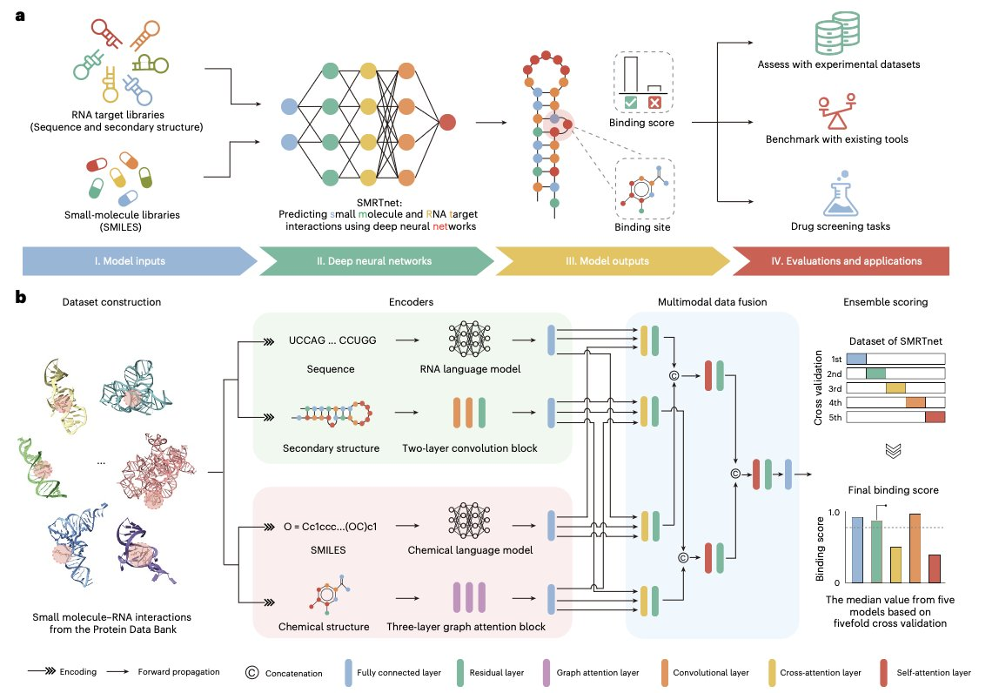
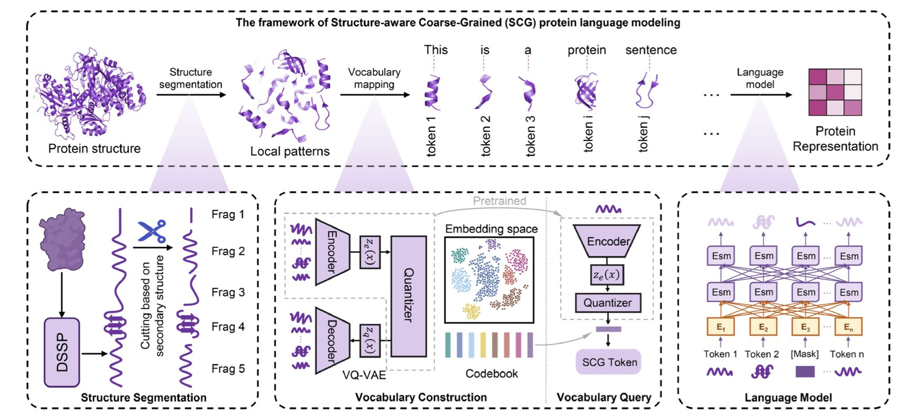
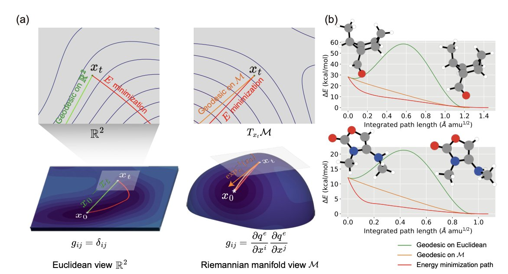
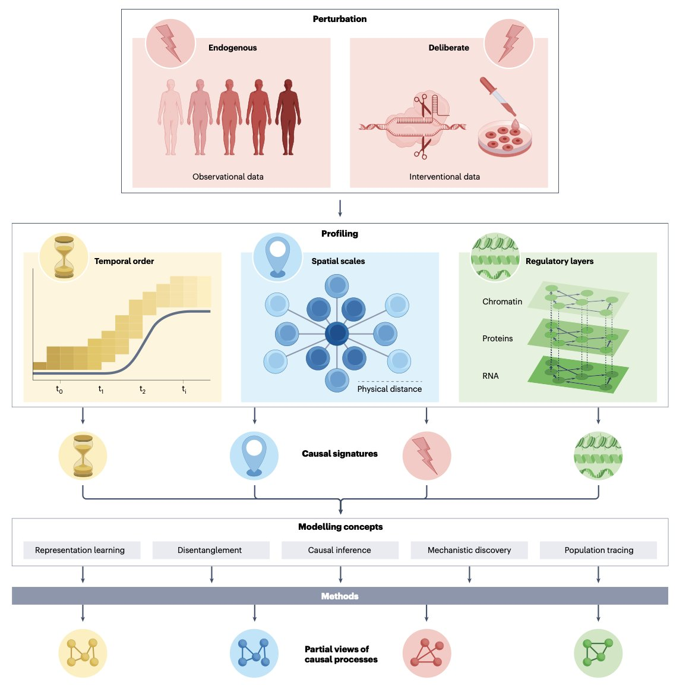
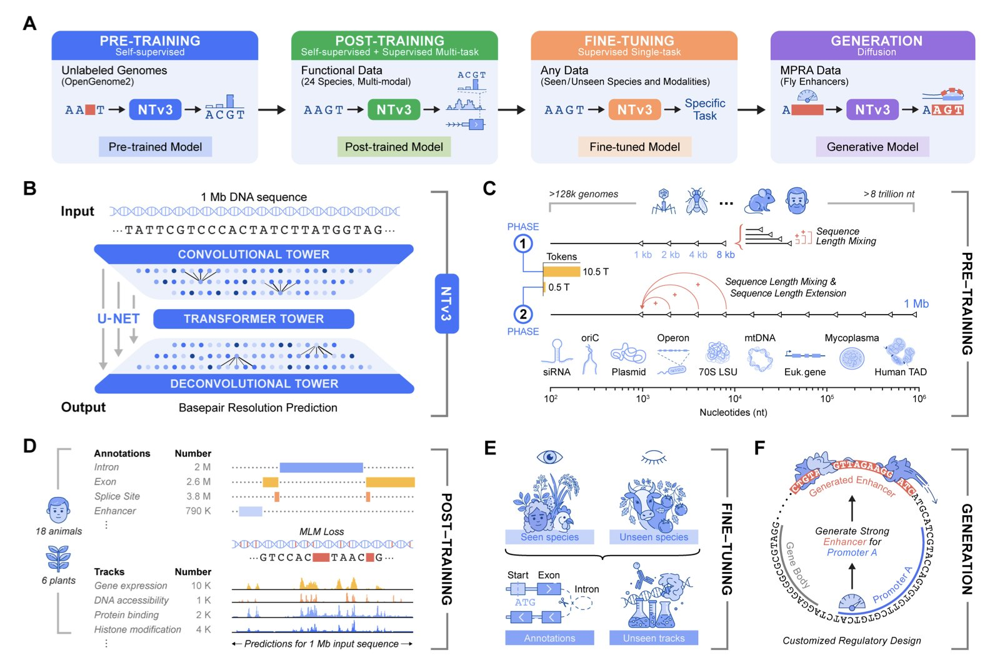

#### 目录  
1. SMRTnet 绕过了获取 RNA 三维结构的难题，仅凭更容易得到的二维结构图，就能高效预测小分子结合物，为靶向 RNA 的药物发现打开了新局面。
2. 把蛋白质从看单个氨基酸的「字母」模式，升级到看结构片段的「单词」模式，这解决了大蛋白在 AI 模型里「记不住开头」的老大难问题。
3. 通过在更符合物理现实的弯曲流形上优化分子，R-DSM 方法实现了化学精度的结构与能量预测。
4. 单细胞分析正在从绘制细胞图谱转向预测扰动效应，这需要我们建立因果模型，而不再是简单的相关性分析。
5. NTv3 首次将基因组序列的精准预测与可控生成整合进一个统一的跨物种基础模型，真正实现了对基因组语言的「读」和「写」。

## 1. 没有 RNA 三维结构，如何筛选靶向药物？  
  
  

几十年来，用小分子靶向 RNA 一直是药物研发领域很多人梦寐以求的目标。毕竟，基因组里有大量的 RNA 扮演着关键的致病角色。但这个领域进展缓慢，有一个巨大的拦路虎：我们不知道绝大多数 RNA 的三维结构。  
  
蛋白质通常会折叠成一个相对稳定的结构，形成清晰的「口袋」让药物分子「停靠」。而 RNA 则不同，它更像一根柔软的绳子，动态变化多端，很难捕捉到它稳定的三维形态。没有这个 3D 蓝图，传统的基于结构的药物设计（Structure-Based Drug Design, SBDD）就成了无源之水。  
  
这篇来自 *Nature Biotechnology* 的工作，SMRTnet，提供了一个解决方案：既然搞不定 3D 结构，那我们干脆不用它。  
  
SMRTnet 的核心想法是，利用 RNA 的二级结构（secondary structure）来预测小分子结合。二级结构描绘了 RNA 链自身如何折叠配对，形成像茎环、发夹这样的基本图案。你可以把它想象成一张电路图，虽然没有展示出每个元件在三维空间中的精确位置，但清晰地标示了各个部件之间的连接关系。获取这种「电路图」比获得完整的 3D 模型要容易得多。  
  
这个模型的工作方式是这样的：它设计了两个并行的「专家」模块。一个模块专门「阅读」RNA 的二级结构信息和序列信息，另一个模块则负责「解析」小分子的化学结构（以 SMILES 字符串的形式输入）。这两个模块分别提取出它们认为最重要的特征后，再通过一个融合模块将这些信息整合起来，最终输出一个结合分数的预测。整个过程有点像两位不同领域的专家——一位生物学家和一位化学家——坐在一起，根据各自的专业知识，共同判断一个分子和一个 RNA 能否「看对眼」。  
  
光说不练假把式。研究者们用 SMRTnet 对 10 个与疾病相关的 RNA 靶点进行了虚拟筛选，结果令人振奋。在实验验证中，预测的化合物命中率达到了 21.1%。在虚拟筛选领域，这算是一个相当不错的成绩了。  
  
更重要的是，他们发现了一个能够靶向 MYC 基因转录本的苗头化合物。实验证明，这个化合物确实能够下调 MYC 的表达，并抑制癌细胞的增殖。这就完成了一个从计算预测到生物学功能验证的完整闭环，证明了 SMRTnet 的实用价值。  
  
还有一个亮点功能是模型的可解释性分析。SMRTnet 不仅能告诉你「这个分子能结合」，还能通过分析模型的注意力权重，反推出它认为最重要的结合区域在哪里。这对于药物化学家来说价值千金，它相当于给出了一个药物作用的「靶点地图」，指导后续如何对分子进行结构修饰以提高活性和选择性。  
  
为了证明二级结构的重要性，作者们还做了一个「破坏性实验」：他们把 RNA 的二级结构信息从输入中拿掉，结果模型的预测性能大幅下降。这个结果清晰地说明，RNA 的二级结构这张「电路图」，正是 SMRTnet 能够成功的关键所在。  
  
SMRTnet 的出现，意味着我们现在可以对成千上万个以前因为缺乏结构信息而被忽视的 RNA 靶点进行大规模的虚拟筛选。它把靶向 RNA 药物发现的门槛，实实在在地拉低了一大截。  
  
📜Title: Predicting small molecule–RNA interactions without RNA tertiary structures  
🌐Paper: https://www.nature.com/articles/s41587-025-02942-z  

## 2. AI 模型处理大蛋白的「失忆症」有救了？  
  
  

做计算药物发现的，大概都遇到过一个头疼的问题：想用大语言模型（Large Language Models）处理一个像 Titin 这样的超大蛋白质时，模型直接「罢工」了。因为模型的输入长度有限，一个包含几万个氨基酸的序列放进去，要么直接报错，要么模型处理到后面，早就忘了开头是什么了。我们管这个叫「语义截断」，这对于理解蛋白质的整体功能是致命的。  
  
这篇工作提供了一个非常巧妙的思路来解决这个问题。它的核心思想是：我们别再让模型一个一个地读氨基酸「字母」了，而是教它直接读由这些字母组成的、有意义的「单词」。  
  
**这个「单词」是什么**？  
就是蛋白质的二级结构片段，比如 α-螺旋（alpha-helices）和 β-折叠（beta-sheets）。这些是蛋白质结构与功能的基本单元。研究者开发了一个叫 SCG（Structure-Aware Coarse-Grained）的框架。它的工作原理分两步：  
1.  **切分 (Segmentation**)：先把蛋白质序列按照二级结构信息，切分成一个个小的结构片段。一个长长的螺旋或者一片折叠，现在就变成了一个单元。这样一来，原来几万个「字母」的序列，一下就被浓缩成了几千甚至几百个「单词」的序列。  
2.  **编码 (Encoding**)：然后，用一种叫做向量量化（Vector Quantization）的技术，给这些结构片段创建一个「词汇表」。它用一个 VQ-VAE 模型扫描了海量的蛋白质结构，自动学习并总结出了一本包含几千个常用「结构词块」的词典。每个真实蛋白质的结构片段，都可以到这本词典里找到最像它的那个「标准词」，并用一个唯一的 ID 来表示。  
  
经过这么一处理，任何一个蛋白质，无论多大，都可以被转换成一串简短的、由「结构单词」ID 组成的序列。  
  
**效果怎么样**？  
效果非常直接。论文里有一张对比图，清晰地展示了这种方法的威力。  
  
你看这张图，横坐标是蛋白质长度，纵坐标是信息保留度。传统的氨基酸语言（Fine-grained）在处理长蛋白时，信息保留度急剧下降，而 SCG 的方法（图中的 SCG-Lang）几乎是一条平线，没受到什么影响。  
  
为了证明这种基于二级结构的切分是关键，研究者还做了个对比实验：如果不是按二级结构，而是随机乱切，或者按照动态规划来切，结果性能都大幅下降。这说明，基于生物学原理的分块，才是成功的关键。  
  
这个方法不仅解决了大蛋白的截断问题，而且在各种下游任务上都表现出色，比如蛋白质功能预测、酶分类和相互作用识别。无论是用在轻量级模型还是深度模型上，它的优势都很稳定。  
  
对于一线研发人员来说，这意味着什么？这意味着我们终于有了一个高效的工具，可以去处理那些以前因为太大而很难建模的蛋白质靶点。这为理解复杂疾病相关的超大分子，以及为它们设计药物，打开了一扇新的大门。  
  
📜Title: Molecular-level protein semantic learning via structure-aware coarse-grained language modeling  
🌐Paper: https://doi.org/10.1093/bioinformatics/btaf654  
💻Code: https://github.com/bug-0x3f/coarse-grained-protein-language  

## 3. 分子结构预测为何总是差一点？答案可能在几何学里  
  
  

做药物发现，我们整天都在和分子的三维结构打交道。找到一个分子的最低能量构象，就像是寻找一个复杂山脉里的最低山谷。传统的计算方法，大多是在一个平面的、类似笛卡尔坐标（x,y,z）的空间里进行搜索。这就像拿着一张平面的城市地图去找山谷，方向可能是对的，但距离和路径全是错的，因为山路是弯曲的，不是直的。  
  
这篇发表在 *Nature Computational Science* 上的工作，提供了一个新思路：我们为什么不用一张‘等高线地图’呢？这张地图本身就是弯曲的，能完美地反映山脉的地形。在数学上，这种弯曲的空间被称为黎曼流形 (Riemannian manifold)。  
  
研究者们用分子内部的物理坐标——也就是键长、键角和二面角——来构建这个黎曼流形。这些坐标是化学家最熟悉的语言，也是分子自身「感受」其几何形态的方式。在这个更自然的流形上，他们开发了一种名为黎曼去噪分数匹配（Riemannian Denoising Score Matching, R-DSM）的模型。  
  
它的工作原理可以这样理解：首先，给一个完美的分子结构加上一点随机的「扰动」，让它偏离最低能量点。然后，模型的任务就是学习如何沿着流形上的「最短路径」（测地线）把这个被扰动的分子推回到原来的完美状态。因为这条路径是沿着能量变化的「山谷」走的，所以效率和精度都高得多。  
  
数据最有说服力。研究者发现，在这个流形上，两点间的测地线距离与真实的能量差，其相关性远高于传统的三维坐标均方根偏差（RMSD）。在标准的 QM9 数据集上测试，R-DSM 方法生成的结构，能量误差中位数只有 0.177 kcal/mol，RMSD 低至 0.031 Å。这是一个了不起的成就，已经达到了我们常说的「化学精度」（chemical accuracy）的水平。  
  
这东西有什么用？一个直接的应用就是结构精修。比如，我们可以用分子力学（MMFF）这种快速但不准的方法先生成一个大概的构象，然后用 R-DSM 把它「打磨」到量子力学（QM）级别的精度。这能极大地节约计算资源。它在生成构象异构体集合方面也表现出色，这对于理解分子的柔性和药物 - 靶点相互作用至关重要。  
  
这个模型的核心是一个基于 SchNet 架构的图神经网络，并采用常微分方程（ODE）求解器进行采样。  
  
目前这个方法还是更偏向于一个精修工具，它需要一个不错的初始结构。如果未来能进一步优化，减少对初始几何的依赖，甚至直接用于从头生成（*de novo* generation），那它的应用场景会更加广阔。但无论如何，它证明了在正确的几何空间里解决问题，往往能事半功倍。  
  
📜Title: Riemannian denoising score matching for molecular structure optimization with accurate energy  
🌐Paper: https://www.nature.com/articles/s43588-025-00919-1  

## 4. 单细胞数据，除了画图还能干什么？  
  
  

我们手里的单细胞测序数据越来越多，UMAP 图谱也越画越漂亮。但一个尖锐的问题摆在面前：这些数据除了告诉我们这里有哪些细胞，还能做什么？我们能用它来预测一个新药的效果吗？或者，敲除一个基因后，细胞的网络会如何重组？  
  
这篇发表在 Nature Reviews Genetics 上的综述，精准地切入了这一痛点。它告诉我们，整个领域正在经历一场关键的转变：从描述性的「细胞图谱绘制」时代，迈向一个更具挑战性的「因果推断」时代。  
  
以前的单细胞分析就像制作一张高清的城市地图，我们能用它精确标出城市里所有的建筑和街道。这很重要，是基础。但现在，我们想做的，是成为一个城市规划师。我们不仅要知道哪里有医院，还要能预测如果在这里新建一个地铁站，会对整个城市的交通流量、周边房价产生什么影响。在生物学里，这个「地铁站」就是一个扰动，比如药物处理、基因编辑或者疾病状态。  
  
要实现这个目标，光有数据是不够的，还需要正确的分析工具。目前市面上的计算方法五花八门，让人眼花缭乱。这篇综述的作者们做了一件很重要的事：他们试图建立一个「方法选择指南」，也就是他们所说的「本体论」（ontology）。他们把现有的各种计算方法，按照它们的建模思路、基本假设和能解决的问题分门别类。这就像一个工具箱的说明书，它告诉你什么时候该用锤子，什么时候该用螺丝刀，而不是胡乱抓一个就用。这个框架能帮助我们针对具体的生物学问题，比如预测药物组合的协同效应，或者推断某个转录因子的下游靶点，来选择最合适的模型。  
  
这里就触及了目前这个领域的痛点：我们的算法模型越来越复杂，理论上能捕捉到精细的因果关系。但现实是，我们手头的数据往往不够「干净」，或者说维度不够多，无法支撑这么复杂的模型。这就像你有一台顶配的赛车引擎，却把它装在了一辆家用车的底盘上，根本发挥不出性能。  
  
因此，建立一套标准的模型评估和基准测试体系就变得至关重要。我们需要客观地知道，一个新方法到底比老方法好在哪里，而不是仅仅看谁的故事讲得更动听。  
  
未来的方向很明确。我们需要整合更多类型的数据，比如空间组学、蛋白质组学，把扰动信号在不同分子层面的传播路径串联起来，真正看清「因」如何导致「果」。只有这样，单细胞分析才能真正从一个「看图」的工具，变成药物研发中那个能指点迷津的「水晶球」。  
  
📜Title: Interpretation, extrapolation and perturbation of single cells  
🌐Paper: https://www.nature.com/articles/s41576-025-00920-4  

## 5. NTv3: 读懂并书写跨物种基因组的语言  
  
  

在基因组学研究里，我们一直面临一个核心挑战：我们拿到了 DNA 序列这本「天书」，但读懂它的语法规则却异常困难。特别是那些相距很远的 DNA 片段是如何「隔空喊话」来调控基因表达的，也就是远距离调控依赖（long-range regulatory dependencies），一直是块难啃的硬骨头。之前的模型，要么看得不够远，要么无法跨物种通用。  
  
InstaDeep 的研究者们拿出了一个叫 NTv3 的新模型，试图解决这个问题。  
  
NTv3 的架构很有意思：它用了一个类似 U-Net 的网络结构。你可以把它想象成一个既能看清单个碱基这棵「树木」，又能俯瞰百万碱基对（Megabase, Mb）级别这片「森林」的系统。这让它能够同时处理局部序列特征和远达 1Mb 的全局信息。为了训练这个大家伙，研究者们喂给它来自不同物种的 9 万亿个碱基对。这就像教一个 AI 不仅学习现代英语，还把古英语、拉丁语和希腊语都学了一遍，从而让它能领悟到所有语言背后共通的底层逻辑。  
  
这个模型的预测能力很强。在超过 16,000 个功能注释任务上，它的表现超过了现有的所有模型。更让人印象深刻的是，作者们没有满足于在已有的基准上刷分，而是自己开发了一套包含 106 个任务的全新、更贴近真实研究场景的基准测试 Ntv3Benchmark。NTv3 在这个新考场里依然是第一名，证明了它的能力非常扎实，不是那种只能应对特定考题的「偏科生」。  
  
不过，如果 NTv3 只能「读」懂基因组，那它只是一个更好的预测工具。真正让它脱颖而出的是，它还能「写」。  
  
通过微调，NTv3 可以变成一个可控的生成模型。这意味着我们可以给它下指令，比如：「帮我设计一段增强子（enhancer）序列，要求它能高效地、并有选择性地激活 A 基因，但不要去碰 B 基因。」这就像我们不仅能读懂莎士比亚，还能模仿他的风格写出十四行诗，并且指定诗的主题。作者们在论文里展示了他们是如何生成具有特定活性水平和启动子（promoter）选择性的增强子的。最关键的是，他们不只是在电脑上生成了序列，还真的去做了实验验证。结果显示，这些人工设计的增强子在细胞里的表现和模型的预测高度一致。  
  
把精准的表征学习、功能预测和可控的序列生成全部塞进同一个框架，NTv3 确实做到了。它不是一个孤立的工具，而是一个平台，一个真正的基因组学基础模型。对于药物研发来说，这意味着我们可以更深刻地理解疾病相关的基因调控网络，甚至有望设计出精准调控特定基因的基因疗法元件。  
  
📜Title: A Foundational Model for Joint Sequence-Function Multi-Species Modeling at Scale for Long-Range Genomic Prediction  
🌐Paper: https://instadeep.com/wp-content/uploads/2025/12/NT_v3.pdf
