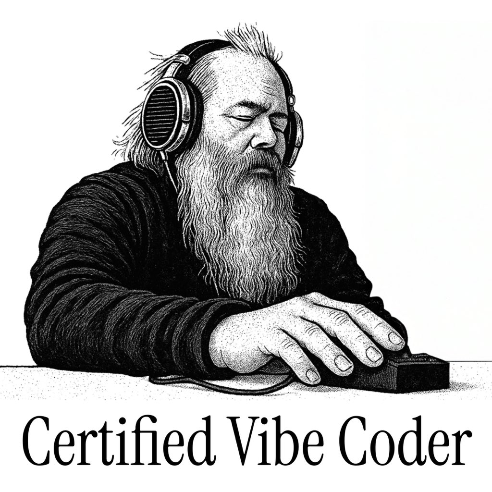
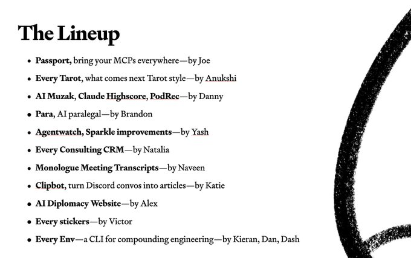
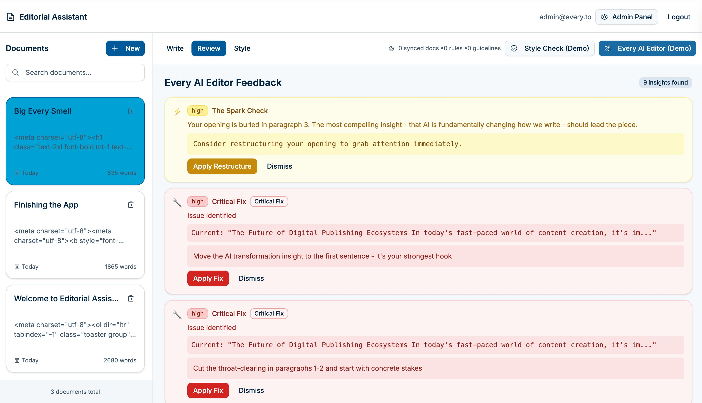
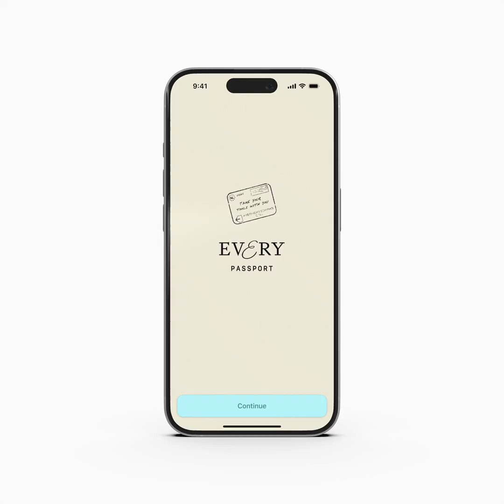
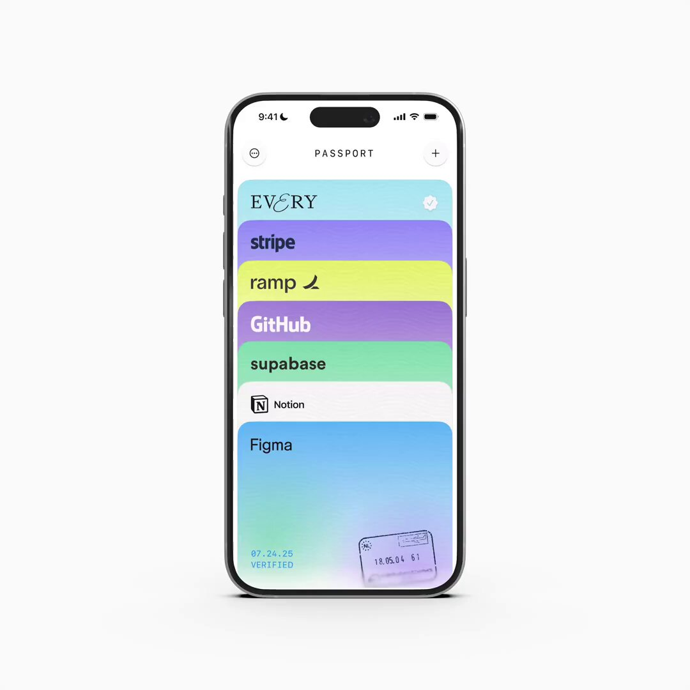
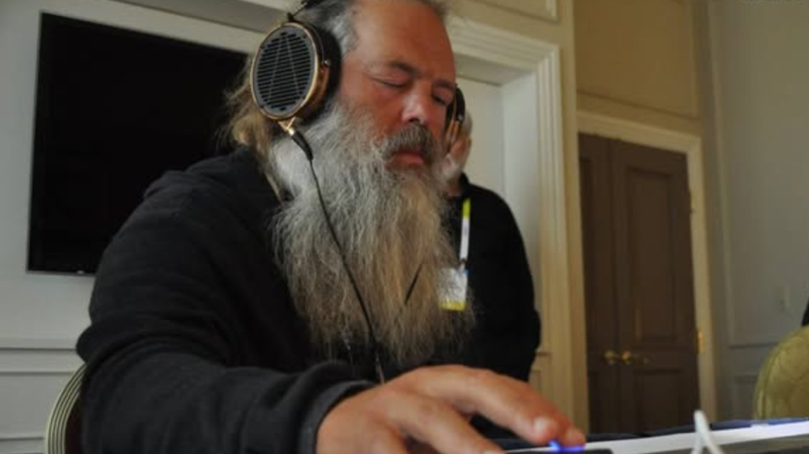
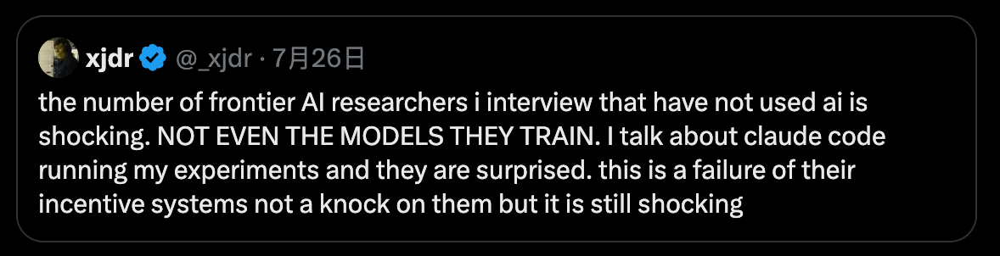

在 AI 技术浪潮席卷全球的今天，一家名为 Every 的科技媒体和创作者社区，正以一种独特而激进的方式，向我们展示未来组织的可能性。他们不仅仅报道 AI，更将自己变成了 AI-First 的“原生部落”。

刚刚过去的一个周末，这个小团队举办了一场内部黑客松，产出了超过 12 个 AI 驱动的项目，并预告了一款名为 **Passport** 的重磅 iOS 应用。这不仅是一次团队建设或一次产品发布，更像是一场关于未来工作方式的生动宣言：当团队 100% 拥抱 AI，创造力将如何被指数级放大。

## 一场黑客松，一次 AI 生产力的极限展示

事件的引爆点，是 Every 团队的一场内部黑客松和随后的 Demo Day。据社区观察者 Amit Bhatia 的推文，这场活动涌现了从“AI 律师助理”到“CLI 工具”等十余个项目。

> **Amit Bhatia (@AmitBhatia):**
> “刚刚参加了 @every 团队一场不可思议的 demo day！一个黑客松周末诞生了 12+ 个项目... 看到非技术团队成员用 Claude Code 交付了完整的应用，这太美妙了。”

团队成员 Katie Parrott，一位编辑，也成功构建并展示了她的“AI Editor”项目。在 AI 工具的加持下，技术与非技术的边界正在以前所未有的速度消融。

> **Katie Parrott (@katieparrott):**
> “我的第一次 Demo Day！在轮到我展示前的五秒钟，我的 @every AI Editor 终于准备好了 😅 感谢 @github Spark 和 Claude Code！”

这场黑客松展现了 Every 团队的核心理念：通过深度使用 AI 工具，实现“复合式工程（compounding engineering）”，让每个人都成为创造者。

## 核心发布：MCP「护照」Passport 登场

在众多创新项目中，由开发者 Joseph Albanese 主导的 **Passport** 应用无疑是皇冠上的明珠。这款即将在下周发布的 iOS 应用，直指当前高阶 AI 使用者的一大痛点：**MCP 的管理**。

MCP，虽然没有官方全称，但从官方推文中推断，它代表着一种“元级别编码提示（Meta-level Coded Prompts）”或类似的封装化、可复用的高级 AI 指令集。它们是驱动 LLM 完成复杂任务的“魔法咒语”，但管理和分享这些“咒语”却日益困难。

> **jpa (@josephpalbanese):**
> “新的 iOS 应用 — Passport。Passport 让你在不同的 AI 工具、上下文和模型之间‘随身携带你的工具’。它是一个很棒的 MCP 管理器，解决了我和许多人一直以来的巨大痛点。”

Albanese 指出，Passport 解决了三大核心问题：
1.  **一键安装**: 告别复杂的安装说明，一键复制粘贴即可使用 MCP。
2.  **清晰组织**: 查看哪个 MCP 用在哪个项目或应用中（同步功能将在 v1.1 版本推出）。
3.  **便捷书签**: 轻松收藏那些在社区中看到的优秀 MCP，以备后用。

Passport 的诞生并非空穴来风，而是 Every 团队在自身高强度 AI 实践中自然生长出的需求。它预示着随着 AI 应用的深化，围绕工作流优化的“元工具”生态将变得至关重要。

## 不止于工具：「AI-First」的文化内核

如果说 Passport 是冰山之巅，那么支撑它的则是 Every 团队根深蒂固的 **“AI-First”** 文化。其联合创始人 Dan Shipper 的社交媒体动态，为我们揭示了这种文化的几个侧面。

**1. 工作游戏化与心流体验**

> **Dan Shipper (@danshipper):**
> “我们正处在这样一个 AI 速度与力量的节点上，工作开始感觉像一个视频游戏。”

当 AI 能够即时响应、快速执行并生成超乎预期的结果时，传统工作中冗长乏味的反馈循环被打破，取而代之的是一种充满即时奖励和探索乐趣的“游戏化”体验。

**2. 全员 AI 带来的 10 倍效应**

> **Dan Shipper (@danshipper):**
> “团队 100% 是 AI-First 和只有 50% 是 AI-First 之间，存在 10 倍的差异。”

这不仅是效率的量变，更是协作模式的质变。当所有成员都具备 AI 协作的共同语言和能力时，沟通成本急剧下降，创新想法的实现路径也大大缩短。

**3. 实践出真知，对抗“理论派”**

Shipper 还转发了一条有趣的观察，指出许多前沿 AI 研究员甚至从未使用过他们自己训练的模型。他评论道：“这是你不需要成为一个高技术研究员，也能以令人惊讶和新颖的方式使用 LLM 的一大原因。”

这与 Every 团队的“全员下场，动手实干”形成鲜明对比，也解释了为何他们能从真实场景中发掘出像 Passport 这样的产品机会。

## AI-Native 组织的未来范本？

Every 的故事，远不止于一个新应用的发布。它展示了一个 AI-Native 组织是如何思考、协作和创造的。他们通过构建内部工具、举办黑客松、拥抱开放文化，形成了一个从内容创作、社区运营到产品开发的良性商业闭环。

从管理复杂的 MCP，到赋能非技术人员编程，Every 正在探索的，是如何将 AI 从一个“外挂工具”无缝融入组织的“操作系统”。Passport 应用的推出，只是这个宏大叙事中的一个新章节。

当大多数公司还在讨论如何“引入”AI 时，Every 已经生活在 AI 所构建的未来之中。他们的实践或许为所有渴望在 AI 时代保持竞争力的初创公司和科技团队，提供了一份珍贵的、可供参考的蓝图。

---

## **参考信息**

*   **Passport 应用发布**: [https://x.com/danshipper/status/1948414062221545650](https://x.com/danshipper/status/1948414062221545650) (由 jpa 发布，Dan Shipper 转发)
*   **黑客松 Demo Day 总结**: [https://x.com/danshipper/status/1948413573954224454](https://x.com/danshipper/status/1948413573954224454) (由 Amit Bhatia 发布，Dan Shipper 转发)
*   **Katie Parrott 的 AI Editor 项目**: [https://x.com/danshipper/status/1948410341852913954](https://x.com/danshipper/status/1948410341852913954)
*   **Dan Shipper 关于 AI-First 文化的评论**: [https://x.com/danshipper/status/1949159655361372275](https://x.com/danshipper/status/1949159655361372275)
*   **Dan Shipper 关于工作游戏化的评论**: [https://x.com/danshipper/status/1948768169859875319](https://x.com/danshipper/status/1948768169859875319)
